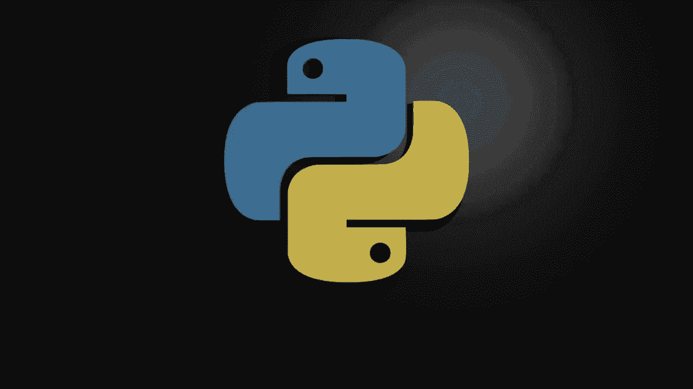
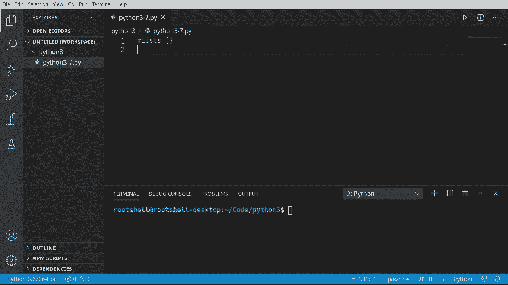
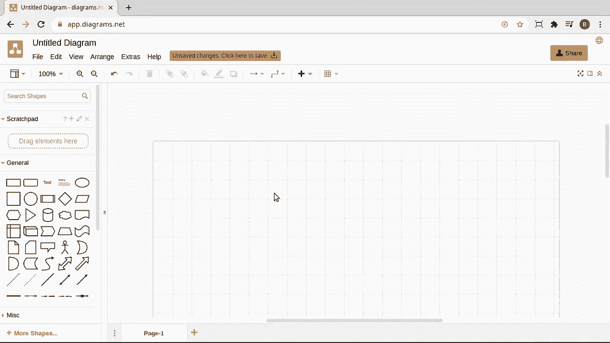
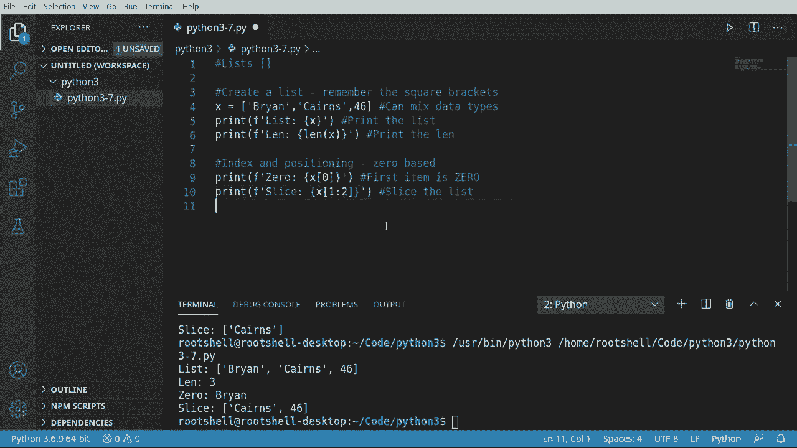
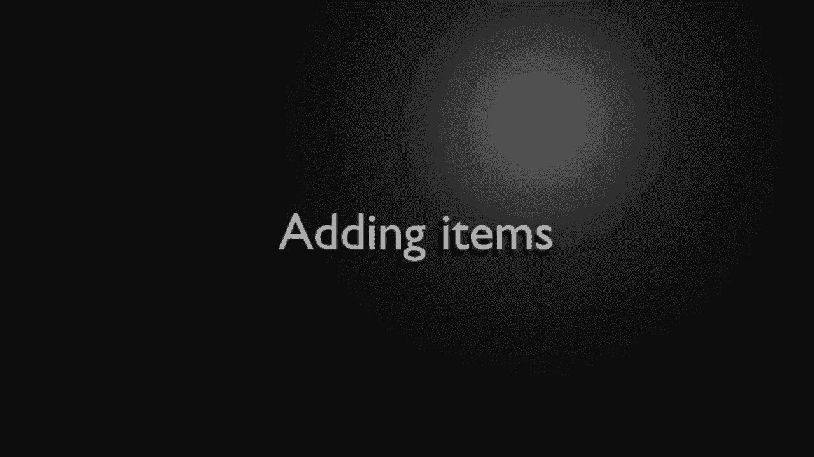
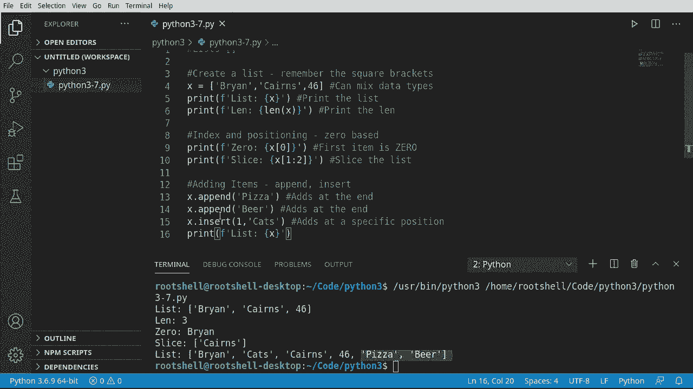
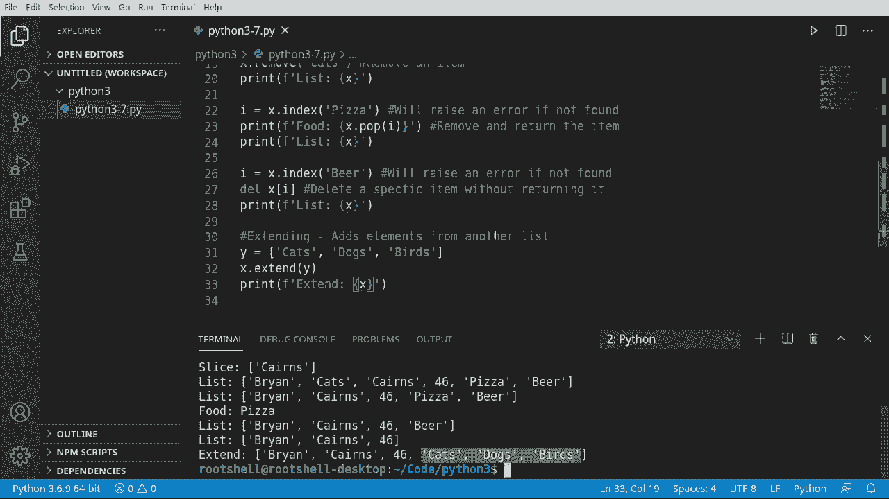
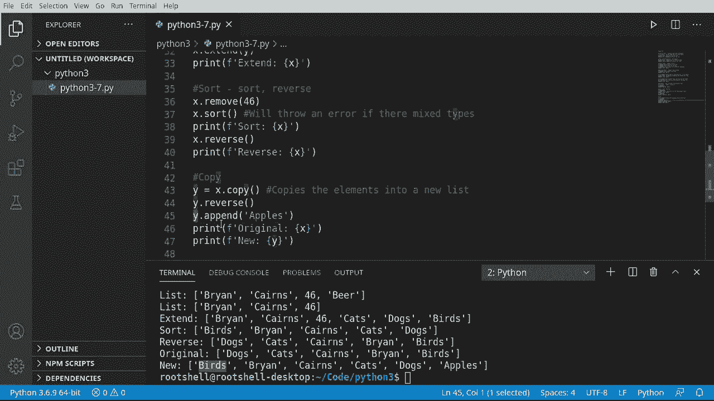
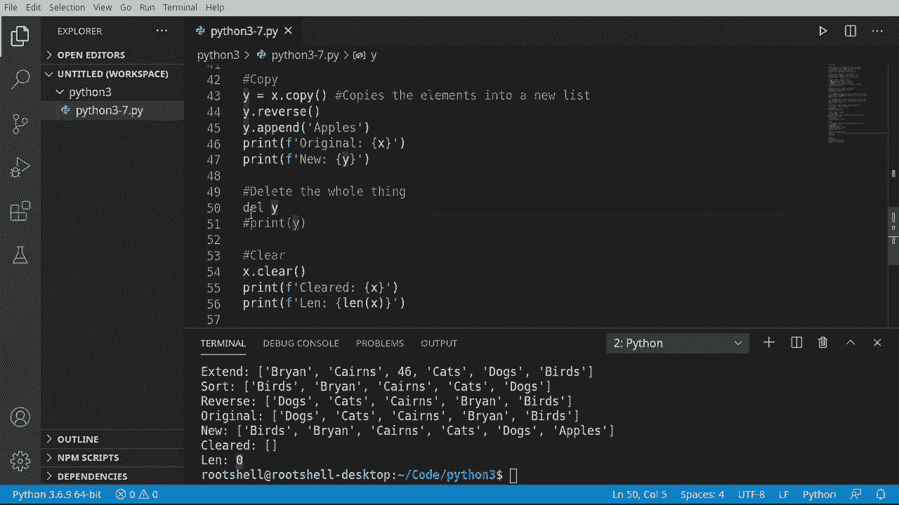
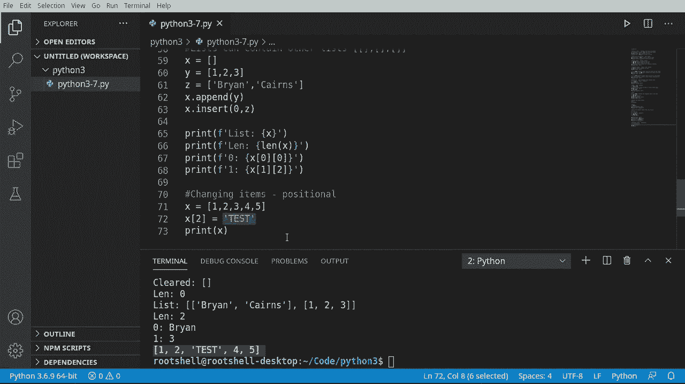

# Python 3全系列基础教程，P7：Python列表 📋







在本节课中，我们将要学习Python中一个非常重要且强大的数据结构——列表。列表允许我们有序地存储多个项目，这些项目可以是不同类型的数据，例如数字、字符串，甚至是其他列表。

---


## 什么是列表？🤔

上一节我们介绍了Python的基本数据类型，本节中我们来看看列表。列表是一个有序的数据集合。列表中的每个项目都有一个对应的位置，称为索引。在Python中，列表的索引是从0开始的，这意味着第一个项目的位置是0，第二个是1，依此类推。

列表使用方括号 `[]` 来表示，其中的项目用逗号分隔。

**公式/代码示例：**
```python
# 这是一个列表
my_list = ['苹果', '香蕉', 123, True]
```

---

## 创建与访问列表 🛠️

现在我们已经知道列表是什么，接下来学习如何创建列表以及如何访问其中的元素。

创建一个列表非常简单，只需将项目放入方括号中即可。列表可以包含不同类型的数据，这是Python列表灵活性的体现。



**公式/代码示例：**
```python
# 创建一个包含混合数据类型的列表
x = ['Brian', 'Karen', 46]
print(x)  # 输出: ['Brian', 'Karen', 46]
```



要访问列表中的特定元素，我们使用方括号和索引。记住，索引从0开始。

**公式/代码示例：**
```python
# 访问列表中的第一个元素
first_item = x[0]
print(first_item)  # 输出: Brian
```

我们还可以使用“切片”来获取列表的一部分。切片就像从面包上切下一片，它允许我们获取从起始索引到结束索引（不包括结束索引本身）的元素。

**公式/代码示例：**
```python
# 获取索引0到1（不包括2）的元素
slice_of_list = x[0:2]
print(slice_of_list)  # 输出: ['Brian', 'Karen']
```



---


## 向列表添加元素 ➕

创建列表后，我们常常需要向其中添加新元素。Python提供了几种方法来实现这一点。

以下是向列表添加元素的两种主要方法：
*   **`append()`**：将单个元素添加到列表的末尾。
*   **`insert()`**：将元素插入到列表的指定索引位置。

**公式/代码示例：**
```python
x = ['Brian', 'Karen', 46]
x.append('披萨')  # 在末尾添加
x.append('啤酒')  # 再次在末尾添加
x.insert(1, '猫')  # 在索引1的位置插入‘猫’
print(x)  # 输出: ['Brian', '猫', 'Karen', 46, '披萨', '啤酒']
```

---

## 从列表中移除元素 ➖

有添加就有移除。从列表中删除元素同样有多种方式，它们的功能略有不同。

以下是移除列表元素的几种方法：
*   **`remove()`**：删除列表中第一个与指定值匹配的元素。
*   **`pop()`**：删除并返回指定索引处的元素。如果不指定索引，则删除并返回最后一个元素。
*   **`del`语句**：删除指定索引处的元素，但不返回该元素。它也可以用来删除整个列表。

**公式/代码示例：**
```python
x = ['Brian', '猫', 'Karen', 46, '披萨', '啤酒']
x.remove('猫')  # 删除第一个‘猫’
print(x)  # 输出: ['Brian', 'Karen', 46, '披萨', '啤酒']

popped_item = x.pop(3)  # 删除并返回索引3的元素（46）
print(popped_item)  # 输出: 46
print(x)  # 输出: ['Brian', 'Karen', '披萨', '啤酒']

del x[2]  # 删除索引2的元素（‘披萨’），不返回
print(x)  # 输出: ['Brian', 'Karen', '啤酒']
```

---




## 合并与复制列表 🔄

有时我们需要合并两个列表，或者在不影响原列表的情况下创建其副本。

`extend()` 方法可以将另一个列表中的所有元素添加到当前列表的末尾。这与 `append()` 不同，`append()` 会将整个列表作为一个元素添加进去。

**公式/代码示例：**
```python
x = ['Brian', 'Karen']
y = ['猫', '狗', '鸟']
x.extend(y)  # 将y中的所有元素添加到x末尾
print(x)  # 输出: ['Brian', 'Karen', '猫', '狗', '鸟']
```

`copy()` 方法可以创建列表的一个浅拷贝。这意味着我们得到了一个包含相同元素的新列表，对新列表的修改不会影响原列表。

**公式/代码示例：**
```python
original = [1, 2, 3]
new_list = original.copy()
new_list.append(4)
print(original)  # 输出: [1, 2, 3]
print(new_list)  # 输出: [1, 2, 3, 4]
```

---



## 排序与清空列表 🔀


列表中的元素可以按特定顺序排列。`sort()` 方法会对列表进行原地排序（默认升序），而 `reverse()` 方法会将列表中的元素顺序反转。

**重要提示**：如果列表中混合了不同类型（如字符串和数字），`sort()` 方法会报错。

**公式/代码示例：**
```python
x = ['狗', '猫', '鸟']
x.sort()  # 按字母顺序升序排序
print(x)  # 输出: ['鸟', '狗', '猫']

x.reverse()  # 反转列表顺序
print(x)  # 输出: ['猫', '狗', '鸟']
```

`clear()` 方法会清空列表中的所有元素，但列表对象本身仍然存在，只是变成了一个空列表。这与 `del` 语句删除整个列表变量不同。




**公式/代码示例：**
```python
x = [1, 2, 3]
x.clear()
print(x)  # 输出: []
print(len(x))  # 输出: 0，列表存在但为空
```

---

## 列表的嵌套与修改 🔗

列表的强大之处在于它可以包含其他列表，形成嵌套结构（或称为多维列表）。这可以用来表示更复杂的数据。

**公式/代码示例：**
```python
# 一个包含两个子列表的列表
nested_list = [[1, 2, 3], ['a', 'b', 'c']]
print(nested_list[0])    # 输出第一个子列表: [1, 2, 3]
print(nested_list[1][1]) # 输出第二个子列表的第二个元素: 'b'
```

要修改列表中某个特定位置的元素，可以直接通过索引进行赋值。

**公式/代码示例：**
```python
x = [1, 2, 3, 4, 5]
x[2] = '测试'  # 将索引2（第三个）的元素改为‘测试’
print(x)  # 输出: [1, 2, '测试', 4, 5]
```

---

## 总结 📝



本节课中我们一起学习了Python列表的核心知识。我们了解了列表是一个有序、可变且可以包含不同类型元素的集合。我们掌握了如何创建列表、访问和切片元素、使用 `append()` 和 `insert()` 添加元素、使用 `remove()`、`pop()` 和 `del` 移除元素。此外，我们还学习了如何用 `extend()` 合并列表、用 `copy()` 复制列表、用 `sort()` 和 `reverse()` 进行排序，以及用 `clear()` 清空列表。最后，我们探讨了列表的嵌套结构和直接通过索引修改元素的方法。列表是Python编程中最基础、最常用的工具之一，务必熟练掌握。