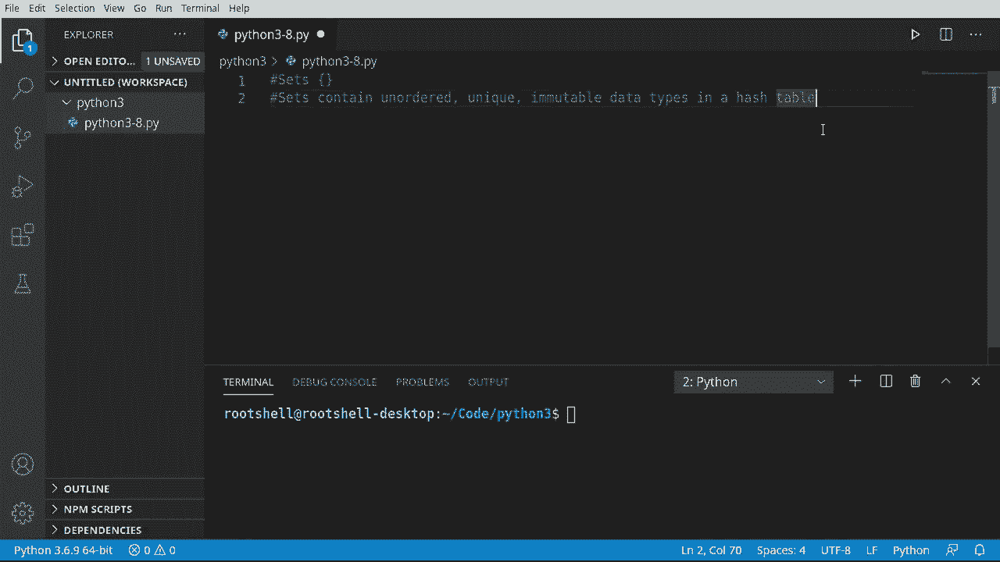
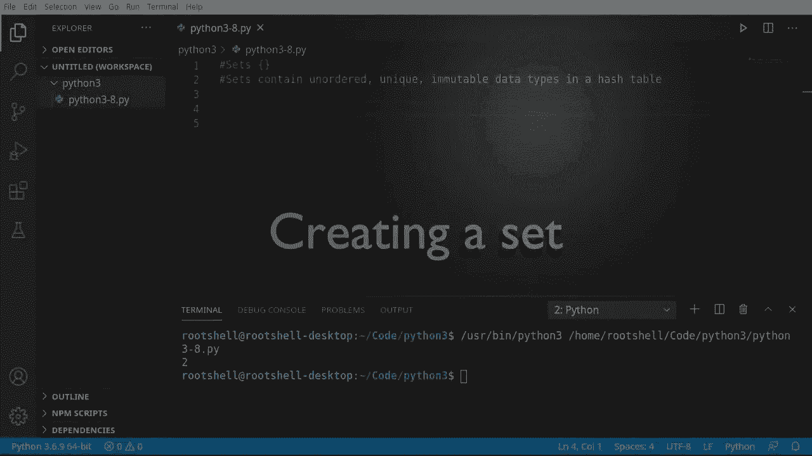
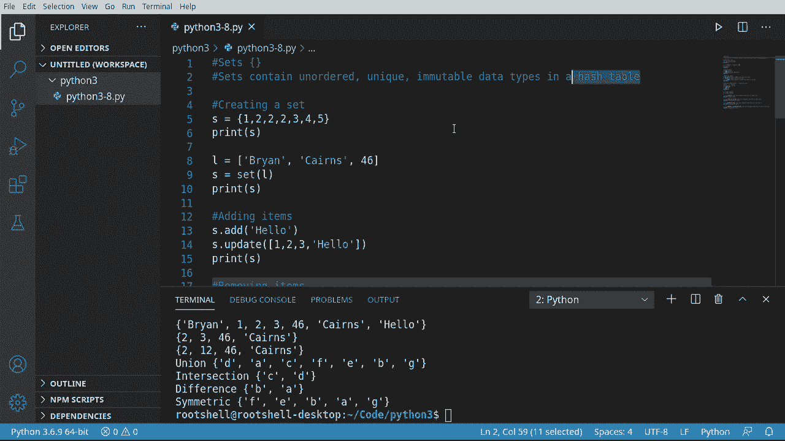

# Python 3全系列基础教程，P8：Python集合 🧩


在本节课中，我们将要学习Python中的另一种重要数据结构——集合。我们将了解集合的定义、特性、创建方法以及如何对其进行添加、删除和修改操作。此外，我们还将探讨集合与列表之间的核心区别，以及集合特有的数学运算。

## 什么是集合？

上一节我们介绍了列表，本节中我们来看看集合。集合与列表有所不同，这种区别在底层实现上具有深远的影响。

集合包含**无序**、**唯一**和**不可变**的数据类型，并存储在一个**哈希表**中。让我们分解一下这些概念：
*   **无序**：意味着我们无法控制集合中元素的顺序，这与列表不同。
*   **唯一**：意味着集合中不能有重复的元素。
*   **不可变数据类型**：意味着一旦元素被添加到集合中，我们就无法更改该元素本身。我们只能删除或添加整个元素。
*   **哈希表**：这是一种底层数据结构，它允许极快的读取和查找访问速度。



## 如何创建集合？



理解了集合的基本概念后，让我们看看如何创建一个集合。

创建集合使用花括号 `{}`。请注意，方括号 `[]` 用于创建列表，这是完全不同的数据类型。

```python
# 创建一个包含数字的集合
S = {1, 2, 3, 4, 5}
print(S)  # 输出：{1, 2, 3, 4, 5}
```

Python会自动剔除集合中的所有重复项，因此我们不必担心重复问题。

```python
# 即使尝试添加重复项，集合也会自动去重
S = {1, 2, 2, 3, 4, 5}
print(S)  # 输出：{1, 2, 3, 4, 5}
```

我们还可以使用 `set()` 函数将其他可迭代对象（如列表）转换为集合。

```python
# 将列表转换为集合
my_list = [‘Brian‘, ‘Karen‘, 46]
S = set(my_list)
print(S)  # 输出可能是：{46, ‘Brian‘, ‘Karen‘}
```

请注意，转换后元素的顺序可能与原列表不同，这体现了集合的**无序**特性。

## 如何操作集合？

创建集合后，我们需要学习如何向其中添加或移除元素。

以下是向集合添加元素的方法：

*   **`add()`**：向集合中添加单个元素。
*   **`update()`**：向集合中添加来自另一个可迭代对象（如列表、元组或其他集合）的多个元素。

```python
S = {1, 2, 3}
S.add(‘hello‘)
print(S)  # 输出：{1, 2, 3, ‘hello‘}

S.update([4, 5, 6])
print(S)  # 输出：{1, 2, 3, 4, 5, 6, ‘hello‘}
```

`update()` 方法同样会遵循唯一性原则，自动去重。

从集合中移除元素主要有两种方法，它们有一个关键区别：

*   **`discard()`**：移除指定元素。如果元素不存在，**不会**引发错误。
*   **`remove()`**：移除指定元素。如果元素不存在，**会**引发 `KeyError` 错误。

```python
S = {1, 2, 3, ‘hello‘}
S.discard(2)   # 正常移除
S.discard(99)  # 元素99不存在，但不会报错
print(S)       # 输出：{1, 3, ‘hello‘}

S.remove(‘hello‘) # 正常移除
# S.remove(‘world‘) # 如果执行这行，会引发 KeyError
```

此外，还有 `pop()` 方法，它会**随机**移除并返回集合中的一个元素。由于集合无序，你无法预知哪个元素会被移除。

```python
S = {‘a‘, ‘b‘, ‘c‘}
item = S.pop()
print(f“被移除的元素是：{item}“)
print(f“剩余集合：{S}“)
```

## 集合的限制与修改技巧

集合的设计目标是为了快速查找，因此它牺牲了一些灵活性。最重要的一点是：**集合中的元素必须是不可变的**，并且**不能通过索引访问或修改特定位置的元素**。

尝试通过索引修改集合元素会导致错误。

```python
S = {1, 2, 3}
# S[0] = ‘a‘  # 这行代码会报错：TypeError: ‘set‘ object does not support item assignment
# print(S[0]) # 这行代码也会报错：TypeError: ‘set‘ object is not subscriptable
```

那么，如何“修改”一个集合元素呢？标准做法是先移除旧元素，再添加新元素。

```python
S = {1, 2, 3, 4, 5}
# 将元素 3 “修改”为 12
if 3 in S:
    S.remove(3)
    S.add(12)
print(S)  # 输出可能是：{1, 2, 4, 5, 12}
```

## 集合的数学运算

集合支持多种数学集合运算，这些操作非常高效。

假设我们有两个集合：
```python
x = {‘A‘, ‘B‘, ‘C‘, ‘D‘}
y = {‘C‘, ‘D‘, ‘E‘, ‘F‘, ‘G‘}
```

以下是集合的几种基本运算：

*   **并集**：获取所有在**任一**集合中的元素。
    ```python
    union_set = x | y  # 或使用 x.union(y)
    print(union_set)  # 输出：{‘A‘, ‘B‘, ‘C‘, ‘D‘, ‘E‘, ‘F‘, ‘G‘}
    ```
*   **交集**：获取所有**同时**在两个集合中的元素。
    ```python
    intersection_set = x & y  # 或使用 x.intersection(y)
    print(intersection_set)  # 输出：{‘C‘, ‘D‘}
    ```
*   **差集**：获取所有在 **x** 中但**不在 y** 中的元素。
    ```python
    difference_set = x - y  # 或使用 x.difference(y)
    print(difference_set)  # 输出：{‘A‘, ‘B‘}
    ```
*   **对称差集**：获取所有**只存在于其中一个集合**中（即不同时属于两个集合）的元素。
    ```python
    symmetric_diff_set = x ^ y  # 或使用 x.symmetric_difference(y)
    print(symmetric_diff_set)  # 输出：{‘A‘, ‘B‘, ‘E‘, ‘F‘, ‘G‘}
    ```

## 总结

本节课中我们一起学习了Python的集合。

*   集合是一种包含**无序**、**唯一**、**不可变**元素的数据结构，基于**哈希表**实现，因此具有极快的查找速度。
*   使用花括号 `{}` 或 `set()` 函数创建集合。
*   使用 `add()` 和 `update()` 添加元素，使用 `discard()` 和 `remove()` 移除元素（注意后者在元素不存在时会报错）。
*   集合元素不能通过索引访问或直接修改，需要通过“先移除后添加”的方式间接修改。
*   集合支持丰富的数学运算，如**并集**、**交集**、**差集**和**对称差集**，这些操作简洁高效。



集合与列表的核心区别在于：列表保持顺序且允许重复，适合需要维护序列的场景；集合不保证顺序且元素唯一，专为需要快速成员检查和集合运算的场景设计。理解两者的差异有助于你在编程中选择最合适的数据结构。