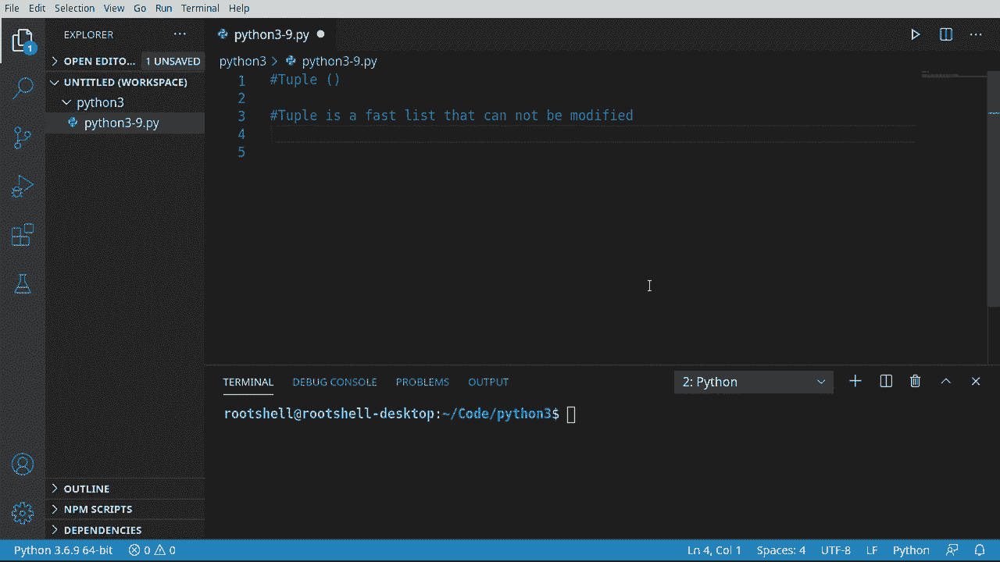
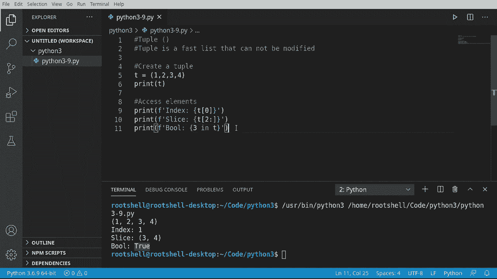
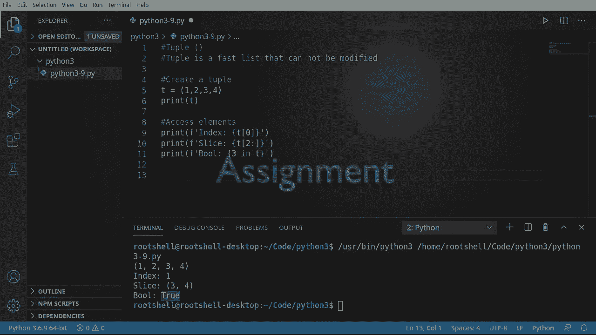
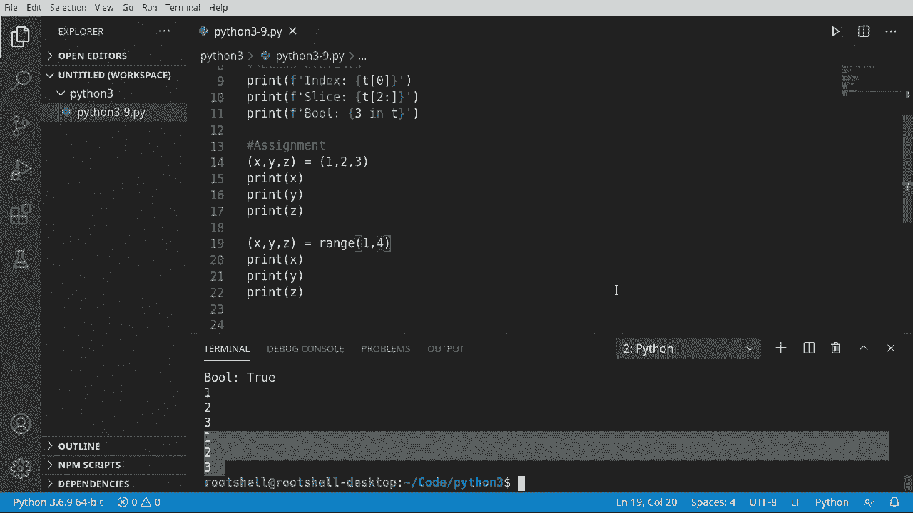

# Python 3全系列基础教程，P9：Python元组：快速且只读 📦


在本节课中，我们将要学习Python中的元组。元组是一种快速、只读的数据结构，一旦创建就不能被修改。它常用于在不同对象、类或框架之间安全地交换数据。

## 创建元组



上一节我们介绍了列表，本节中我们来看看如何创建元组。元组使用圆括号 `()` 来定义，这是它与列表（方括号 `[]`）和集合（花括号 `{}`）的主要区别。


以下是创建一个元组的示例代码：

```python
T = (1, 2, 3, 4, 5)
print(T)
```

运行这段代码，输出结果会显示元组 `T` 及其内容，并用圆括号标识。

## 访问元组元素

创建元组后，我们需要知道如何访问其中的数据。访问元组元素的方法与访问列表元素完全相同，都是通过索引。

以下是访问元组元素的示例：

```python
T = (1, 2, 3, 4, 5)
print(T[0])  # 输出第一个元素
print(T[1:3])  # 切片，输出索引1到2的元素
```

记住，索引是从0开始的。切片操作可以方便地获取元组的一部分。

## 检查元素是否存在



有时我们需要检查某个值是否存在于元组中。Python提供了简单的语法来完成这个操作。



以下是如何检查元素是否在元组中的示例：

```python
T = (1, 2, 3, 4, 5)
print(3 in T)  # 输出：True
print(6 in T)  # 输出：False
```

使用 `in` 关键字可以快速返回一个布尔值，表示元素是否存在。

## 元组解包

元组一个非常实用的特性是“解包”。它允许我们将元组中的值一次性分配给多个变量。

以下是元组解包的基本示例：

```python
# 定义变量元组和值元组
(x, y, z) = (1, 2, 3)
print(x)  # 输出：1
print(y)  # 输出：2
print(z)  # 输出：3
```

Python会自动将右侧元组中的值按顺序分配给左侧元组中的变量。

## 结合range函数

我们可以将元组解包与 `range()` 函数结合使用，快速为多个变量赋值。`range()` 函数生成一个整数序列。

以下是使用 `range()` 进行元组解包的示例：

```python
# 尝试解包range(3)
(x, y, z) = range(3)
print(x, y, z)  # 输出：0 1 2

# 指定range的起始值
(a, b, c) = range(1, 4)
print(a, b, c)  # 输出：1 2 3
```

需要注意的是，左侧变量的数量必须与 `range()` 生成的值的数量完全一致，否则会引发错误。

---



本节课中我们一起学习了Python元组。我们了解了如何创建只读的元组、如何访问和检查其中的元素，并掌握了实用的元组解包技巧，包括如何与 `range()` 函数配合使用。元组因其不可变性，在需要确保数据不被意外修改的场景中非常有用。