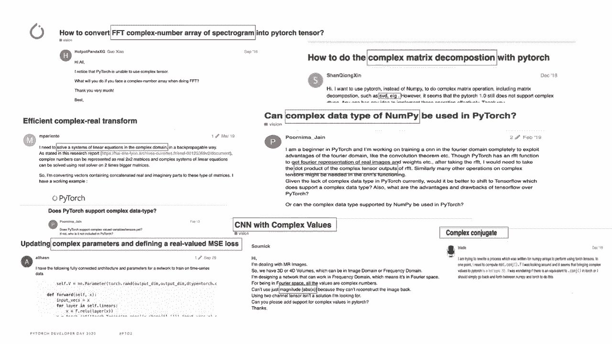
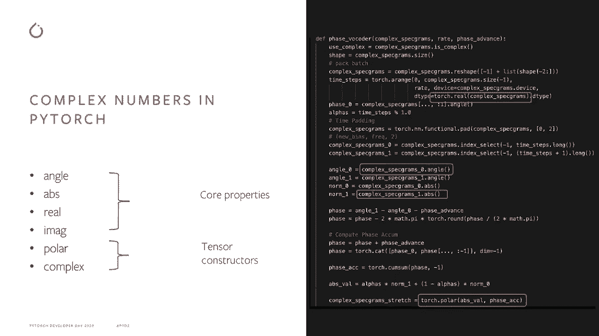
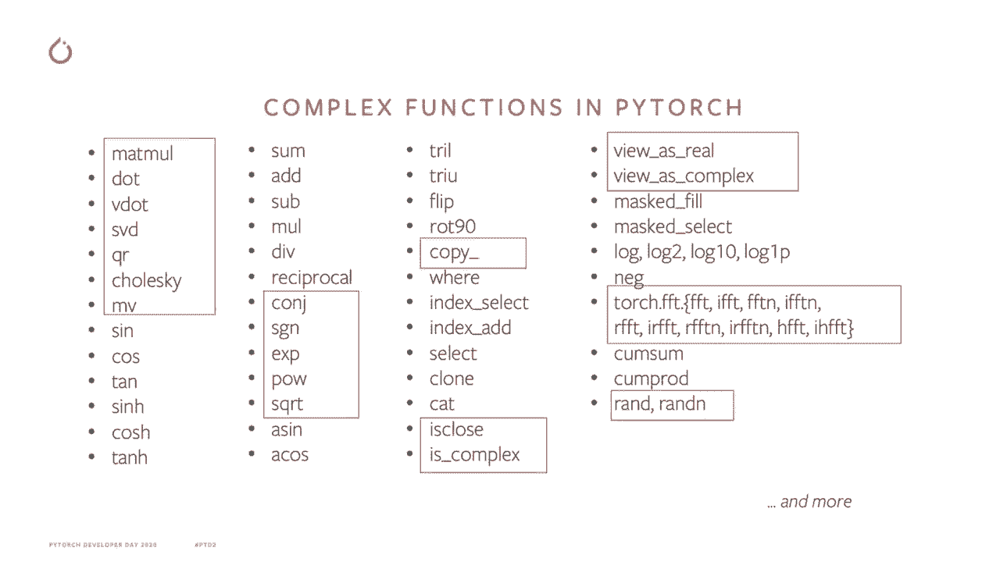
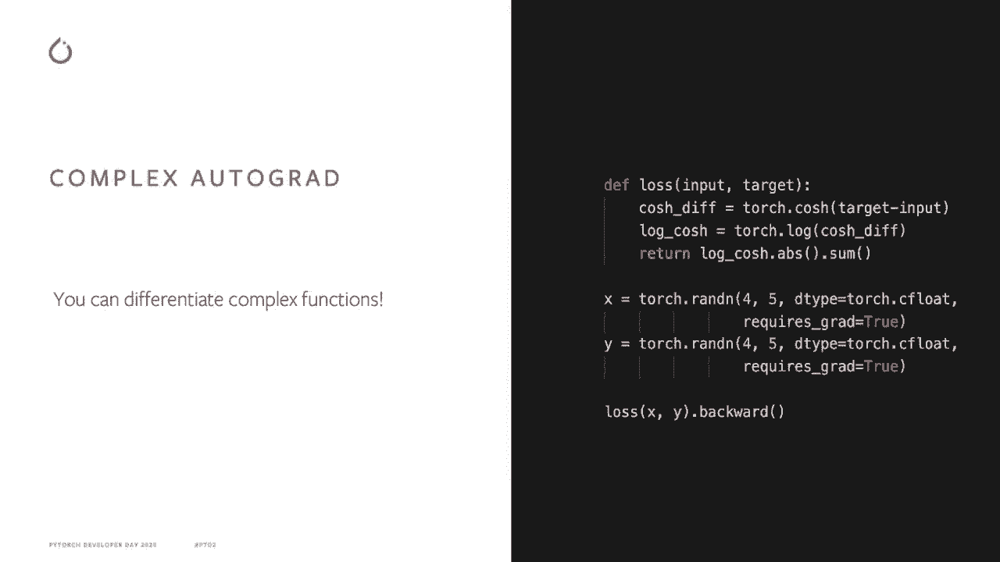
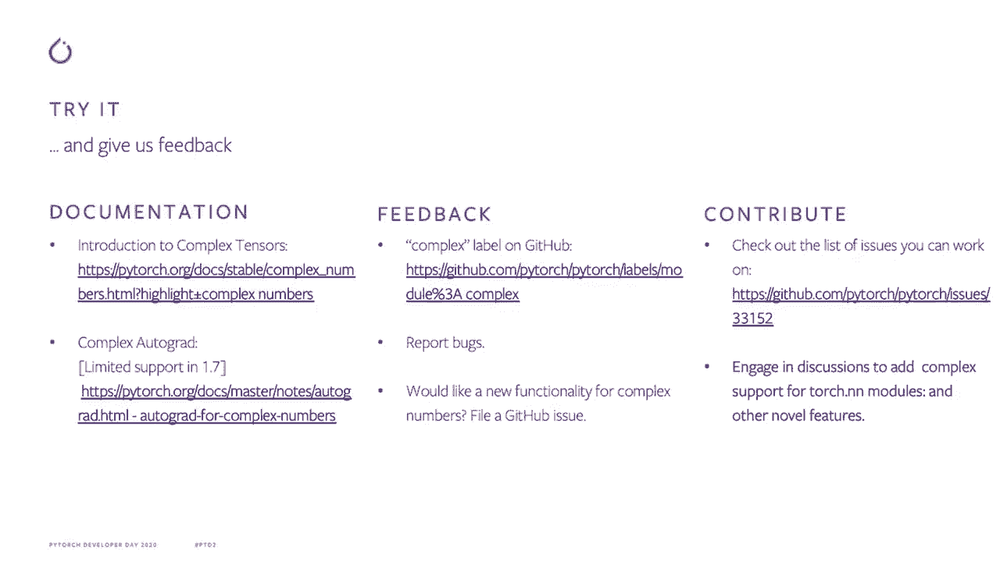

# PyTorch 进阶学习讲座 P1：PyTorch 中的复数 🧮

在本节课中，我们将要学习 PyTorch 对复数的原生支持。我们将了解什么是复数、它们在深度学习中的应用，以及 PyTorch 如何通过引入新的数据类型和功能来简化复数运算。

---

复数是可以表示为 `a + b*i` 的数字，其中 `a` 和 `b` 是实数，`i` 是单位虚数，满足 `i² = -1`。

复数在数学、物理和工程等多个领域都有应用，例如量子力学和信号处理。欧拉公式 `e^(iθ) = cosθ + i*sinθ` 建立了虚数与三角函数之间的联系。这个关系可以将标准的余弦波方程重写为两个复指数的乘积，从而简化相关的数学计算，因为复指数比正弦函数更容易处理。

在深度学习领域，复数可能具有丰富的表示能力。然而，由于 PyTorch 过去缺乏原生复数支持，利用这种潜力变得困难。随着用户对复数支持的需求日益增长，PyTorch 团队决定采取行动。

---

上一节我们介绍了复数的基本概念和应用背景，本节中我们来看看社区对复数支持的主要需求，这构成了 PyTorch 添加该功能的三大动力。

以下是社区反馈归结的三个主要点：

1.  **自然表示**：历史上，复数被表示为两个实数的元组，编写和维护相关代码非常繁琐。用户需要一个更简单、更直观的 API。
2.  **复数功能**：用户希望为复数操作提供与实数类似的支持，并能利用 PyTorch 在 CPU 和 GPU 等加速器上的计算能力。
3.  **自动微分**：为了支持神经网络研究，需要在复数域实现自动微分，这对优化问题至关重要。

---

了解了用户需求后，我们来看看 PyTorch 中的复数张量如何简化我们的工作。

在 PyTorch 1.6 之前，表示复数需要笨重的元组形式。从 PyTorch 1.6 开始，引入了两种原生的复数数据类型：`complex64` 和 `complex128`，分别对应于 `float32` 和 `float64`（double）数据类型。

拥有原生复数支持的好处是，你不再需要编写繁琐且容易出错的变通代码。许多常见操作，如矩阵乘法（`matmul`）、奇异值分解（`SVD`）等，现在都已支持复数。张量构造函数和核心属性也提供了自然的复数支持。

---

上一节我们看到了复数张量带来的便利，本节中我们来看看 PyTorch 为复数提供了哪些具体的操作符支持。

以下是我们已添加的部分操作符示例：

*   **线性代数操作**：如 `matmul`, `svd`, `inverse`
*   **三角函数操作**：如 `sin`, `cos`, `exp`
*   **代数操作**：如加法、乘法、共轭 `conj()`

团队正在持续努力，以添加更多操作符。

---

不仅如此，在最新版本的 PyTorch 中，你还可以对复数函数进行自动微分。

对于熟悉复变函数微分的用户，PyTorch 计算的是共轭导数（Wirtinger derivative）。对于希望使用复数参数优化实值目标函数的常见情况，现有的优化器可以开箱即用。如果你想编写自定义梯度函数，可以查阅 PyTorch 官网关于复数自动微分的文档。

---

最后，让我们展望一下未来的工作。团队正在积极支持复数在分布式计算中的应用，以实现更大的性能提升。同时，也在扩展复数操作符的覆盖范围，并努力为 `torchaudio` 等库添加原生复数支持，因为这些库大量使用了复数。

---

**总结**

本节课中我们一起学习了 PyTorch 对复数的原生支持。我们回顾了复数的定义和应用，了解了社区推动此功能开发的三大需求，并探讨了 `complex64`/`complex128` 数据类型如何简化代码。我们还查看了已支持的复数操作符和自动微分功能，并展望了未来的发展方向。

PyTorch 网站提供了详细的文档帮助你入门。欢迎尝试这些新功能并通过 GitHub 提交反馈、报告问题或参与讨论。你的每一条反馈都对 PyTorch 的发展至关重要。