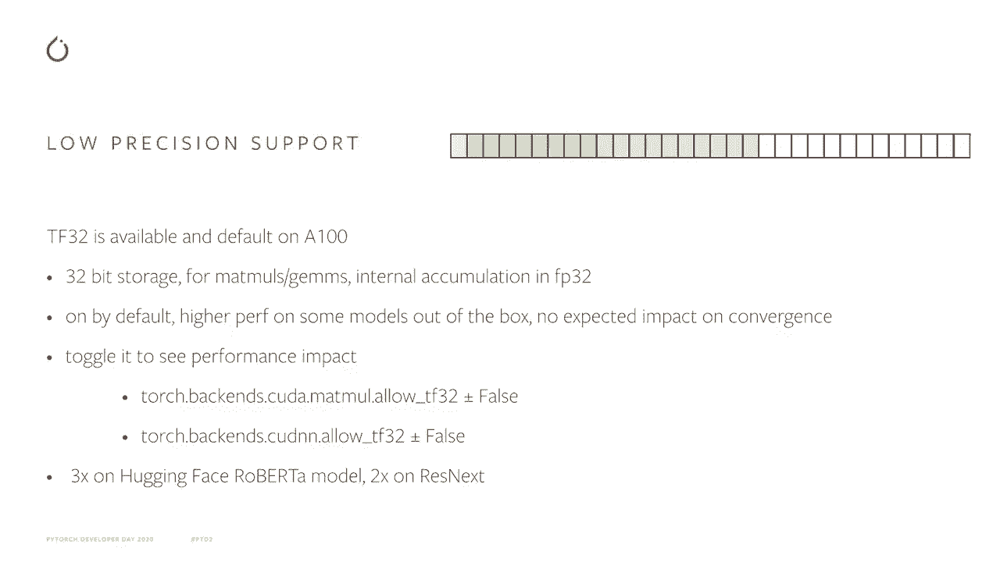
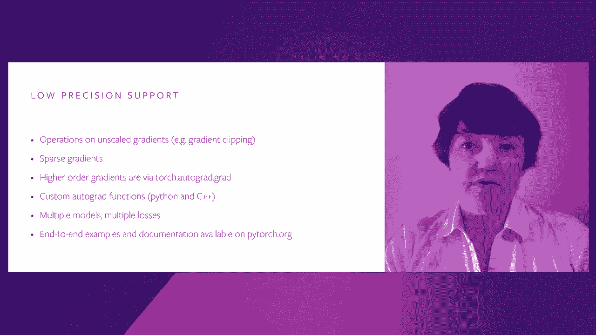
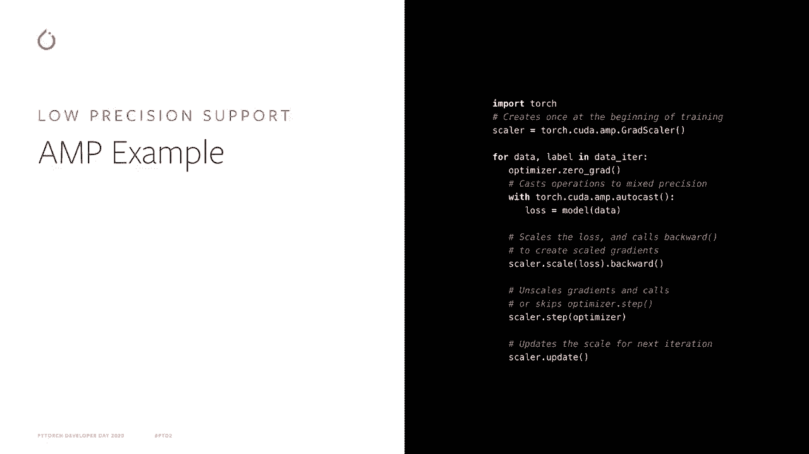
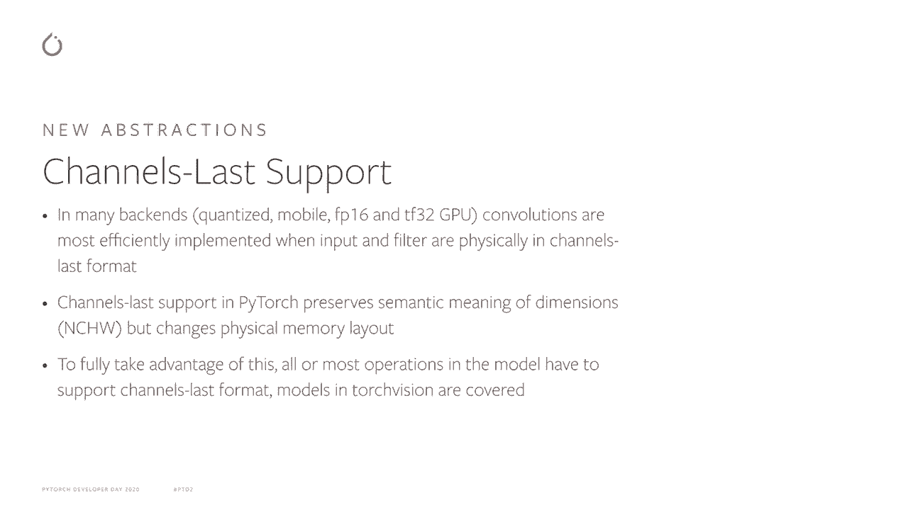
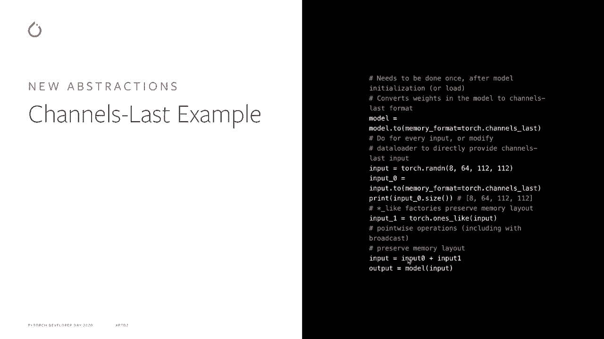
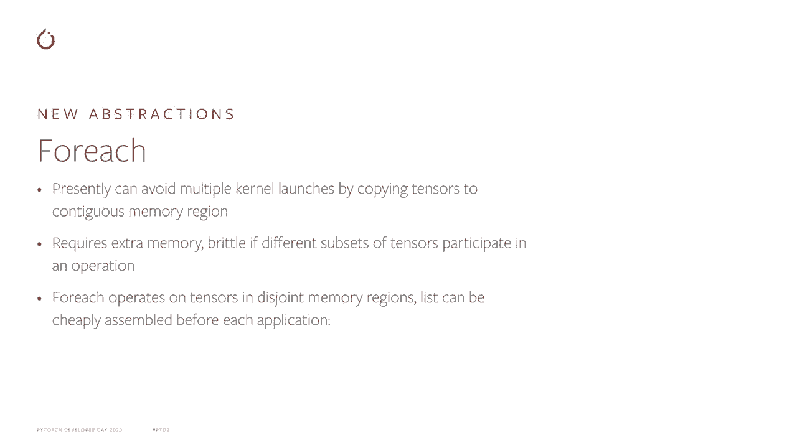
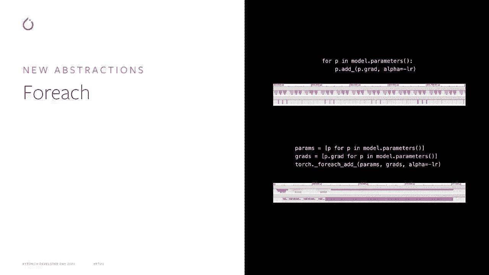
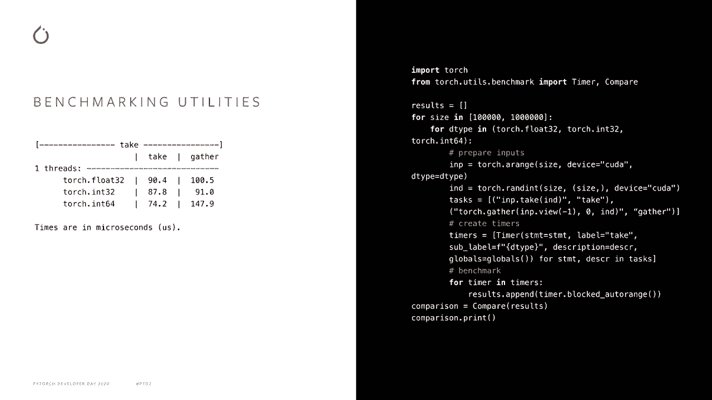
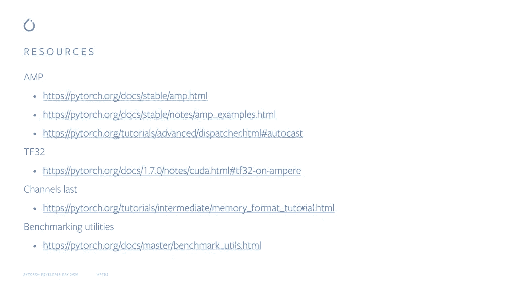

# PyTorch 进阶学习讲座 P11：L11 - PyTorch 性能优化 🚀


在本节课中，我们将学习 PyTorch 中的性能优化技术，包括低精度数据类型支持、内存格式优化、批量操作以及基准测试工具的使用。这些技术能帮助你在现代硬件上显著提升模型的训练和推理速度。


---

## 低精度数据类型支持

上一节我们介绍了性能优化的概述，本节中我们来看看如何通过使用低精度数据类型来提升性能。在现代硬件上，牺牲一些精度可以换取显著的性能提升。PyTorch 使得处理低精度数据类型变得简单，并支持量化。本节课主要讨论 TF32 和 FP16 数据类型。

右侧的图表显示了相应数据类型的内存表示，绿色框是指数位，红色框是有效位。FP32 可以用八个指数位表示广泛的动态范围，其动态范围与标准 FP32 数据类型相同，但只有 7 个有效位的有限精度。FP16 则作出了相反的权衡，具有有限的动态范围和更好的精度。TF32 兼具两者的优点，其动态范围与标准 FP32 相同，但与 FP16 一样有许多有效位。

TF32 在新的 NVIDIA Ampere GPU 上启用，支持 32 位存储。标准网络在计算密集型操作读取输入数据时可以透明地受益，但只读取 10 位有效位，因此存在一些精度问题。然而，内部累积发生在 FP32 中，因此我们不期望转换会受到影响。

你可以开启和关闭 TF32，以观察其对性能和转换的影响。使用基准测试，例如 `HuggingFace RoBERTa` 模型大约提高了 3 倍的速度，而在 `ResNet` 等较低复杂度的模型中则提高了大约 2 倍，相比于同一硬件上的 FP32 性能。

TF32 开箱即用，无需对现有脚本进行修改。然而，如果你愿意稍微调整现有脚本，以实现更好的性能，FP16 将会很有用。

---

## 自动混合精度 (AMP)



上一节我们讨论了 TF32，本节中我们来看看如何通过自动混合精度进一步优化性能。自动混合精度现在在 PyTorch 中得到支持，该功能源自由 NVIDIA 维护的流行 `apex` 包。它自动化训练 FP16 网络，并处理由于 FP16 训练中的有限动态范围而产生的数值问题。

PyTorch 旨在覆盖广泛的用例：
*   支持对无偏梯度的操作。
*   支持对稀疏梯度的操作。
*   更高阶的自动梯度可以通过 Torch 的 autograd 计算。
*   支持自定义 autograd 函数。
*   支持涉及多个模型和多个损失的复杂脚本。
*   Python 和 C++ 路径都被支持。

示例和文档可在 PyTorch 的网站上找到。

这是一个使用 AMP 的简单示例。有两个重要部分：
1.  **GradScaler**：控制所有缩放的标量对象，确保转换和数值稳定性。
2.  **autocast** 上下文管理器：确保 `nn.Linear` 和卷积等操作以 FP16 运行，而在进行需要全精度的操作（如 softmax）时以 FP32 运行，以达到最佳性能。

最后，调用优化器步骤的语法稍有不同，你还必须更新下一次迭代的梯度缩放。



```python
# 示例代码片段
scaler = GradScaler()
with autocast():
    output = model(input)
    loss = loss_fn(output, target)
scaler.scale(loss).backward()
scaler.step(optimizer)
scaler.update()
```

但总体来说，所需的代码更改非常少，你应该能够实现比 TF32 更好的性能，前提是 FP16 在你的 GPU（如 Volta 及更新架构）上得到支持。

---

## 通道优先 (Channels Last) 内存格式



现在让我们转到下一个主题，即内存格式优化。在许多后端和数据类型（例如 TF32 和 FP16）中，当数据以通道优先格式存储时，卷积性能最佳。PyTorch 支持通道优先的物理内存格式，同时保留维度的传统语义意义。

例如对于四维张量（NCHW）：
*   第一个维度仍然是批次大小。
*   第二个维度是通道数。
*   其余是空间维度（高度、宽度）。

为了充分利用通道优先支持，模型中的所有或大多数操作必须支持该格式，而 PyTorch 中大多数操作都支持。例如，在 TorchVision 中，许多流行模型都已涵盖。

这里有一个小示例，展示了如何通过调用辅助函数将模型转换为通道优先格式。



```python
model = model.to(memory_format=torch.channels_last)
```

输入也必须是通道优先格式，因此你必须修改数据加载器，以直接提供通道优先的输入，或在脚本中手动对输入调用转换函数。

```python
input = input.to(memory_format=torch.channels_last)
```

输入布局在大多数操作中被传播，因此网络中的中间变量将保持通道优先格式。复制和张量工厂操作也保持布局。类似于张量工厂的操作也会逐点保留其输入的布局，而复制操作也会以与输入相同的格式生成输出。



对于卷积网络，你可以预期通过切换到通道优先格式获得约 20% 的性能收益。

---

## 批量操作优化 (`torch._foreach` APIs)

我们在 PyTorch `_foreach` APIs 中实现的另一个有趣特性是提供了对批量张量的高效逐点操作。与其为批量中的每个张量启动一个小内核，不如为每个操作启动几个较大的内核，每个内核处理多个张量。这种模式在优化器中尤其常见且有用。



即使现在，如果你将张量复制到连续的内存区域，然后直接在该连续内存区域上进行操作，你也可以避免启动多个内核。但这需要额外的内存，并且如果每次操作的张量子集不同，可能会变得脆弱。`_foreach` APIs 允许每个操作直接在不相交的内存区域上进行，并且可以在每次应用前廉价地组装张量列表。

这里是比较在循环中对张量批次逐个操作和使用 `_foreach` 操作的时间线。循环方式的 GPU 时间线显示大部分时间处于闲置状态，内核非常短，但大多数时间是在内核之间的空闲时间。CPU 则不断忙于启动这些小内核。

相比之下，当我们使用 `_foreach` APIs 进行相同的操作时，GPU 总是处于忙碌状态，并运行相对较大的内核。CPU 一开始在提交这些内核时忙碌，但随后在其余时间内处于闲置状态。上方的时间线仅显示处理的少量张量，在下方的时间线中，在相同的时间内处理了几百个张量。

PyTorch 1.7 使用 `_foreach` APIs 实现了通用优化器，能够实现约 3 到 6 倍甚至更大的加速，具体取决于网络中的参数数量。`_foreach` 也易于使用，可以实现你自己的优化器，或者处理网络中需要对不规则批次的张量进行操作的场景。

所以，试试看，将你的优化器替换为基于 `_foreach` 的版本，并查看它是否能改善性能。



---

## 基准测试工具

最后，让我们谈谈基准测试工具。PyTorch 基准测试工具是针对 PyTorch 用户和开发者的。当然，你也可以自己开发基准测试工具，但这需要处理一些问题：
*   你希望基准测试运行足够长的时间，以获得可靠的时间测量结果，但不希望它们永远运行。
*   你需要收集统计数据以估计测量中的噪声。
*   你需要确保比较的是同类项，所有同步调用都已执行，且 CPU 上的多线程得到了适当控制。
*   如果你是一名开发者，正在开发新操作或优化现有操作，你需要确保在各种输入大小下性能良好。
*   完成所有基准测试后，你需要一些后处理数据的方法。

我们的基准测试工具使所有这些事情变得简单。这个代码片段展示了如何使用 `Timer` 和 `Compare` API 来比较两种相似 PyTorch 操作（如 `take` 和 `gather`）针对不同数据类型的性能。

```python
from torch.utils.benchmark import Timer, Compare

# 定义测量代码
timer1 = Timer(stmt="torch.take(a, b)", globals={"a": a, "b": b})
timer2 = Timer(stmt="torch.gather(a, 0, b)", globals={"a": a, "b": b})

# 进行比较
comparison = Compare([timer1, timer2])
comparison.print()
```

计时器 API 基于 Python 的 `timeit` 模块，因此应该显得很熟悉。它们还提供了一些附加选项，可以包含元数据，以便后续分析更为简便。脚本的输出会将时间以表格形式展示。


我们希望你会觉得我们的基准测试工具很方便。

---

## 总结与资源



本节课中我们一起学习了 PyTorch 中的多项性能优化技术：
1.  **低精度计算**：利用 TF32 和 FP16 数据类型，通过自动混合精度 (AMP) 在保持精度的同时提升计算速度。
2.  **内存格式优化**：使用通道优先内存格式来优化卷积等操作的硬件利用率。
3.  **批量操作**：利用 `_foreach` APIs 对批量张量执行高效操作，显著减少内核启动开销，尤其在优化器中效果明显。
4.  **基准测试**：使用 PyTorch 内置的基准测试工具来科学、可靠地测量和比较操作性能。



以下是一些资源，你可以用来获取更多关于上述话题的信息：
*   PyTorch 官方文档：`torch.cuda.amp`, `torch.channels_last`, `torch.utils.benchmark`
*   NVIDIA Apex 库（AMP 的前身）
*   PyTorch 性能教程和博客


感谢你的聆听，希望你能将这些性能优化技术应用到你的项目中，并期待在 PyTorch 社区中看到你的分享。