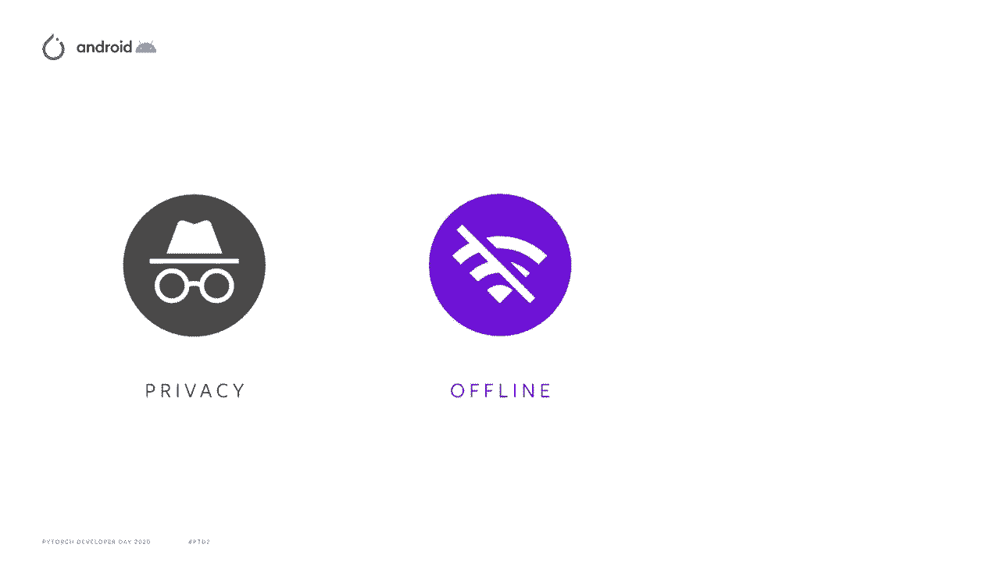
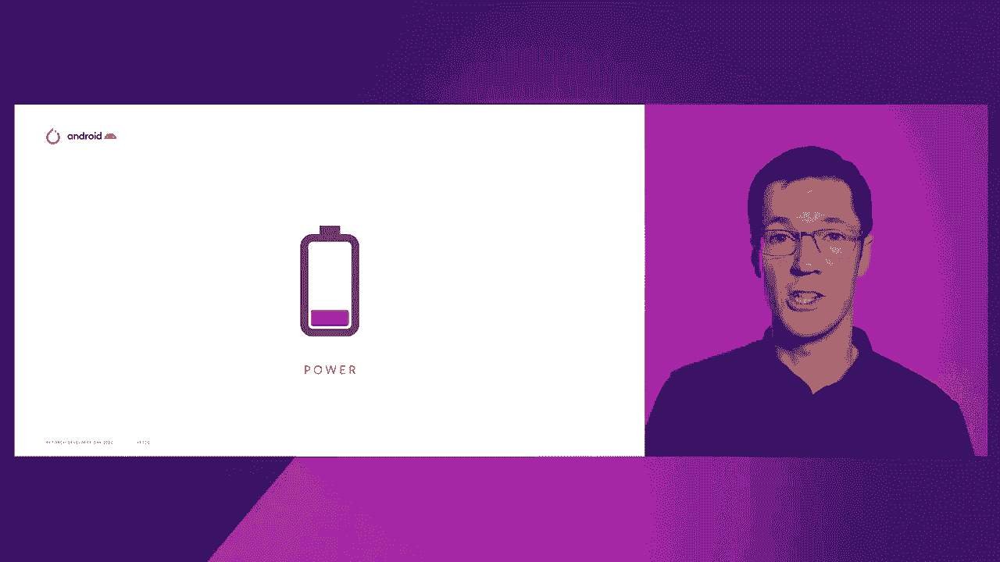
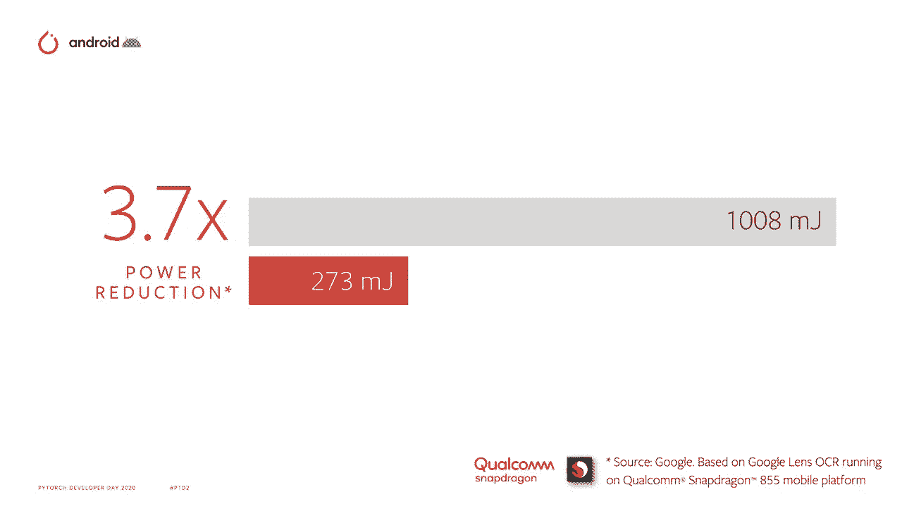
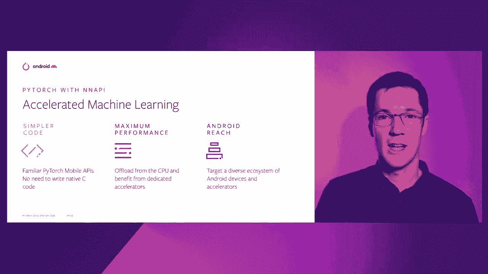
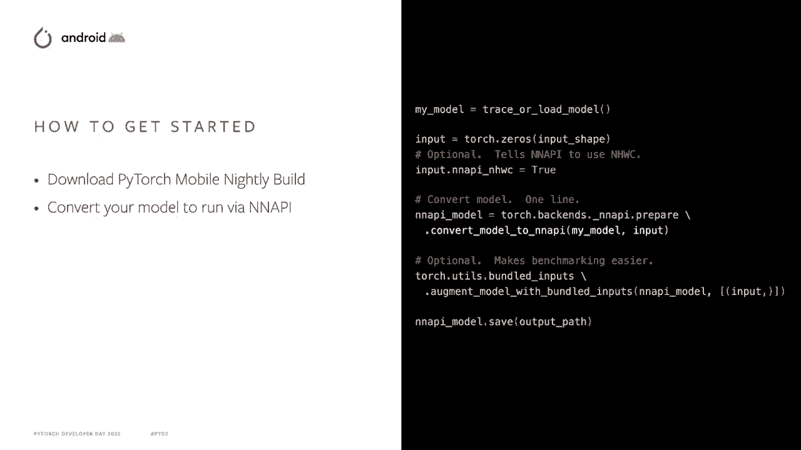
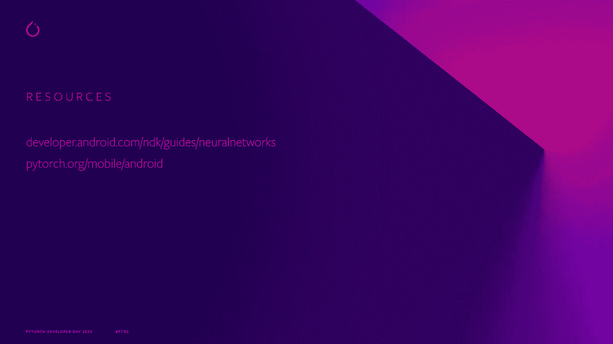

# PyTorch 进阶学习讲座 L14：PyTorch 移动端与 Android 神经网络 API 📱➡️🧠


在本节课中，我们将学习如何利用 PyTorch Mobile 与 Android 神经网络 API（NNAPI）在移动设备上高效运行机器学习模型。我们将了解其优势、工作原理以及如何快速开始使用。

## 概述：设备端机器学习的优势

在设备端进行机器学习能带来一系列好处。通过将计算移至数据本地，可以提高隐私保护能力。这确保了功能在间歇性网络连接情况下也能正常工作，并有效减少了延迟。



## 移动设备的挑战与解决方案



上一节我们介绍了设备端机器学习的优势，本节中我们来看看移动设备面临的挑战及其解决方案。

在移动设备上，我们始终面临功率限制。因此，尽可能高效地进行计算至关重要。

幸运的是，现代设备配备了一系列专业芯片来提供帮助。**GPU**、**DSP** 和新型专用的机器学习硬件加速器（通常称为 **NPU**）可以在不单独使用 CPU 的情况下提高功率效率。这些芯片各自适合不同的任务，不同的移动设备可以配置不同的芯片组合。这种复杂性可能使得在所有用户中推广一个功能变得困难。

因此，**Android 神经网络 API** 提供了一个一致的计算卸载接口。应用可以调用机器学习框架或直接调用 NNAPI。然后，计算图会根据设备在运行时的能力进行分区。这些分区随后被传递给特定的供应商驱动程序代码，以根据所使用的硬件优化调用。

## Android 神经网络 API 的功能演进

我们一直在构建这些功能。在 Android 11 中，NNAPI 支持超过 100 个操作，包括 **LSTM**。它支持浮点和量化数据类型，现在可以在图中直接使用 `if` 和 `while` 构造实现控制流。诸如服务质量、异步命令缓冲和内存域等功能使工作负载的优化变得更加广泛。

我们还将 Android 神经网络 API 制作成了可升级模块。这意味着我们可以在 Android 版本发布之外进行更新，以更好地跟上机器学习社区的步伐。

## 性能收益与实际案例

机器学习的进步以及更强的加速可以在开发功能时带来显著的好处。以下是两个实际案例：

*   **ML Kit**：在从 CPU 切换到使用 NNAPI 后，延迟减少了 **9 倍**。
*   **Google Lens 团队**：在将其 OCR 模型切换到 NNAPI 后，性能提升了近 **4 倍**。

我们希望将这些好处带给尽可能多的开发者，因此很高兴 PyTorch Mobile 已经增加了对神经网络 API 的支持。

## 开始使用 PyTorch Mobile 与 NNAPI



利用 PyTorch Mobile，你可以获得相同熟悉的 PyTorch API，而无需编写本地 C++ 代码。你可以直接从 CPU 卸载到专用硬件，以在 Android 生态系统中获得最佳性能。

那么，如何开始呢？其实非常简单。以下是具体步骤：

1.  **下载 PyTorch Mobile 夜间版本**。
2.  **转换你的模型**。



这只是一小段代码，如下所示。你需要使用你的 TorchScript 模型。


```python
import torch
import torch.utils.mobile_optimizer as mobile_optimizer

# 加载你的 TorchScript 模型
model = torch.jit.load(‘your_model.pt’)

# 创建一个输入变量以匹配输入形状
example_input = torch.rand(1, 3, 224, 224) # 示例输入



# 将布局设置为 NCHW（注意：原文为 N HWC，但 PyTorch 常用 NCHW，此处根据上下文调整）
# 实际上，NNAPI 可能偏好 NHWC，具体需参考文档。这里展示转换流程。
optimized_model = mobile_optimizer.optimize_for_mobile(model, backend=‘nnapi’)

# 可选地，如果你愿意，可以将输入打包，以便于基准测试
# 最后，保存你的模型
optimized_model.save(“your_model_nnapi.pt”)
```

保存你的模型，你就可以开始使用了。

## 运行时推理与案例

当进行运行时推理时，如果你使用基准测试或直接在你的应用中，则不需要任何代码更改。只需将现有模型切换为新的 NNAPI 优化模型。

实时分割是一个可以真正受益于硬件加速的功能。想象一下，在虚拟绿幕效果中，试图从背景中识别前景用户的场景。你希望持续运行此功能并保持低延迟，以提供响应迅速的用户体验。但通常你还会同时进行大量并行计算，例如视频合成效果。

**Facebook Messenger 团队**现在正在测试 NNAPI，以用于他们的沉浸式 360 背景功能，利用新的 PyTorch Mobile 能力。他们看到**延迟减少了两倍，功耗也减少了两倍**。

## 当前支持与未来路线图

初始版本支持一套强大但小型的功能：
*   支持 Android 10+ 设备。
*   支持线性、卷积模型（如 **Facebook DenseNet**）和多层感知器模型。


此外，团队正在全力以赴开发下一组功能，包括：
*   更多的操作符类型。
*   支持流行的 **Mask R-CNN** 模型。
*   优化 CPU 路径的回退。
*   团队还在调查对早期设备和控制流语义的额外支持。

## 总结与资源

本节课中我们一起学习了 PyTorch Mobile 对 Android 神经网络 API 的支持。这是对 Android 神经网络 API 的新 PyTorch Mobile 支持的简要概述。



**总结要点**：
1.  设备端 ML 提升隐私、离线可用性与延迟。
2.  Android NNAPI 提供统一的硬件加速接口。
3.  PyTorch Mobile 使其更易用，无需底层代码。
4.  转换模型简单，运行时无需更改应用代码。
5.  已带来显著的性能提升案例。

**下一步行动**：
*   今天下载 PyTorch Mobile 夜间版本，开始测试代码。请务必提供你的反馈。
*   想要了解更多关于 Android 神经网络 API 的信息，请查看 [Android NDK 开发文档](https://developer.android.com/ndk/guides/neuralnetworks)。
*   想了解更多关于 PyTorch Mobile 集成的信息，请访问 [PyTorch Mobile 开发页面](https://pytorch.org/mobile)。


我们迫不及待想看到你如何利用 PyTorch Mobile 的全部硬件能力，在 Android 上创造出令人惊叹的机器学习驱动体验。