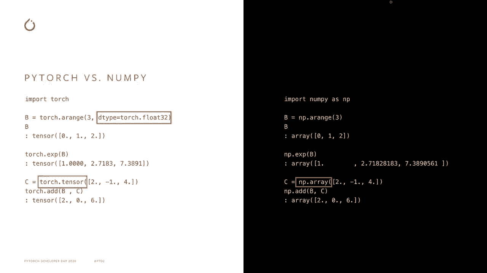
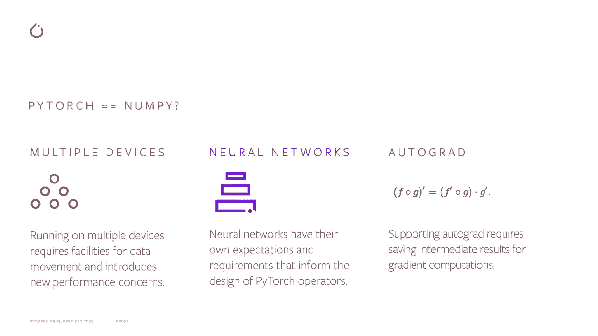
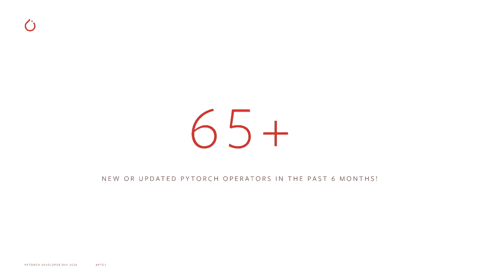
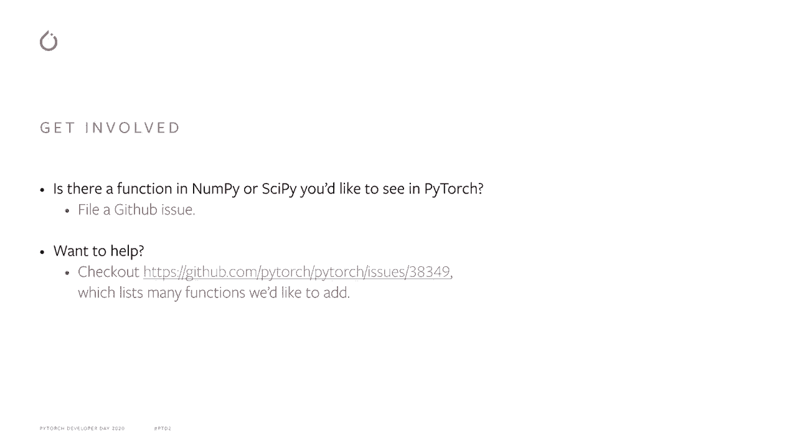

# PyTorch 进阶学习讲座 P2：L2 - 使 PyTorch 更加“与 NumPy 兼容” 🎯


在本节课中，我们将学习 PyTorch 团队如何致力于提升其与 NumPy 的兼容性。我们将探讨兼容性的意义、PyTorch 1.7 版本中的具体改进，以及未来的发展方向。

## 1. PyTorch 兼容 NumPy 的意义 🎯

上一节我们介绍了本课程的主题，本节中我们来看看 PyTorch 兼容 NumPy 的具体含义和目标。

NumPy 是一个流行的用于处理数组（在 PyTorch 中称为张量）的 Python 包。它的 API 广为人知，这使得许多首次使用 PyTorch 的用户感到熟悉。


使 PyTorch 兼容 NumPy，意味着它实现了与 NumPy 相同的功能，并且这些功能在 PyTorch 和 NumPy 中的行为几乎相同。这意味着熟悉 NumPy 的人将已经对 PyTorch 感到熟悉，使其直观易用。这应该让人们花更少的时间查看文档，而更多的时间开发他们的程序。

兼容 NumPy 的 PyTorch 并不是一个新概念。从一开始，PyTorch 就被设计成类似于 NumPy。然而，PyTorch 和 NumPy 之间存在小差异。

以下是两个代码片段的对比，展示了它们的相似性与差异：

```python
# NumPy 示例
import numpy as np
a = np.array([1, 2, 3])
b = np.exp(a)


# PyTorch 示例
import torch
a = torch.tensor([1, 2, 3])
b = torch.exp(a.float())  # 需要明确指定浮点类型
```

在这个片段中，我们看到 PyTorch 对数据类型的要求更为明确，要求在调用指数函数之前，指定张量包含浮点值。

现在，我们可能会认为 Numpy 兼容性的目标是消除 PyTorch 和 NumPy 之间的所有差异。但实际上并非如此。PyTorch 和 NumPy 之间将始终存在差异，因为它们关注不同的场景。



例如：
*   PyTorch 旨在在多个设备上运行，而不仅仅是在 CPU 上。它还可以在 GPU、TPU、移动设备和自定义 ASIC 上运行。
*   PyTorch 旨在运行神经网络。神经网络通常比科学程序以较低的浮点精度运行。
*   PyTorch 旨在支持自动微分（autograd），这有其特定的要求。例如，为了正确计算反向传播，PyTorch 必须保存中间计算结果。

在这种情况下，PyTorch 和 NumPy 之间将永远无法完全相同，但我们仍然可以努力使 PyTorch 尽可能类似于 NumPy。

## 2. PyTorch 1.7 中的兼容性改进 🚀

上一节我们了解了兼容性的目标和意义，本节中我们来看看在 PyTorch 1.7 版本中是如何实现这一目标的，以及为什么这是迄今为止最兼容 NumPy 的版本。

这是因为我们添加了许多 NumPy 中存在但 PyTorch 缺失的新运算符，并且更新了一些在 PyTorch 中行为与 NumPy 中相应运算符不同的旧运算符。



以下是我们在 PyTorch 1.7 中添加或更新的主要功能类别：

*   **快速傅里叶变换（FFT）**：添加了一系列与 FFT 相关的功能。
*   **统计计算**：增加了用于计算统计量的新函数，比如 `torch.quantile`。
*   **张量操作辅助函数**：增加了如 `hstack`, `vstack` 和 `dstack` 等函数。
*   **特殊数学函数**：甚至添加了第一类的零阶修正贝塞尔函数。


我们还更新了一些运算符的行为以匹配 NumPy。一个关键例子是除法运算符。

在 PyTorch 1.7 中，除法现在与 NumPy 和 Python 3 中的除法兼容，总是执行**真除法**（结果为浮点数），而不是有时执行**整数除法**（结果为整数）。

```python
# 在 PyTorch 1.7 及以后版本中
result = torch.tensor([3, 4]) / 2  # 结果为 tensor([1.5000, 2.0000])
```

总的来说，我们在 PyTorch 1.7 中修改了超过 **65** 个运算符，使其行为更贴近 NumPy。

## 3. 未来展望与社区参与 🤝




上一节我们回顾了 PyTorch 1.7 的成就，本节中我们简要谈谈在 PyTorch 1.8 及之后的发展方向。

在 PyTorch 1.8 中，我们预计将增加或修改另外 **38** 个运算符。我们也希望扩展两个新模块：

1.  **`torch.fft` 模块**：包含之前提到的快速傅里叶变换功能。
2.  **`torch.linalg` 模块**：包含线性代数功能。


我们还计划保持与社区的紧密互动。在项目进行时，我们有 **14** 位活跃的社区贡献者，并且此后已经添加了更多新功能。这是一个让你也参与进来的好机会。

以下是参与 PyTorch 开发的方式：

*   **提出需求**：如果你希望在 PyTorch 中看到 NumPy 或 SciPy 的某个功能，请通过在我们的 GitHub 仓库上提交 Issue 来告诉我们。
*   **贡献代码**：如果你想通过贡献一个运算符来参与 PyTorch 开发，请查看相关的 Issue 链接以获取更多信息。




再次感谢我们的社区贡献者。与我们出色的 PyTorch 社区合作，使 PyTorch 更加兼容 NumPy，最终让它更易于使用，这是一次很棒的经历。感谢所有贡献者的帮助和支持。

## 总结 📝


本节课中我们一起学习了 PyTorch 提升 NumPy 兼容性的努力。

我们首先理解了兼容性的意义在于降低学习成本，让熟悉 NumPy 的用户能更快上手 PyTorch。接着，我们详细了解了 PyTorch 1.7 版本通过新增和修改大量运算符（如 FFT 函数、统计函数和修正除法行为）来实现这一目标。最后，我们展望了未来版本的计划，并了解了如何作为社区成员参与其中，共同推动 PyTorch 的发展。


通过不断提升与 NumPy 的兼容性，PyTorch 旨在成为一个更直观、更强大的深度学习框架。