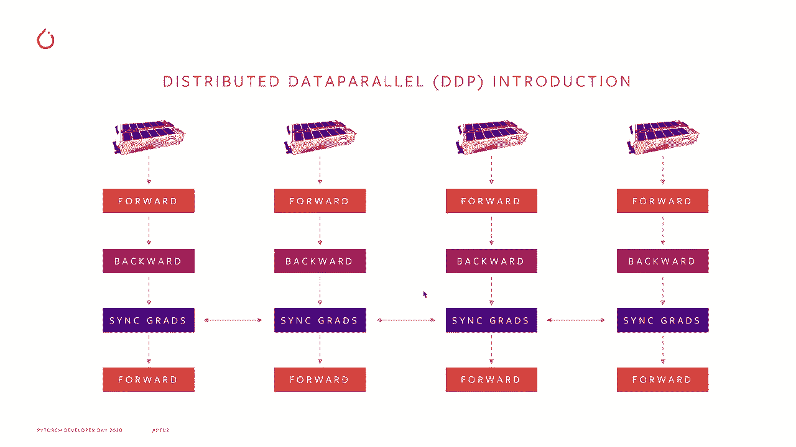
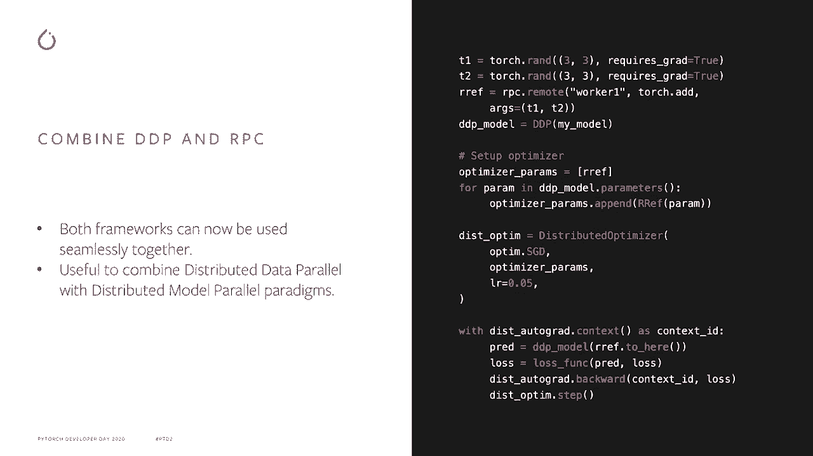
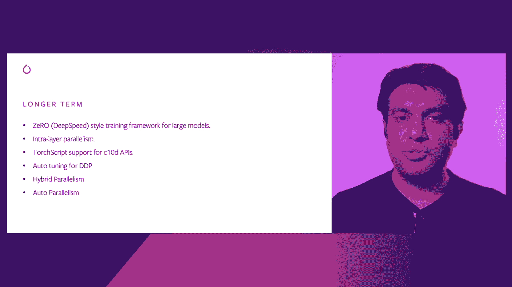

# PyTorch 进阶学习讲座！P5：L5- PyTorch 分布式数据并行 (DDP) 🚀


在本节课中，我们将深入学习 PyTorch 分布式数据并行 (DDP) 的核心概念、最新改进以及未来的发展方向。我们将从 DDP 的基本原理开始，逐步探讨其高级特性和优化方法，最后展望 PyTorch 分布式计算的未来。

---


## 概述

分布式数据并行 (DDP) 是一种用于在多 GPU 上高效训练模型的技术。当模型可以放入单个 GPU 但需要在海量数据上训练时，DDP 通过在多个 GPU 上复制模型，并行执行前向与反向传播，并同步梯度来实现加速。



## DDP 快速回顾 🔄

如果你有一个足够小的模型可以适应单个 GPU，你会使用分布式数据并行在大规模的数据和多个 GPU 上进行训练。你会在多个 GPU 上复制这个模型。

运行前向和后向传播并行处理，得到梯度后，所有的 rank 会进入一个同步梯度操作，以聚合所有的梯度。接着，你会继续其他迭代，进行更多的前向和后向传播以及同步梯度操作。

上一节我们回顾了 DDP 的基本流程，本节中我们来看看 DDP 的一些最新改进和高级功能。

## DDP 的最新改进与功能

### 1. DDP 通信钩子

这个功能允许你完全覆盖同步梯度操作，你可以注册一个 Python 可调用对象，然后根据你想要如何聚合梯度来添加任意逻辑。

以下是通信钩子的一个应用示例：如果你想在通信之前对梯度进行 FP16 压缩，你可以实现一个可调用对象。

```python
def fp16_compress_hook(grad):
    # 压缩梯度为 float16
    compressed_grad = grad.to(torch.float16)
    # 执行全局归约操作（此处为示意，实际由DDP框架调用）
    # ...
    # 解压回 float32
    return compressed_grad.to(torch.float32)
```

你还可以实现更复杂的算法，例如 Gossip SGD 这种非全同步的算法。

### 2. DDP 对不均匀输入的支持

在不同的 rank 中，如果批次数量不均匀，通常会导致一些 rank 提前完成数据处理，从而在同步梯度调用时造成挂起或超时。

为了解决这个问题，我们引入了 `Join` 上下文管理器。它确保提前完成数据处理的 rank 会执行一系列虚假的同步操作，以匹配仍在处理数据的其他 rank，从而保证所有 rank 能够同时完成处理。

```python
with model.join():
    # 你的训练循环代码
    output = model(input)
    loss = criterion(output, target)
    loss.backward()
    optimizer.step()
```



### 3. DDP 的内存优化

传统的 DDP 会为梯度桶创建额外的副本，增加了内存占用。为了避免这种情况，我们引入了 `grad_as_bucket_view` 参数。

当设置 `grad_as_bucket_view=True` 时，参数的 `.grad` 字段将成为梯度桶的一个视图，这样我们就只保留一份梯度副本，显著减少了内存使用。

```python
model = DDP(model, device_ids=[local_rank], grad_as_bucket_view=True)
```

### 4. 将 DDP 与 RPC 结合使用

RPC 框架用于分布式模型并行，而 DDP 用于分布式数据并行。现在我们可以将这两个框架结合起来，形成更复杂的训练范式。

以下是一个结合使用的概念流程：
1.  使用 RPC 将模型的一部分参数放在远程 worker 上。
2.  本地模型用 DDP 包装，进行数据并行。
3.  在前向传播中，通过 RPC 获取远程参数。
4.  计算损失并运行反向传播，DDP 会聚合所有副本的梯度。
5.  优化器步骤会同时更新本地和远程参数。

### 5. DDP 中的动态分桶

DDP 会将参数分到多个桶中以进行高效的全归约通信。它默认假设反向传播的顺序是模型参数的反向顺序。

为了解决因顺序不匹配导致的性能问题，DDP 现在可以记录第一次反向传播中的实际参数顺序，并以最优顺序重建桶，从而更优地调度全归约操作。这项优化在 BERT 和 RoBERTa 等模型中带来了约 3% 到 7% 的性能提升。

### 6. 杂项改进

*   **更好的错误处理**：在 NCCL 后端中添加了更完善的错误处理机制，可通过环境变量配置。
*   **分布式键值存储**：对 `c10d` 中的分布式键值存储 API 进行了规范化，并完善了文档。
*   **Windows 支持**：为 `c10d` 通信库添加了 Windows 系统支持。

了解了 DDP 的当前能力后，接下来让我们看看 PyTorch 分布式计算的未来发展方向。

## PyTorch 分布式的未来工作

### 短期计划 (如 PyTorch 1.8/1.9)

1.  **点对点通信**：为进程组和 `c10d` 添加基于 `send` 和 `recv` 的点对点通信支持。
2.  **RPC 原生 GPU 支持**：使 RPC 框架能够无缝发送和接收 GPU 张量。
3.  **远程模块 API**：为分布式模型并行添加高级 API，方便地将模型部件放置在不同的设备或主机上。
4.  **管道并行性**：集成管道并行训练范式，用于训练无法放入单个 GPU 的超大模型。
5.  **第三方通信库扩展**：扩展 `c10d` 以支持集成第三方的集体通信库。

### 长期愿景

1.  **Zero 风格训练框架**：集成类似 DeepSpeed ZeRO 的训练框架，以支持极其庞大的模型训练。
2.  **张量并行（层内并行）**：支持将单个层（如 Transformer 中的线性层）拆分到多个设备上，这是训练超大模型的关键技术。
3.  **`c10d` 对模型内通信的支持**：支持在模型内部直接调用集体通信操作，实现更灵活的混合并行。
4.  **DDP 自动调优**：自动优化 DDP 的各类参数（如桶大小），用户无需手动为特定环境调优。
5.  **混合并行性**：确保管道并行、模型并行、数据并行和张量并行能够无缝协作，为用户提供灵活的并行策略组合。
6.  **完全自动化**：最终目标是用户只需提供模型和计算资源，系统能自动找出最优的混合并行训练方案。



## 总结


本节课中我们一起学习了 PyTorch 分布式数据并行 (DDP) 的核心机制。我们从基础原理出发，探讨了通信钩子、不均匀输入处理、内存优化、与 RPC 结合以及动态分桶等高级特性。最后，我们展望了 PyTorch 分布式计算在点对点通信、管道并行、自动化混合并行等方面的未来规划。DDP 是进行大规模深度学习训练的强大工具，而 PyTorch 团队正在持续推动其向更高效、更易用、更自动化的方向发展。


> **提示**：关于 PyTorch 分布式的更多详细信息，请查阅官方概述页面，那里汇集了所有相关资源。