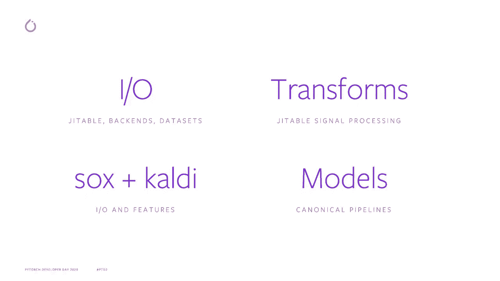
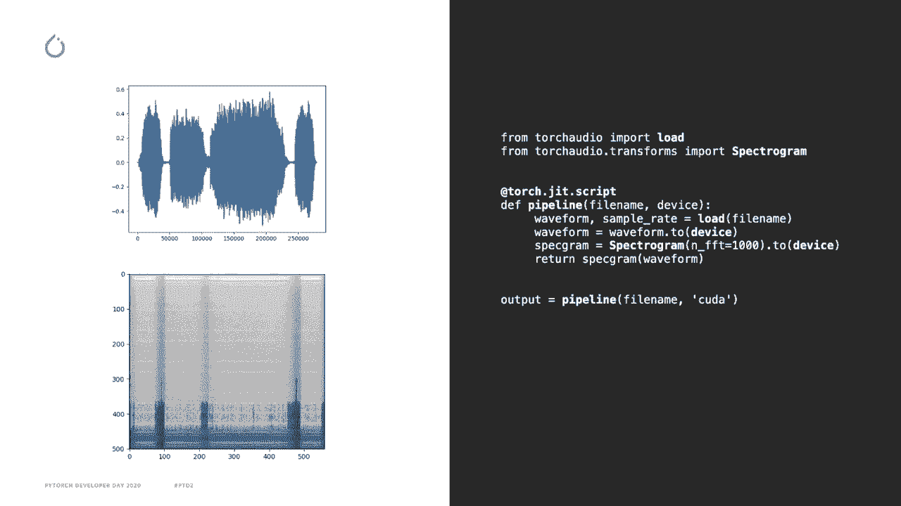
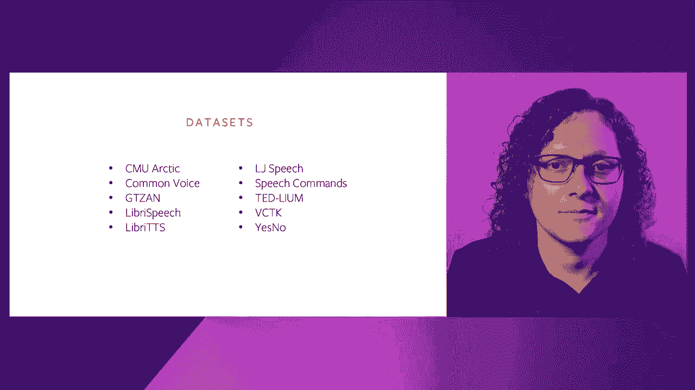
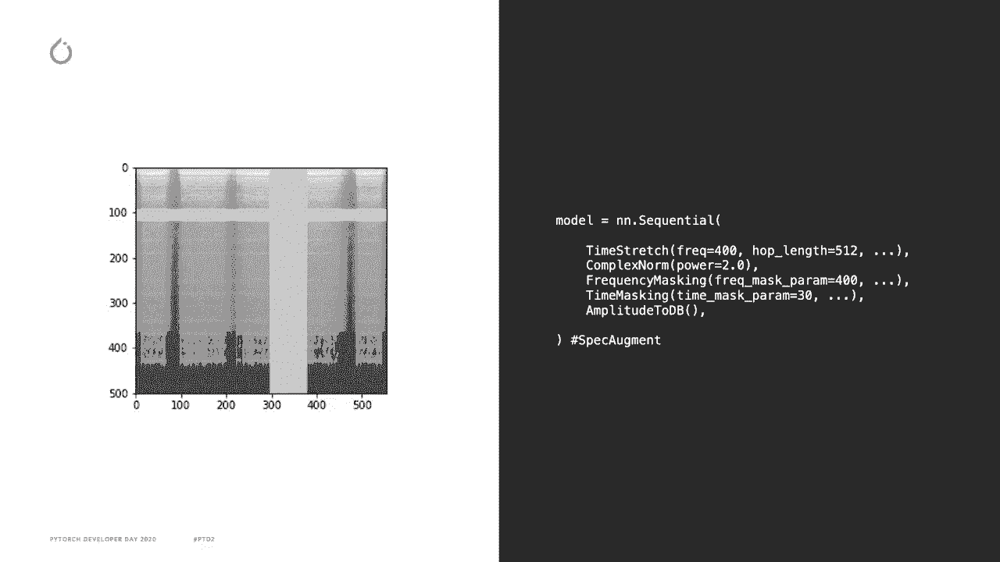
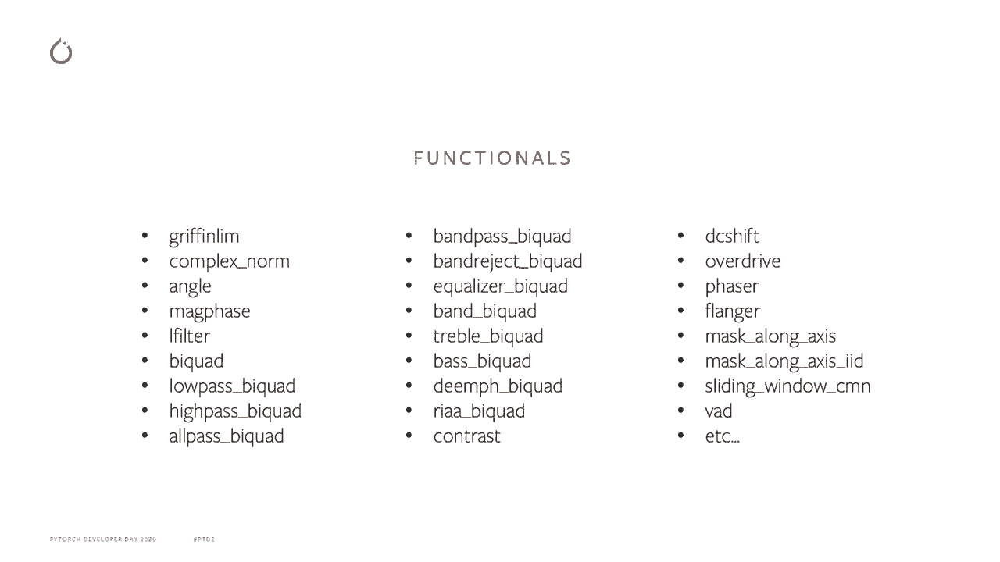
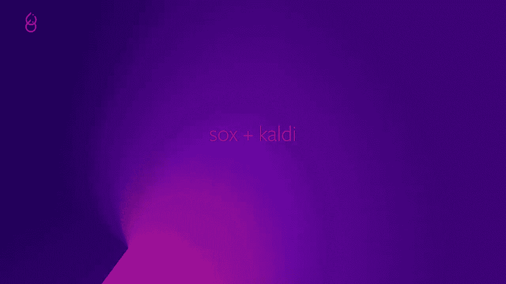
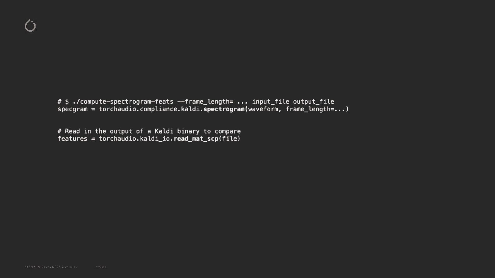
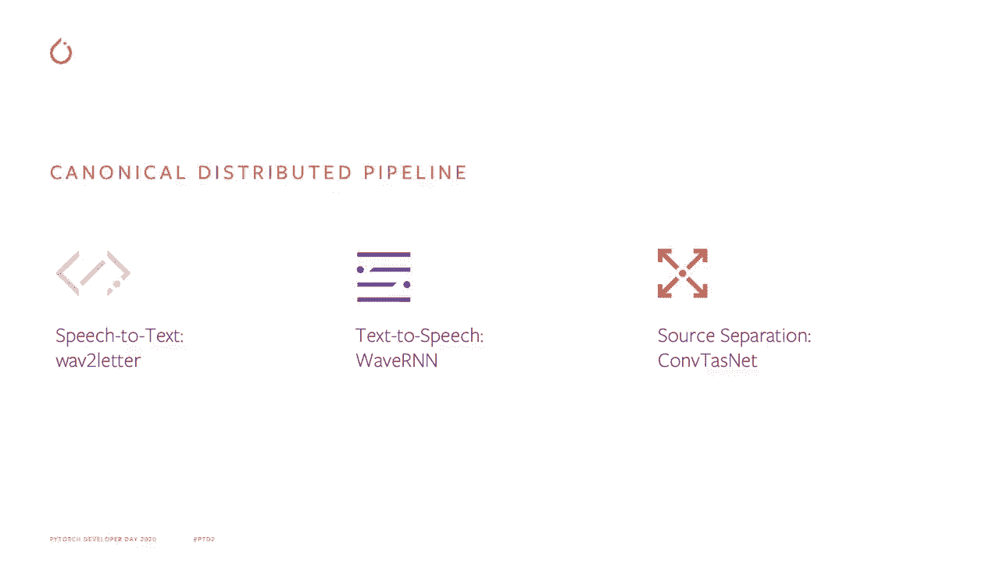
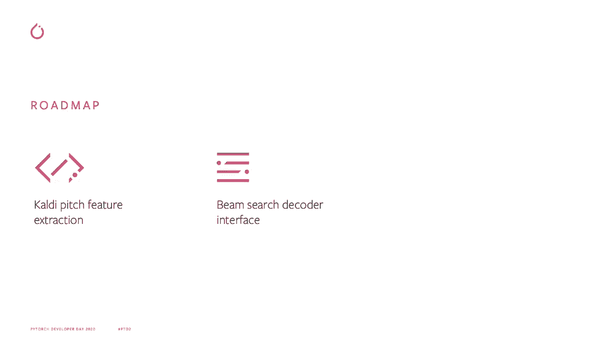

# PyTorch 进阶学习讲座！P6：L6 - TorchAudio 🎼


在本节课中，我们将学习 PyTorch 的音频处理库 **TorchAudio**。我们将了解它的核心功能、设计目标以及如何利用它来构建音频处理管道。

---

## 概述：TorchAudio 的目标与核心功能

TorchAudio 的目标是为研究人员和工程师提供构建模块，帮助他们将音频研究带入生产环境。通过这种方式，TorchAudio 可以加速其他开源生态系统库的开发。

TorchAudio 围绕以下四个核心功能构建：
1.  **I/O 功能**：用于从各种文件格式读取和保存张量。
2.  **变换功能**：用于音频和信号处理的神经网络模块。
3.  **Sox 和 Kaldi 兼容性**：提供与这些流行音频处理库的接口。
4.  **模型分发与示例管道**：提供用于主要任务的预训练模型和标准训练流程。

---

## 核心功能一：I/O 与数据集

上一节我们介绍了 TorchAudio 的整体目标，本节中我们来看看它的第一个核心功能：**I/O 与数据集**。

TorchAudio 的 I/O 功能支持从多种文件格式（如 MP3、WAV、FLAC 和 SPHERE）读取和保存张量。它还可以下载并使用常见的音频数据集，并且在使用 PyTorch 多进程工作时，样本可以并行加载。



以下是一个使用 `torchaudio.load` 函数读取音频文件并应用变换的代码片段：


```python
import torchaudio
import torchaudio.transforms as T

# 从文件读取音频，返回波形张量和采样率
waveform, sample_rate = torchaudio.load('audio_file.wav')

# 配置并实例化一个频谱图变换
spectrogram_transform = T.Spectrogram(n_fft=400)
# 对波形张量应用变换，得到频谱图张量
spectrogram = spectrogram_transform(waveform)
```

特别需要强调的是，变换是标准的 PyTorch 模块，因此可以使用 `torch.jit` 进行编译。同时，加载函数使用 `torch.multiprocessing`，因此也可以在支持 JIT 的地方编译和移植。这使得整个音频处理管道能够轻松地在生产环境中使用 JIT 进行部署。

---



## 核心功能二：音频变换



了解了数据加载后，我们进入下一个核心功能：**音频变换**。

正如之前提到的，这些变换是用纯 PyTorch 编写的，因此天然支持批处理、自动微分和 GPU 加速。每个变换都是一个 `torch.nn.Module`，可以方便地组合在 `torch.nn.Sequential` 包装器中，用于数据增强。

以下是一个组合变换的示例：

```python
from torch import nn

# 定义一个数据增强流水线
augmentation_pipeline = nn.Sequential(
    T.TimeStretch(),          # 随机时间拉伸
    T.ComplexNorm(),          # 计算复数范数（幅度谱）
    T.FrequencyMasking(freq_mask_param=80),  # 随机频率掩蔽
    T.TimeMasking(time_mask_param=80),       # 随机时间掩蔽
    T.AmplitudeToDB()         # 将幅度转换为分贝
)



# 对频谱图应用增强
augmented_spectrogram = augmentation_pipeline(spectrogram)
```

频率掩蔽和时间掩蔽是声学信号处理中常用的技术，用于随机屏蔽频谱图中的一段频率或一段时间，以增加模型的鲁棒性。

TorchAudio 的代码结构分为执行计算的功能函数和作为神经网络模块的变换类，后者包装功能函数并保持其状态。最近添加的新功能包括用于频率和时间掩蔽的 `mask_axis` 参数，以及几个在信号处理或语音活动检测中使用的双通道滤波器。



---

## 核心功能三：Sox 与 Kaldi 兼容性



掌握了内置变换后，我们来看看 TorchAudio 如何与外部强大的音频库集成。

TorchAudio 提供了与 **Sox** 和 **Kaldi** 的接口。

对于 **Sox**，TorchAudio 提供了一种直接在 PyTorch 中以可 TorchScript 化的方式使用其高效音频操作的方法。例如，你可以对 PyTorch 张量直接应用增益、速度、速率变化、填充和修剪等效果。

对于 **Kaldi**，TorchAudio 为 TorchAudio 变换提供了一个包装器，模拟提供给 Kaldi 二进制文件的标志。你还可以通过 TorchAudio 读取 ARK 和 SCP 文件，使得 Kaldi 的处理输出可以在你的 PyTorch 程序中使用。Kaldi 在语音识别社区中使用非常广泛，因此 TorchAudio 旨在简化与它的接口。

---



## 核心功能四：预训练模型与示例管道


最后，我们来了解 TorchAudio 在模型层面的支持。

TorchAudio 添加了针对不同任务的模型和示例训练管道：

*   **语音识别**：添加了使用 LibriSpeech 数据集和 CTC 模型的示例训练管道。
*   **文本到语音**：添加了基于 WaveRNN 模型的 Vocoder，以及使用 LibriTTS 数据集的示例训练管道。
*   **源分离**：添加了 ConvTasNet 模型和一个使用 Wall Street Journal 混合数据集的示例训练管道。

这些预构建的管道为初学者和研究人员提供了强大的起点，可以快速开始特定音频任务的研究和开发。



---


## 未来路线图

在结束之前，有必要了解一下 TorchAudio 未来的发展方向。根据社区需求，开发团队计划包含以下功能：



1.  **高质量音调特征提取**。
2.  **波束搜索解码器接口**，这对语音识别应用尤其有用。
3.  **RNN  transducer 损失函数**。

---

## 总结与资源

本节课中，我们一起学习了 PyTorch 的音频库 **TorchAudio**。我们了解了它的四大核心功能：I/O 与数据集、音频变换、与 Sox/Kaldi 的兼容性，以及预训练模型与示例管道。

要开始使用和了解更多关于 TorchAudio 的信息，你可以访问 [PyTorch 官网](https://pytorch.org/audio)。该网站包含 API 文档、安装说明、教程以及 GitHub 页面的链接。还有一个新的语音命令识别教程可供学习。


TorchAudio 兼容 Linux、macOS、Windows，并支持 Python 3.6 及以上版本，与 PyTorch 本身保持一致。


感谢观看！