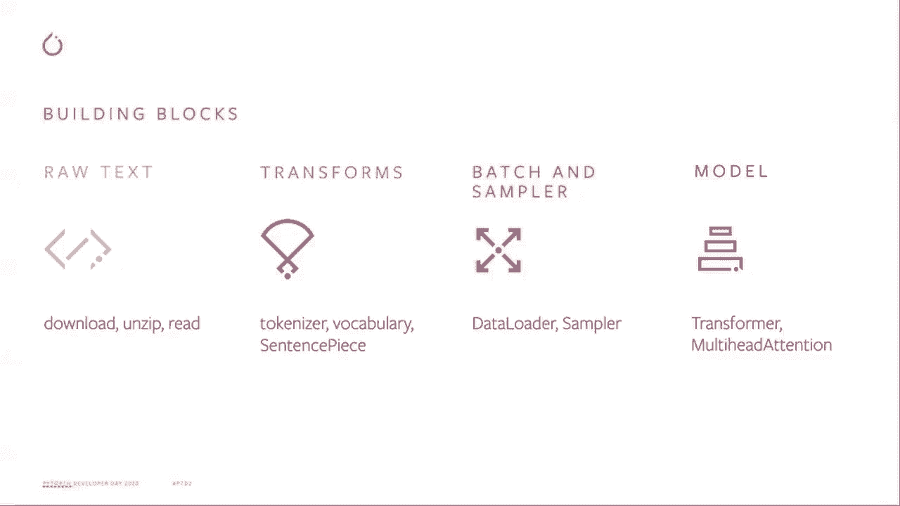
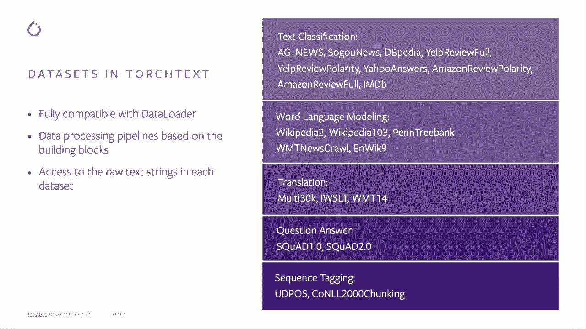
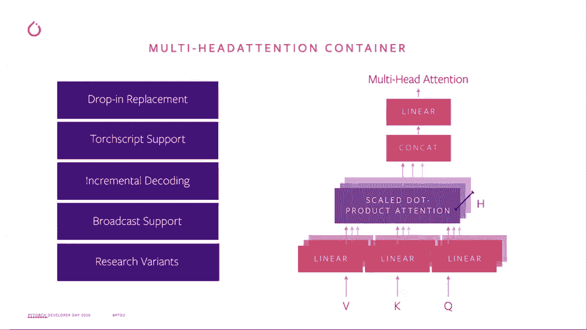
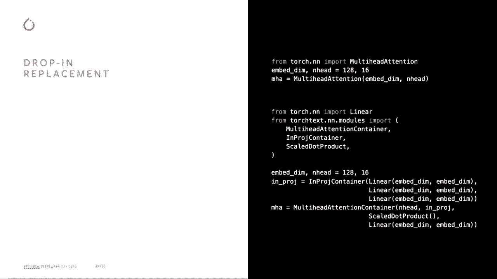
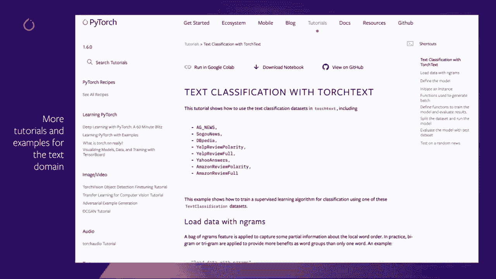

# PyTorch 进阶学习讲座！P7：L7 - TorchText 🎼


在本节课中，我们将学习 PyTorch 文本处理库 TorchText 在 2020 年的主要更新。我们将了解 TorchText 如何加速 NLP 研究、支持从研究到生产的转化，并探索其提供的新数据集、数据处理管道以及与 NLP 相关的新模块。

---


## 为什么需要 TorchText？🤔

我们希望 PyTorch 在文本领域有所作为，主要基于三个目标。

首先，我们希望加速 NLP 研究，并提供可重用、正交且正确的构建模块。我们将与内部团队和外部开源社区合作，构建一个更完善的文本处理管道，以同时支持 Facebook 的产品和外部研究。

其次，我们希望提供一个将研究转化为生产的解决方案。这意味着将这些管道和模块与 PyTorch 的广泛能力（如 TorchScript、量化和分布式训练）集成，为大多数 NLP 管道从研究到生产的过渡提供更好支持。

第三，我们希望与社区互动，探索新技术。NLP 领域发展迅速，PyTorch 团队希望建立良好的技术理解并促成新的研究合作。

基于这些目标，TorchText 提供了便捷的数据集访问、文本处理管道和一些与 NLP 相关的核心模块。

---

## 全新的数据集 📊



在 TorchText 中，我们引入了新的数据集，并重写了一些现有数据集。这些更新将在夜间版本中作为原型发布，并很快正式推出。

这些新数据集与 PyTorch 的 `DataLoader` 完全兼容。用户能够灵活地构建数据处理管道，并使用标准的分词器（Tokenizer）和词汇表（Vocabulary）模块。

以下是 Beta 版本中可用的新数据集列表：
*   多个新的文本分类数据集。
*   重写的问答（QA）数据集，支持更灵活的格式。
*   新的语言建模数据集。

---



## 高效的数据处理管道 ⚙️

上一节我们介绍了新数据集，本节中我们来看看如何处理这些原始数据，将其转换为可用于训练模型的张量。

我们提供了性能经过改进的数据处理管道，其中部分利用了 C++ 扩展。我们的目标是让向生产环境的迁移变得更加容易。

以下是使用 PyTorch 和 TorchText 的端到端管道概述：
1.  **原始数据读取**：读取原始字符串数据。
2.  **字段转换**：应用分词器、构建词汇表、进行向量化等转换。
3.  **批处理与采样**：数据被送入 `DataLoader` 和 `Sampler`，生成训练所需的批次（Batch）。

我们正努力将这些步骤重写为独立的、正交的构建模块。通过 C++ 扩展，我们能够支持所有这些转换的 GPU 加速，这为生产环境提供了更好的支持。

---

## 全新的 NLP 模块：多头注意力 🧠

现在，我们进入与 NLP 相关的模块部分。我们在 TorchText 中发布了新的 `MultiheadAttentionContainer` 模块。

除了与 PyTorch 原生 `nn.MultiheadAttention` 一样支持 dropout 外，我们的新容器还兼容 TorchScript。根据用户反馈，我们还增加了对增量解码和广播（broadcasting）的支持。

这个新容器的设计理念，是为用户提供一个在 Transformer 架构下进行新颖研究的灵活工具。Transformer 架构在文本、音频和视觉领域都非常流行，我们希望提供一个高度灵活的模块，让用户可以轻松尝试不同的想法。

以下是如何将 PyTorch 原生的多头注意力切换到 TorchText 新容器的示例代码：

```python
# 假设原来使用 PyTorch 的 MultiheadAttention
# attention = nn.MultiheadAttention(embed_dim, num_heads)



# 切换到 TorchText 的 MultiheadAttentionContainer
from torchtext.nn import MultiheadAttentionContainer
attention = MultiheadAttentionContainer(nhead=num_heads,
                                        embed_dim=embed_dim,
                                        attention_module=my_custom_attention_function)
```

仅通过这几行代码的更改，用户就能更灵活地尝试与多头注意力概念相结合的不同自定义组件，例如自定义的投影容器、注意力计算函数等。

---



## 教程与总结 📚

最后，在我们的官方网站上，有几个与文本相关的教程，包括一个展示如何使用新数据集进行文本分类的教程。请查阅这些教程以了解如何构建 NLP 管道。请注意，我们也会更新教程来展示如何构建序列到序列（Seq2Seq）的管道。

---



### 本节课总结


在本节课中，我们一起学习了 TorchText 在 2020 年的核心更新：
1.  了解了 TorchText 致力于**加速研究**、**促进生产转化**和**社区协作**的三大目标。
2.  认识了全新的、与 `DataLoader` 兼容的**数据集**。
3.  探索了基于正交构建模块、支持 GPU 加速的**高效数据处理管道**。
4.  学习了全新的、高度灵活的 **`MultiheadAttentionContainer` 模块**，它支持自定义组件并与 TorchScript 兼容。
5.  知道了可以查阅官方**教程**来获取构建完整 NLP 管道的实践指导。


希望您能享受今年的 PyTorch 开发者日，我们下次再见！