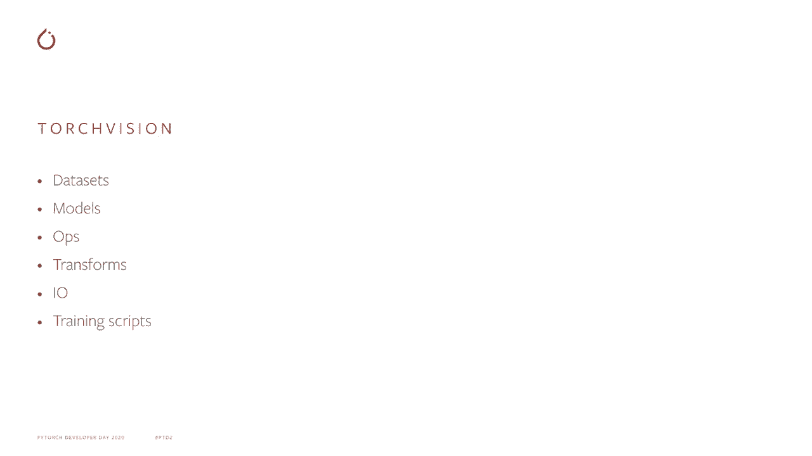
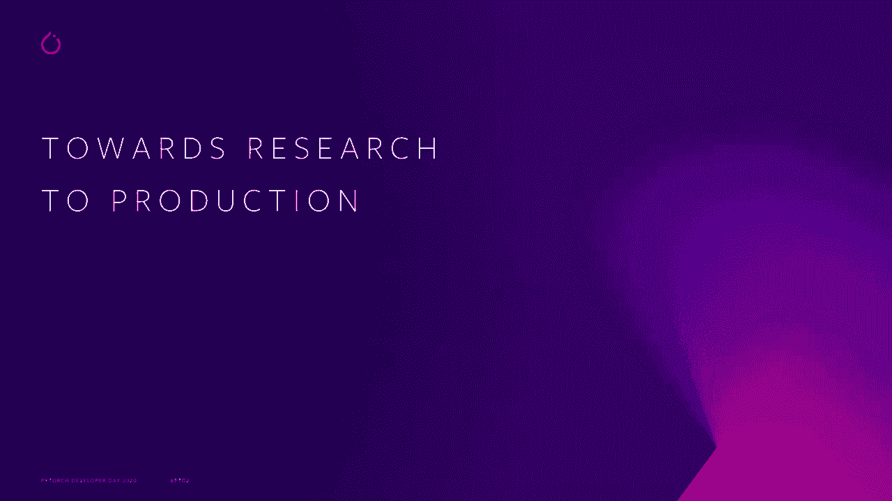
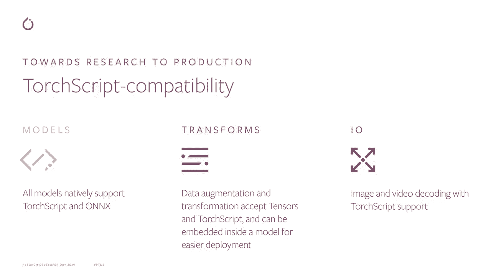
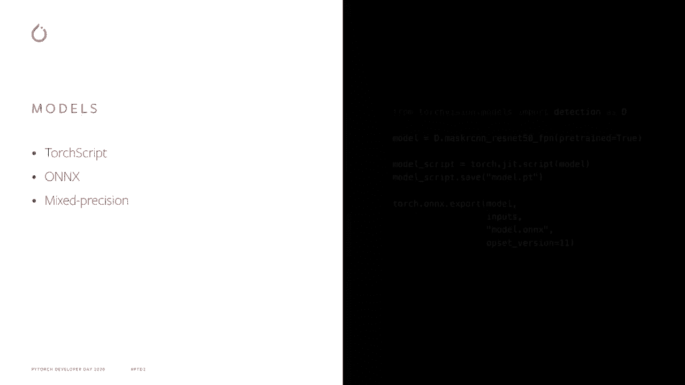
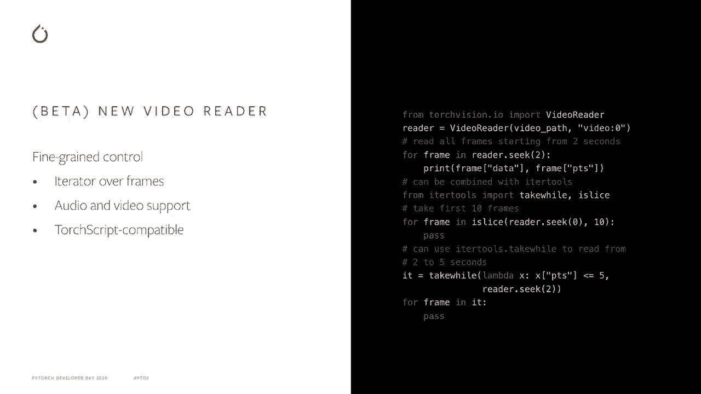
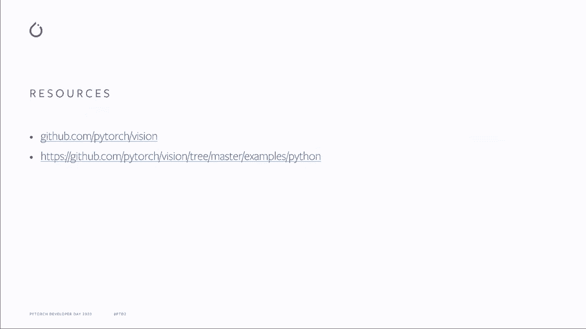

# PyTorch 进阶学习讲座！P8：L8 - TorchVision 🎯

在本节课中，我们将学习 TorchVision 库。TorchVision 是 PyTorch 生态系统中的一个重要组成部分，专门用于简化计算机视觉任务。我们将了解它的核心功能、最新特性以及如何利用它从研究快速过渡到生产环境。

---

## 什么是 TorchVision？🤔

TorchVision 是一个旨在促进计算机视觉研究和实验的库。它扩展了 PyTorch，增加了对计算机视觉非常有用的特定功能，同时保持了 PyTorch 核心库的精简和专注。

TorchVision 通过提供多个构建模块，使你能够快速启动一个新的计算机视觉项目。

以下是 TorchVision 提供的主要构建模块：

*   **数据集**：提供常见数据集，涵盖分类、目标检测等主流视觉任务。
*   **模型**：提供分类、检测等任务的参考模型实现。
*   **操作符**：包含专门针对计算机视觉模型的张量操作符，以及用于简化数据增强管道创建的数据转换操作符。
*   **数据读取**：提供高效的图像和视频读取原语。
*   **参考脚本**：包含展示如何训练视觉模型的参考训练脚本。

---

## 从研究到生产：TorchVision 的改进 🚀

上一节我们介绍了 TorchVision 的基本构成，本节中我们来看看它如何帮助简化从研究到生产的路径。

PyTorch 通过 Torch Script 实现这一路径。Torch Script 是 PyTorch 程序的中间表示，可以导出并在 C++ 环境中运行。每个深度学习管道的核心都依赖于其模型。

通过与 Torch Script 和 ONNX 团队密切合作，我们已经使所有 TorchVision 模型原生支持 Torch Script 和 ONNX 导出。

得益于预训练模型和 TorchVision 工具，你可以快速构建一个分类器。但在将 Python 代码嵌入 C++ 运行时，模型只是故事的一部分。你常常需要将输入数据准备成与模型兼容的格式。

过去，TorchVision 依赖 Pillow 进行大多数数据转换，因此将应用程序迁移到 C++ 需要以兼容 C++ 的方式重新实现这些转换。

现在，TorchVision 的转换可以直接在 Torch 张量上工作，并且可以导出到 Torch Script，因此你只需在 Python 中实现一次转换。

最后，TorchVision 现在提供用于图像和视频解码的原生 I/O 功能，使得完整的从原始数据到模型的生产管道可以从 Python 转换到 C++。

---

## 核心新功能详解 🔍

现在让我们更详细地看看这些新功能。

### 1. 模型导出与混合精度

所有 TorchVision 模型都原生支持 Torch Script 和 ONNX 导出，因此可以用几行代码将它们导出到 C++。

此外，所有模型都支持混合精度训练和推理，这可以带来更快的运行速度和更低的内存占用。

### 2. 张量友好的数据转换

TorchVision 的转换操作已从 `nn.Module` 继承，并接受与 Torch Script 兼容的 Torch 张量作为输入。

这为数据增强管道带来了几个好处：
*   现成的 GPU 支持。
*   支持视频用例，通过高效的帧批量转换。
*   可以将转换与模型一起在 C++ 环境中导出。

### 3. 原生图像 I/O

TorchVision 现在提供 JPEG 和 PNG 格式的图像读取和写入操作符，支持原生 Torch Script。

你可以将本地图像路径直接读取到 Torch 张量，或者将操作分解为：先读取文件的原始字节并返回为 `UInt8` 张量，再将原始数据解码为图像张量。

由于原生 Torch Script 支持，图像解码可以与你的模型一起嵌入，实现端到端的导出体验。

### 4. 视频读取 API（Beta）

TorchVision 提供了一个基于帧的视频读取 API，支持音频和视频，并且与 Torch Script 兼容。

视频读取器是一个迭代器，可以与其他工具结合使用，实现高级视频读取模式，例如：
*   在指定时间戳后读取接下来的 10 帧。
*   跳过视频的每隔一帧。
*   读取两个时间戳之间的所有帧。

这个新的视频读取 API 目前作为 Beta 版本发布，其 API 可能会根据用户反馈进行调整。

---

## 获取示例与参与贡献 💡

我们在 GitHub 上的示例库中提供了一些新功能的附加示例。你可以找到关于视频读取 API 及其转换的 Jupyter Notebook。

在 TorchVision 项目中，我们欢迎任何贡献。如果你发现错误，或者有改进建议或新功能请求，请通过 TorchVision GitHub 页面的问题跟踪器告诉我们，或者直接提交拉取请求。

---

## 总结 📝

本节课中，我们一起学习了 TorchVision 库。我们了解了它是一个用于促进计算机视觉研究和实验的 PyTorch 扩展库，提供了数据集、模型、转换和 I/O 等核心构建模块。

我们重点探讨了 TorchVision 如何通过支持模型和转换的 Torch Script 导出、提供原生图像/视频 I/O 操作来简化从研究到生产的路径。这些特性使得开发者能够构建出可以利用 PyTorch 强大能力的出色新应用。

希望 TorchVision 能帮助你在计算机视觉的旅程中快速启航！