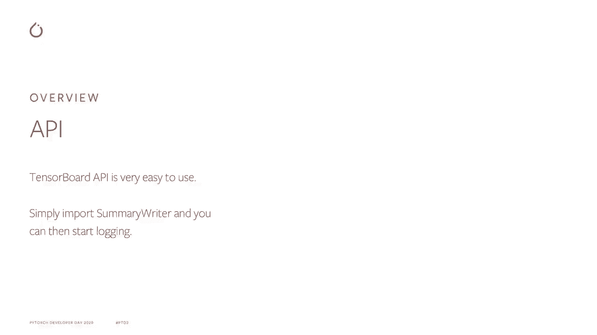
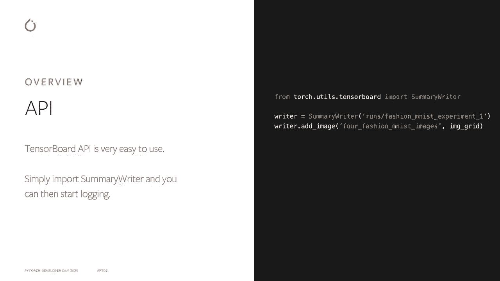
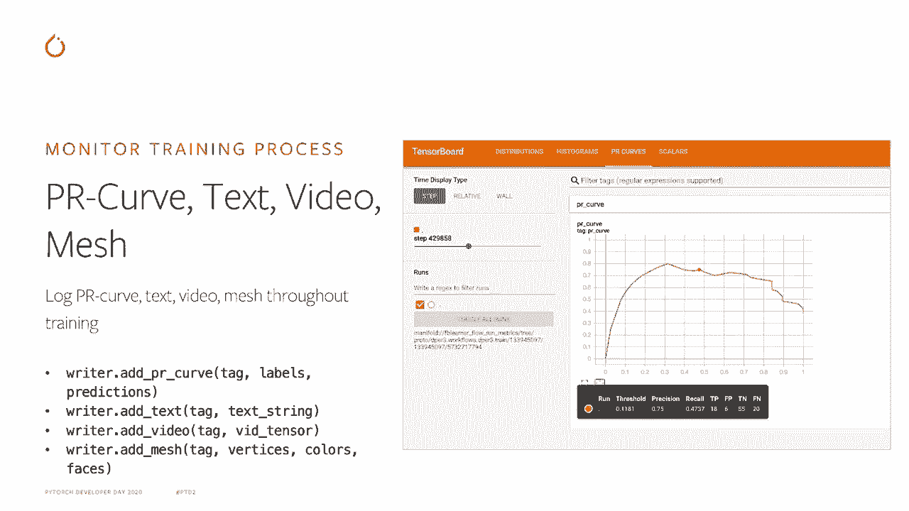
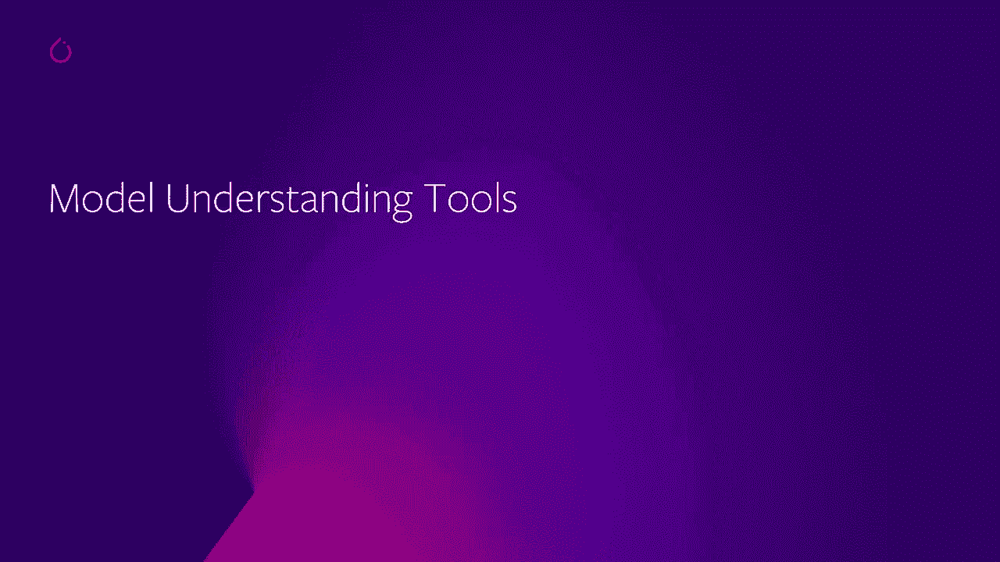
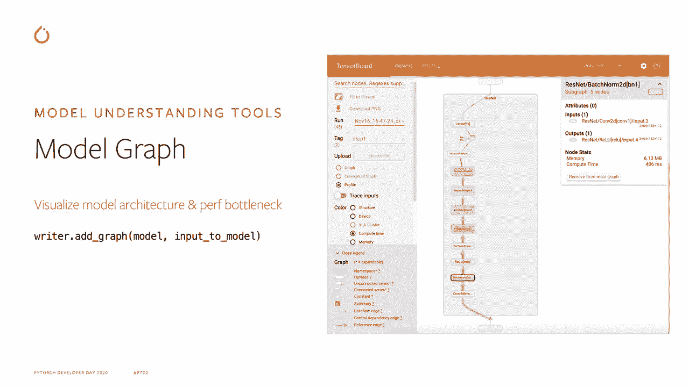
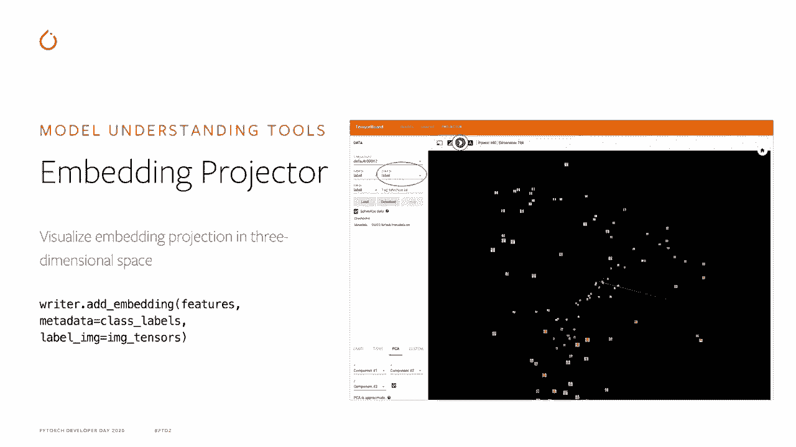
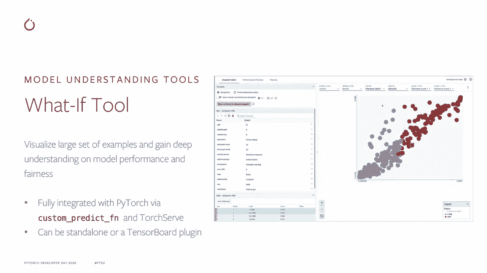
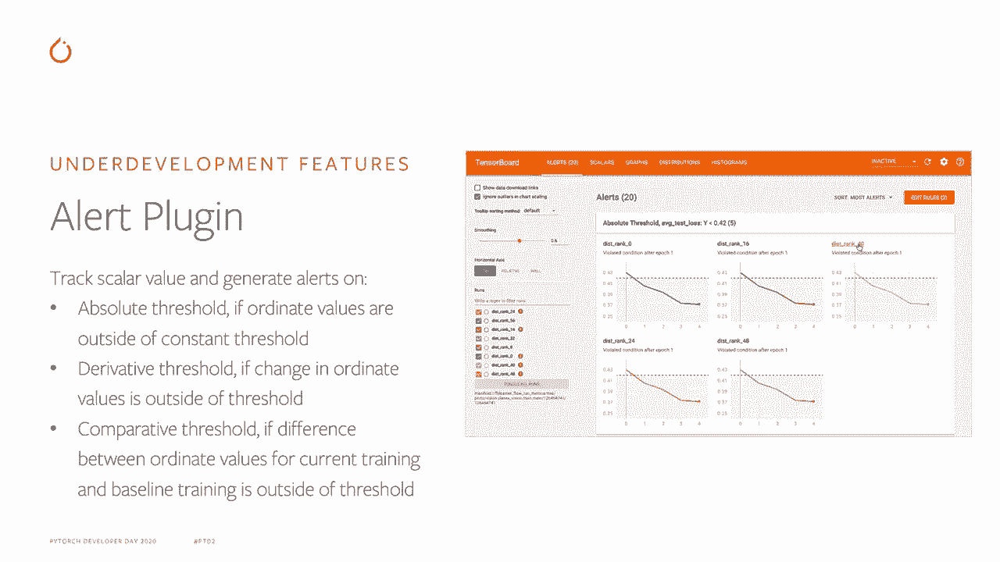

# PyTorch进阶学习讲座！P10：L10- 使用TensorBoard进行可视化 📊


在本节课中，我们将学习如何使用TensorBoard来可视化PyTorch模型。课程将首先概述TensorBoard API，然后深入探讨用于监控训练过程的API，以及用于模型监控的工具API。最后，我们将简要了解一些正在开发中的新功能。

## 概述与API介绍 📋

自PyTorch 1.2版本以来，PyTorch已原生支持TensorBoard。我们与Google TensorBoard团队保持着密切合作，因此PyTorch中的TensorBoard API非常易于使用。


要开始使用，你只需初始化一个`SummaryWriter`对象，并传入一个表示日志存储目录的路径。

```python
from torch.utils.tensorboard import SummaryWriter
writer = SummaryWriter(‘log_dir’)
```

这个目录可以是本地路径，也可以是远程路径，例如Amazon S3。之后，你就可以使用`add_scalar`或`add_image`等API来记录数据。




## 监控训练过程 📈

最常见的用例是监控模型的训练过程。这包括使用Scalar API来监控模型的学习曲线、每秒查询数（QPS）或CPU使用率在整个训练过程中的变化。



以下是记录标量数据的方法：

```python
writer.add_scalar(‘Loss/train’, loss_value, global_step)
```


你可以通过使用多线图或边距图API，在同一张图表中可视化多个标量序列。直方图API则允许我们在训练过程中可视化张量的直方图和分布，例如模型权重、激活值或梯度。

记录直方图的方法如下：

```python
writer.add_histogram(‘gradients’, gradients, global_step)
```

张量的直方图和分布将自动计算并记录到TensorBoard。

图像API允许我们可视化训练样本图像、目标检测框，或者在训练过程中由Matplotlib或PIL生成的图像。例如，你可以将模型预测结果通过Matplotlib转换为图像，然后使用图像API进行记录。



```python
writer.add_image(‘predictions’, img_tensor, global_step)
```



TensorBoard还提供了其他多种API，用于记录模型的PR曲线、文本、视频、网格等数据。

## 模型与监控工具 🔧



上一节我们介绍了如何记录训练数据，本节中我们来看看TensorBoard提供的模型监控工具。



图形插件允许我们可视化模型架构并识别性能瓶颈。你只需传入一个PyTorch模型和一个输入张量，模型的计算图就会自动生成并记录到TensorBoard。

```python
writer.add_graph(model, input_tensor)
```

嵌入投影插件允许我们在三维空间中可视化嵌入向量的分布。

HParams插件允许我们可视化模型超参数与性能指标之间的关联，这有助于我们识别最有潜力的超参数组合。例如，我们可以使用平行坐标图来分析表现最佳的几次运行，并找出它们在超参数设置上的共同特征。

What-If工具允许我们可视化大量数据样本，并按照某些特征值或模型预测值对其进行分组。这有助于深入理解模型在不同数据子集上的性能或公平性。该工具通过自定义预测函数与TorchServe和PyTorch完全集成，可以作为独立应用程序或TensorBoard插件使用。



## 未来展望 🚀


最后一部分将介绍我们目前正在开发并计划在不久的将来引入开源社区的一些功能。

Profiler插件将启用自动模型性能分析和优化建议。它还将提供每个操作和GPU内核的详细性能视图。

Plotly插件将使我们能够在TensorBoard中原生可视化Plotly图形，提供比通过图像API转换并记录更好的交互式用户体验。

警报插件允许我们监控训练过程中的特定模型指标。当这些指标超出或低于预设阈值时，可以自动触发警报。这些阈值可以是绝对值、导数值或比较值。



## 总结 📝

本节课中，我们一起学习了如何使用TensorBoard来可视化PyTorch模型。我们从基础的API介绍开始，学习了如何记录标量、直方图和图像数据以监控训练过程。接着，我们探讨了用于可视化模型结构、嵌入向量和超参数分析的高级工具。最后，我们展望了即将推出的新功能，如性能分析器和交互式图表支持。


要了解更多关于PyTorch TensorBoard的信息，请访问[PyTorch官方网站](https://pytorch.org)并查阅TensorBoard相关文档和教程。