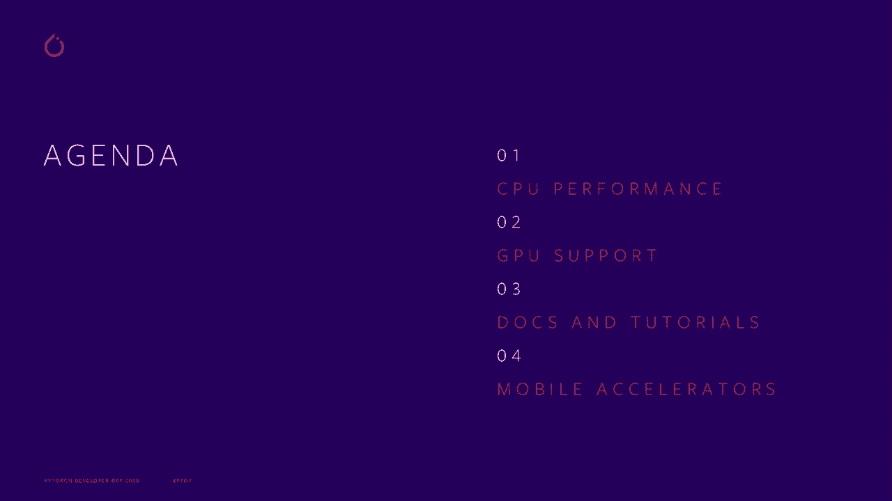
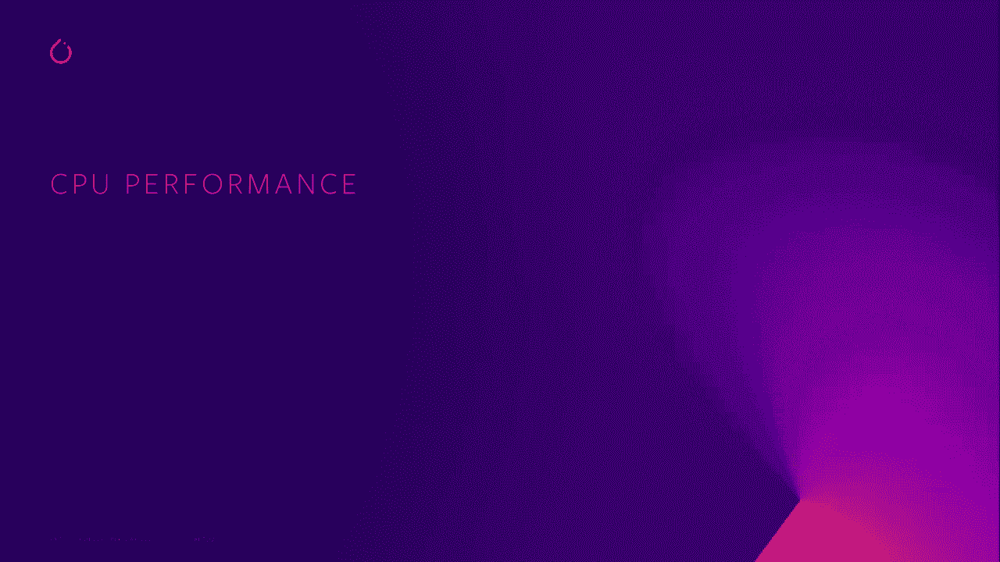
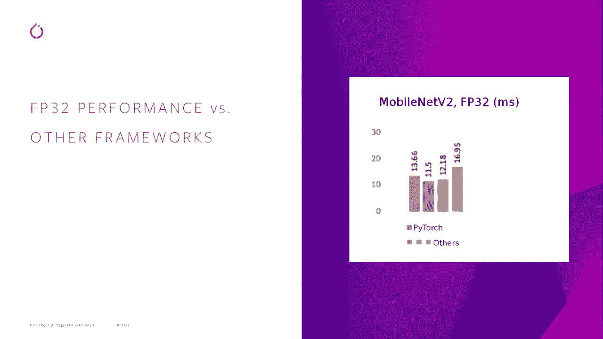
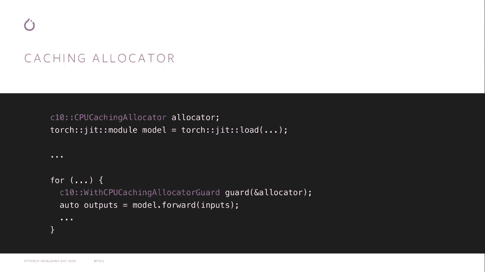
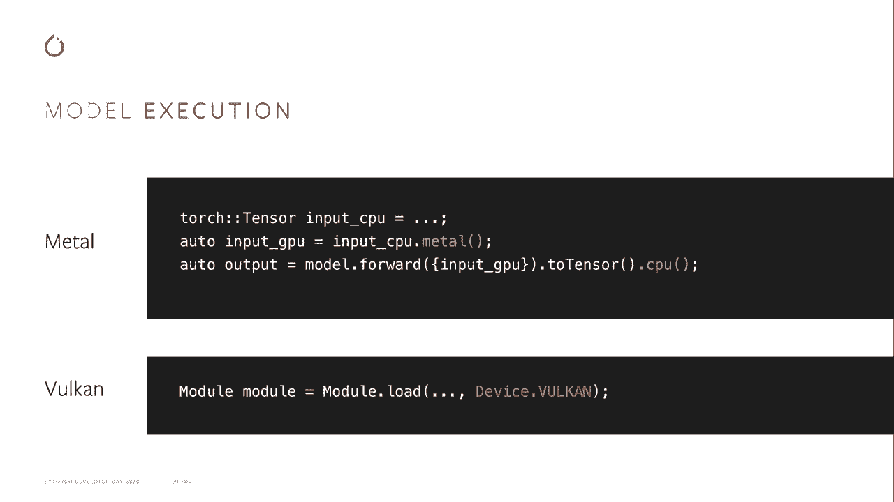
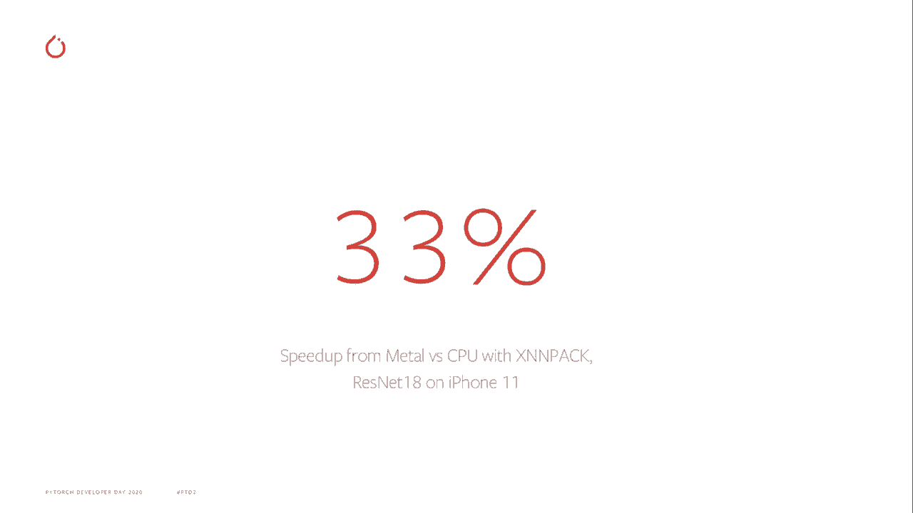
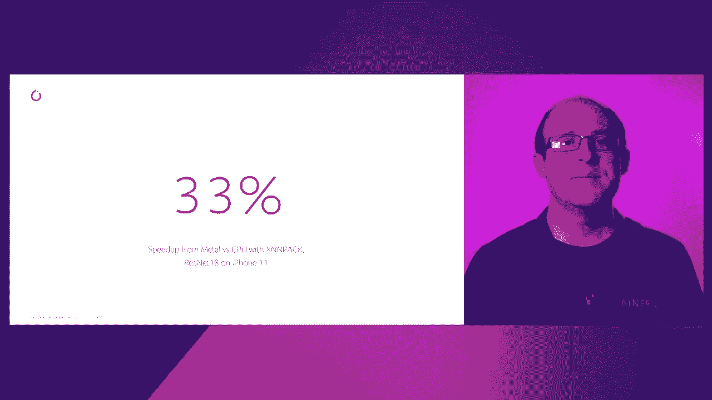
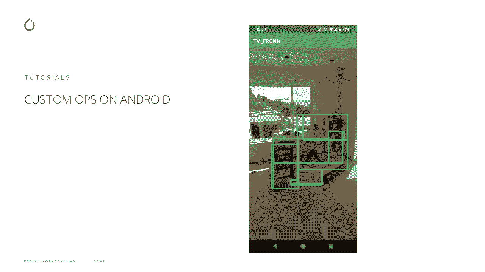

# PyTorch进阶学习讲座！P13：L13- PyTorch移动版 🚀


在本节课中，我们将学习PyTorch移动版（PyTorch Mobile）在过去一年中的主要改进。内容包括CPU性能优化、GPU原型支持、扩展的文档与教程，以及移动推理加速器的相关信息。



---



## CPU性能优化 ⚡

上一节我们介绍了课程概述，本节中我们来看看CPU性能优化。CPU是移动设备上最普遍且灵活的计算单元，因此CPU性能一直是PyTorch Mobile的高优先级任务。

在过去一年中，我们进行了多项改进。以MobileNet V2模型的浮点版本为基准，PyTorch Mobile从1.3版本到1.7版本，推理时间从约250毫秒缩短至15毫秒，实现了超过10倍的性能提升。

与其他移动推理框架相比，PyTorch Mobile目前处于中游水平。考虑到移动设备的限制比服务器更多，我们无法运行所有复杂的编译器优化机制来获取最佳性能。



因此，需要进行一些前期准备工作以确保模型尽可能快地运行。

以下是获取最佳性能的步骤：

1.  **使用优化函数**：我们已将优化步骤打包成一个名为 `optimize_for_mobile` 的单一函数。调用此函数可对模型执行批量归一化折叠、权重预打包和模型冻结等优化。
    ```python
    import torch
    from torch.utils.mobile_optimizer import optimize_for_mobile

    optimized_model = optimize_for_mobile(traced_model)
    torch.jit.save(optimized_model, "optimized_model.pt")
    ```
2.  **使用缓存分配器**：我们发布了用于内存管理的缓存分配器。默认情况下，PyTorch在张量使用完毕后会立即释放其内存缓冲区。对于需要重复运行相同模型的场景，这会造成频繁分配和释放的开销。缓存分配器允许更明确地控制内存策略，通常可带来5%到20%的性能提升，但会增加推理时的内存占用。
    ```cpp
    // 示例：在C++ API中使用缓存分配器
    auto allocator = std::make_shared<torch::mobile::DefaultCPUAllocator>();
    torch::jit::Module module = torch::jit::load("model.pt");
    // 在推理循环前设置分配器
    {
        torch::autograd::AutoGradMode guard(false);
        torch::AutoNonVariableTypeMode non_var_type_mode(true);
        // 使用分配器运行推理
    }
    ```

---

## GPU原型支持 🎮

上一节我们探讨了CPU优化，本节中我们来看看GPU支持。GPU不仅用于服务器端机器学习，几乎所有移动设备也配备了GPU，可用于加速设备端推理。

在高端设备上，GPU能显著提升性能。即使在低端设备上，使用GPU也能降低功耗，并释放CPU以处理其他密集型任务。



目前，我们为iOS和Android提供了GPU推理的原型支持。

以下是使用GPU后端的方法：

1.  **模型准备**：使用之前提到的 `optimize_for_mobile` 函数，并通过参数指定目标后端（如Metal或Vulkan）。
    ```python
    # 为Metal（iOS）优化
    optimized_model_metal = optimize_for_mobile(traced_model, backend='metal')
    # 为Vulkan（Android）优化
    optimized_model_vulkan = optimize_for_mobile(traced_model, backend='vulkan')
    ```
2.  **iOS (Metal) 推理步骤**：运行模型时，需要将输入张量移至GPU，并在推理完成后将结果移回CPU。
    ```python
    # 假设 `input_tensor` 是CPU上的输入
    input_on_gpu = input_tensor.metal()  # 移至Metal设备
    output_on_gpu = model(input_on_gpu)
    output_on_cpu = output_on_gpu.cpu()  # 移回CPU
    ```
3.  **Android (Vulkan) 推理步骤**：
    *   **C++ API**：与Metal类似，需要手动移动数据。
    *   **Java API**：在加载模型时指定设备，API会自动处理数据移动。
    ```java
    // Java API 示例
    Module module = Module.load(assetFilePath(this, "model.pt"), Device.VULKAN);
    // 输入输出会在Vulkan设备上自动处理
    ```

性能提升因设备和模型而异。例如，在iPhone 11上，将ResNet 18模型从优化后的CPU实现切换到Metal后端，性能提升了33%。

---

## 扩展的文档与教程 📚

上一节我们介绍了GPU支持，本节中我们来看看新发布的文档与教程资源。提升PyTorch Mobile的易用性和可访问性是我们的首要任务，而完善的文档是实现这一目标的关键。

我们发布了一系列新的教程和文档，旨在帮助开发者更好地使用和优化PyTorch Mobile。

以下是可用的核心资源列表：





1.  **PyTorch移动性能秘籍**：这是一个关于性能技巧的一站式资源，涵盖了操作符融合、模型量化、选择最佳内存格式、内存重用以及如何设置基准测试等内容。
2.  **Vulkan与Metal教程**：这些教程深入介绍了如何正确使用相应的API来访问GPU进行加速推理。
3.  **演示应用程序**：我们提供了适用于Android和iOS的演示应用，展示了如何将PyTorch Mobile集成到实际应用中，功能涵盖图像分割、机器翻译等。
4.  **Android自定义操作符教程**：该教程指导开发者如何在Android应用中使用自定义操作符。以前这需要配置Android NDK以使用外部依赖，过程较为复杂，本教程简化了这一流程。例如，演示了如何使用ROI对齐操作符在应用中运行Faster R-CNN目标检测模型。

---

## 移动推理加速器 🚄



我们今天发布的最后一项内容是**移动推理加速器**的访问。这项技术将GPU推理的优势提升到了新的水平。它能够进一步优化模型在移动设备上的执行效率。

关于这项发布的更多细节，将由下一位演讲者进行详细介绍。您可以访问PyTorch官方网站获取更多资源和教程链接。

在官网上，您可以找到入门教程、深入教程以及“秘籍”页面，其中包含了关于如何使用特定功能的小技巧和提示。

---



## 总结

本节课中我们一起学习了PyTorch移动版（PyTorch Mobile）的最新进展。

我们首先了解了如何通过 `optimize_for_mobile` 函数和缓存分配器来大幅提升CPU推理性能。接着，我们探讨了为iOS（Metal）和Android（Vulkan）提供的GPU原型支持，以及如何使用它们来进一步加速推理并降低功耗。然后，我们介绍了新发布的扩展文档与教程集，包括性能秘籍、GPU教程、演示应用和自定义操作符指南，这些资源将帮助开发者更高效地使用PyTorch Mobile。最后，我们简要提及了移动推理加速器的发布。


希望这些改进和资源能帮助您在移动设备上更愉快、更高效地使用PyTorch。