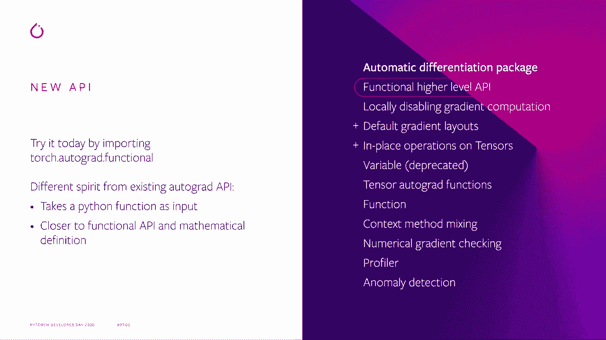
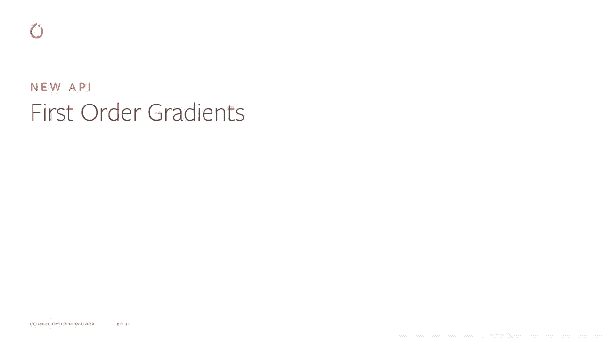
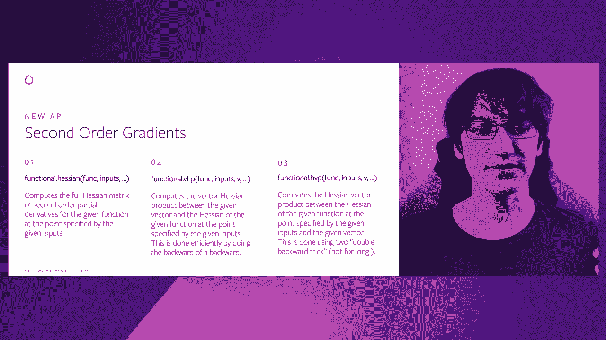
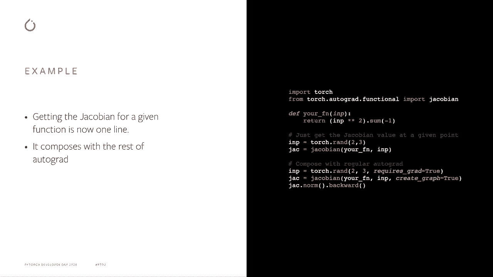
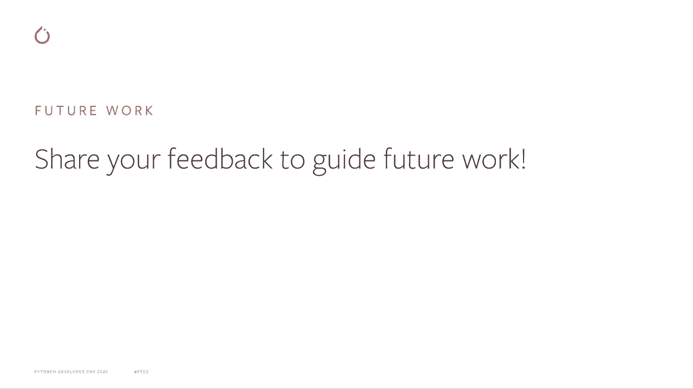

# PyTorch进阶学习讲座！P3：L3 - Autograd的高级API 🚀


在本节课中，我们将要学习PyTorch Autograd子系统新增的高级API。这个新API旨在为更广泛的用户（不仅仅是神经网络开发者）提供一个通用、高效且易于使用的自动微分接口。

---

## 动机与背景 🤔

上一节我们介绍了Autograd的基本概念。本节中我们来看看为什么需要一个新的高级API。

当前的Autograd API存在一些局限性。`backward`函数主要面向Torch和NumPy用户，它会填充所有张量的`.grad`字段，并且与我们在序列到序列模型中使用的状态和优化器紧密耦合。类似地，`autograd.grad`函数则更倾向于神经网络用户，因为它的命名和API设计都是为反向传播构建的。

我们认为，现在有更多普通用户使用Autograd进行比单纯的神经网络更广泛的优化任务。因此，我们需要一个好的通用API来满足他们的所有需求。

此外，对于更高级的功能，例如计算雅可比矩阵（Jacobian），在PyTorch中拥有一个官方参考实现是非常有益的。原因是，直到最近，如果你想用PyTorch计算雅可比矩阵，你需要复制粘贴几年前编写的代码。这意味着用户代码中可能包含过时的实现。我们无法轻易地改进计算雅可比矩阵的方式，并让所有人自动获得升级。因此，这个新API将帮助我们通过这个通用接口为用户带来更多性能改进。

基于这个想法，我们最近还围绕这个API添加了一个完整的基准测试系统。这确保了现有模型和用户常用模型具有良好的性能，并且我们也可以通过不同的变化来衡量所做的改进。我们还可以监测性能回归，确保其影响不显著，并在影响主要版本发布之前捕捉并修复问题。

---

## 新API概览 📚

上一节我们了解了新API的动机。本节中我们来看看这个新API的具体位置和设计理念。

这个新API位于`torch.autograd.functional`模块下。你可以在Autograd文档中找到它，名为“功能性高级API”。与现有API相比，它具有稍微不同的设计理念，主要是将**函数**作为输入，而不是前向传播的**结果**。

这样做主要有两个原因：
1.  它更接近数学公式，人们习惯于直接对函数进行求导。
2.  它使我们在前向传播期间对发生的事情有更多的控制自由，特别是对于我们计划的一些优化。在前向传播期间，我们可能需要做一些特殊的事情，而不希望用户为此担心。因此，这个新API将允许我们非常高效地做到这一点。

---

## API功能详解 ⚙️

上一节我们介绍了新API的设计思路。本节中我们来详细看看它包含哪些具体功能。

这个新API主要包含两大部分。





### 一阶梯度计算

以下是关于一阶梯度计算的函数：

*   **`jacobian(func, inputs)`**：给定一个函数`func`和一些输入点`inputs`，直接计算雅可比矩阵。
*   **`vjp(func, inputs, v)`**：计算向量-雅可比乘积（Vector-Jacobian Product）。这对应于反向模式自动微分，在神经网络领域就是反向传播算法。它非常接近现有的`autograd.grad`函数。
*   **`jvp(func, inputs, v)`**：计算雅可比-向量乘积（Jacobian-Vector Product）。这对应于前向模式自动微分，可以用于计算方向导数。

### 二阶梯度计算

以下是关于二阶梯度计算的函数：



*   **`hessian(func, inputs)`**：计算所有二阶导数的海森矩阵（Hessian）。
*   **`vhp(func, inputs, v)`**：计算向量-海森乘积（Vector-Hessian Product）。这使我们能够有效地进行反向模式自动微分，计算海森矩阵与给定向量之间的乘积。
*   **`hvp(func, inputs, v)`**：计算海森-向量乘积（Hessian-Vector Product）。这更对应于前向模式自动微分。


---

## 使用示例 💻

上一节我们列出了新API的核心功能。本节中我们通过一些例子来看看如何使用它。

再次以雅可比函数为例。现在你不需要从旧的代码中复制粘贴，可以直接从`torch.autograd.functional`导入。

```python
import torch
from torch.autograd.functional import jacobian



def my_func(x):
    return x ** 2

inputs = torch.tensor([1.0, 2.0, 3.0], requires_grad=True)
J = jacobian(my_func, inputs)
print(J)
```
当你有一些输入时，只需调用`jacobian`函数，你就能得到雅可比矩阵的值。这很简单，这就是你需要做的所有事情。

一个很好的特性是，你可以将这个新API与现有的Autograd API组合使用。例如，如果你的输入需要梯度，你可以请求雅可比矩阵的计算来创建计算图，从而能够进行反向传播。

```python
# 继续上面的代码
J_norm = J.norm()
J_norm.backward()
print(inputs.grad) # 计算得到的梯度
```
你可以看到，你可以计算刚得到的雅可比矩阵的范数并进行反向传播。然后你可以将其与训练的其余部分组合，以获得你所需的所有量。

还有许多更多的例子，例如：
*   基于雅可比计算的梯度惩罚。
*   使用`jvp`计算雅可比-向量积，这对应于前向模式自动微分，对计算高维方向导数非常有用，而方向导数对许多优化算法非常有用。
*   使用`hessian`或`hvp`等二阶方法，使你能够更高效、更简单地执行牛顿步法或近似牛顿步法，而不是使用当前的Autograd API。

---

## 未来工作 🚧

上一节我们学习了如何使用新API。本节中我们简要了解一下围绕该API的未来开发计划。

第一部分是我们目前正在进行的工作：
1.  **前向模式自动微分**：对于`jvp`和`hvp`函数，目标是将其底层实现替换为真正的前向模式自动微分。这项工作正在进行中，希望能很快发布。基于此，你可以获得非常好的性能提升。有趣的是，如果你在其发布时已经使用了这个API，你将免费享受到这个新前向模式自动微分带来的好处。
2.  **`vmap`集成**：这与你可能听说过的`vmap`功能（向量化映射）合作，目的是加速雅可比和海森矩阵的计算速度。
3.  **与`torch.nn`的可组合性**：当前的`nn.Module`持有大量状态，并且它们不是纯函数式的，因此与我们设计的新API并不完全兼容。这里的想法是尝试在PyTorch端提供`nn.Module`的函数式版本，以便我们能更高效地将它们与新API一起使用。

对于更长期的工作，我们正在寻找更多想法。请分享你对这些工作的反馈，告诉我们它如何帮助你实现你想做的事情。如果你对这里发生的事情有任何问题或担忧，请在GitHub或PyTorch论坛上提出issue。请帮助我们让这个API完全符合你的需求。

---



## 总结 📝


本节课中我们一起学习了PyTorch Autograd新增的高级API。我们了解了其开发动机、设计理念、包含的一阶和二阶梯度计算功能（如`jacobian`、`vjp`、`hessian`等），并通过示例看到了其简洁的用法。最后，我们还展望了该API未来的优化和发展方向。这个新的功能性API旨在为更广泛的科学计算和优化任务提供一个强大而灵活的工具。