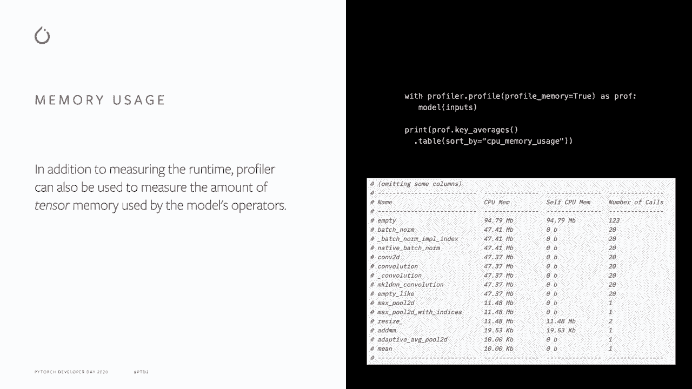
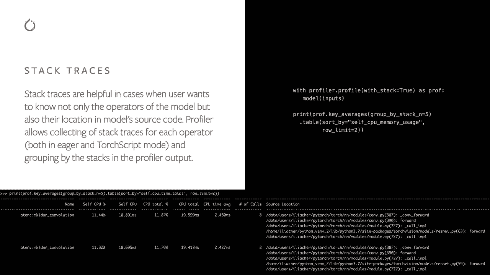

# PyTorch进阶学习讲座 L9：🔥 最新的Profiler API和最佳实践


在本节课中，我们将学习PyTorch Profiler工具，并重点介绍其新增的内存使用分析和堆栈跟踪功能。通过本教程，你将掌握如何利用Profiler来测量模型运行时的性能指标、分析内存消耗，并定位代码中的性能瓶颈。

---

## 🎯 什么是PyTorch Profiler？

PyTorch Profiler是一个易于使用的工具，它允许你测量模型操作符的运行时和其他性能指标。


上一节我们介绍了Profiler的基本概念，本节中我们来看看一个简单的使用示例。

首先，我们需要导入必要的模块并创建一个模型。在下面的代码中，我们创建了一个ResNet-18模型，并使用`torch.profiler.profile`上下文管理器来包装推理过程，从而对内部的所有操作进行分析。

```python
import torch
import torchvision.models as models

# 创建模型
model = models.resnet18()
inputs = torch.randn(5, 3, 224, 224)

# 使用Profiler进行分析
with torch.profiler.profile() as prof:
    model(inputs)

# 打印分析结果
print(prof.key_averages().table(sort_by="cpu_time_total"))
```

分析完成后，可以打印出结果表格。该表格默认按操作符名称分组，并显示如自身CPU时间和总CPU时间等指标。

---

## 📊 Profiler的核心功能

除了基本的时间分析，Profiler还具备更多高级功能，例如按操作符输入形状分组、支持CPU和GPU操作符、添加自定义代码范围标签，以及以Chrome JSON格式保存跟踪数据。

以下是启用按输入形状分组功能的示例：

```python
with torch.profiler.profile(record_shapes=True) as prof:
    model(inputs)

print(prof.key_averages(group_by_input_shape=True).table())
```

启用`record_shapes=True`参数后，分析结果会按操作符的输入形状进行分组。例如，你可能会看到卷积（convolution）等操作符具有多种不同的输入形状。

---

## 💾 分析内存使用情况

除了运行时，了解模型操作符的内存消耗也至关重要。Profiler新增了内存分析功能，可以测量张量所占用的内存量。

只需在创建profile时传递`profile_memory=True`参数，之后即可按CPU或CUDA内存使用量进行排序。



```python
with torch.profiler.profile(profile_memory=True) as prof:
    model(inputs)

# 按CPU内存使用总量排序
print(prof.key_averages().table(sort_by="cpu_memory_usage"))
```


在分析结果中，你可能会发现大部分内存被`empty`操作符消耗，这并不意外，因为该操作符用于创建新的张量。此外，用于改变张量大小的`resize`操作符也会消耗内存。通过“总CPU内存”列，你还可以看到其他直接或间接调用了`empty`和`resize`的操作符。

---

## 🧭 使用堆栈跟踪定位代码

有时，我们不仅想知道是哪个操作符消耗了资源，还想知道它在源代码中的具体位置。这时，堆栈跟踪功能就非常有用了。

通过传递`with_stack=True`参数，并按照调用栈条目进行分组，可以精确定位操作符的调用来源。

```python
with torch.profiler.profile(with_stack=True) as prof:
    model(inputs)



print(prof.key_averages(group_by_stack_n=5).table())
```

在输出结果中，你可以看到操作符的名称，以及其在PyTorch库内部和你的原始模型脚本中的具体源文件位置和行号。例如，对于ResNet模型中的卷积操作，堆栈跟踪可以显示其来自`torch.nn`模块以及你脚本中具体的调用点。

---


## 📝 总结


本节课中，我们一起学习了PyTorch Profiler工具。我们首先了解了它的基本用途——测量操作符运行时。接着，我们探索了其按输入形状分组的高级功能。然后，我们重点学习了新增的内存分析功能，它可以量化张量的内存消耗。最后，我们介绍了堆栈跟踪功能，它能帮助我们将性能指标与源代码位置关联起来，从而更有效地进行性能调优。

如果你想了解更多关于Profiler的细节并查看更多示例，请查阅PyTorch官方文档中的Profiler相关教程。