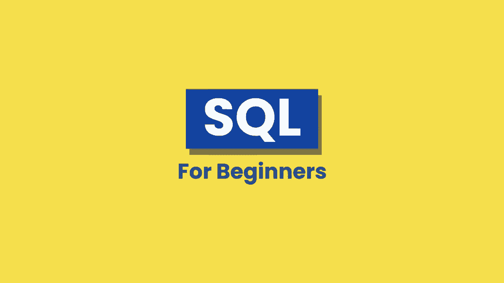
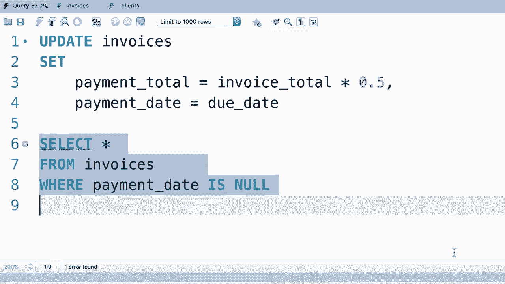
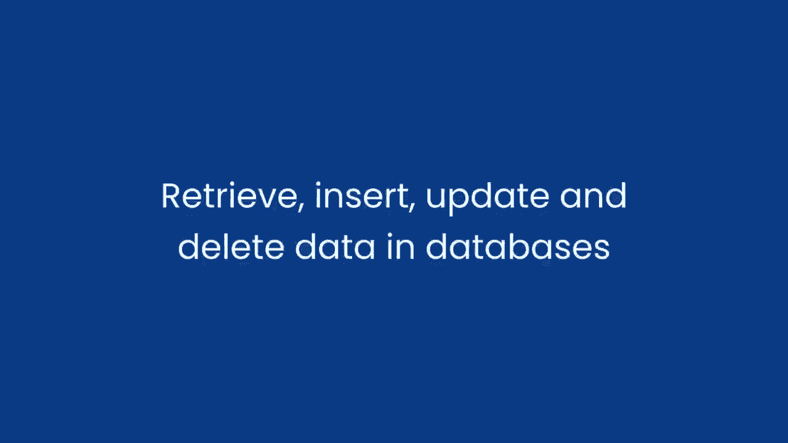
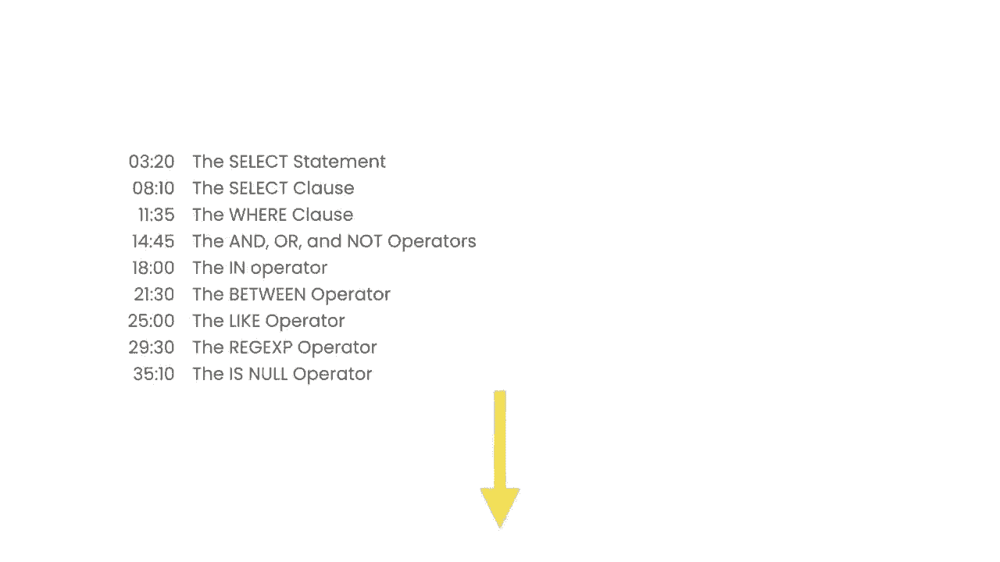

# SQL常用知识点合辑——P1：L1- 介绍 🗂️

在本节课中，我们将对SQL进行一个简要的介绍，了解课程的目标、涵盖的核心内容以及学习路径。SQL是管理和操作数据库的强大工具，掌握它对于软件开发和数据分析至关重要。

## 课程概述

我的名字是Mosh Hamiddani，我将担任本课程的讲师。在这个为期三小时的课程中，你将学习开始使用SQL所需的一切知识。

课程开始时，我会提供一个三分钟的SQL介绍。之后，我们将安装必要的工具并编写第一个SQL查询。

这个课程非常适合希望从头开始学习SQL的初学者，也适合那些已有一些基础知识但希望查漏补缺的学习者。

## 课程目标

在本课程结束时，你将能够从数据库中检索和插入数据、更新和删除数据。

我们将讨论数据库中的表、表之间的关系、不同类型的连接操作、子查询、正则表达式等核心概念。

这些是每位软件开发者或数据科学家都必须了解的基本概念。

## 课程特色

本SQL课程包含了大量练习，旨在帮助你学习和牢固记忆SQL语法。

此外，视频下方提供了一个目录，方便你快速跳转到特定的教程部分。

现在让我们开始学习吧。

---

上一节我们对课程有了整体认识，接下来我们将正式踏入SQL的世界。

## 总结

本节课我们一起学习了SQL课程的简介、目标以及特色。我们了解到本课程旨在帮助初学者和有一定基础的学习者系统掌握SQL的核心操作，包括数据查询、增删改以及高级的表连接和子查询等概念。准备好必要的工具后，我们就可以开始编写第一个SQL查询了。