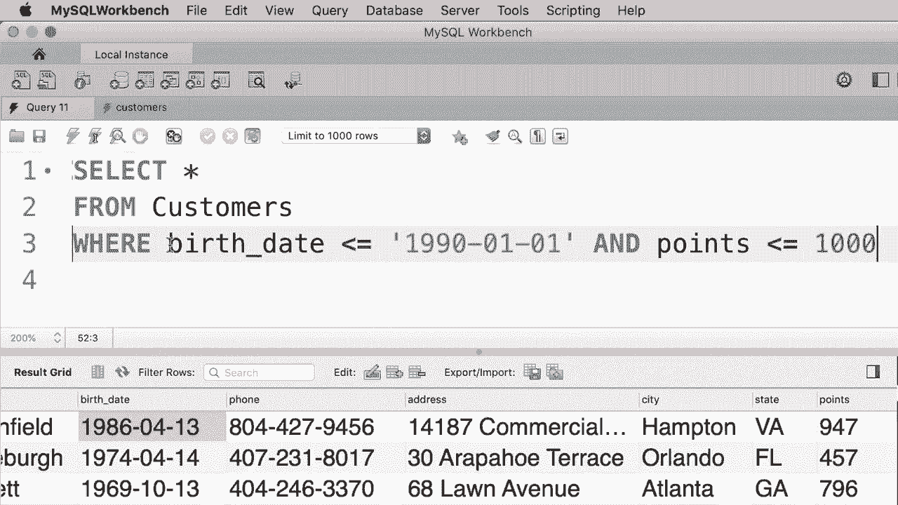
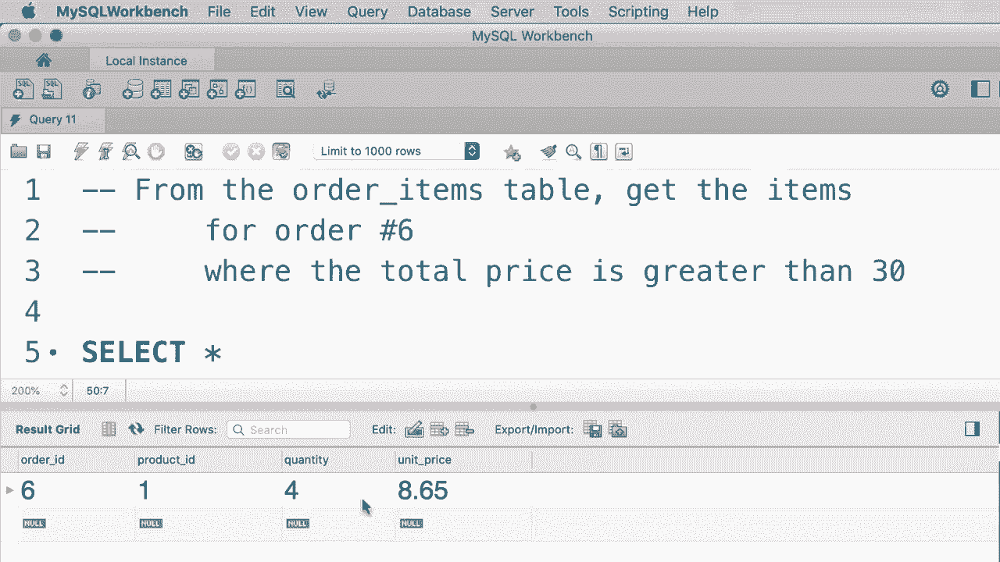

# SQL常用知识点合辑——P10：L10- AND、OR 和 NOT 运算符 🔍

在本节课中，我们将要学习如何在SQL查询中组合多个搜索条件来过滤数据。我们将重点介绍三个核心的逻辑运算符：`AND`、`OR` 和 `NOT`。掌握这些运算符能让你编写出更精确、更灵活的查询语句。

## 概述 📋

当我们需要从数据库中筛选出符合特定条件的数据时，单一的搜索条件往往不够。例如，我们可能想找出“1990年后出生且积分超过1000”的客户。这时，就需要使用逻辑运算符来连接多个条件。本节课将详细讲解`AND`、`OR`和`NOT`的用法、优先级以及如何组合它们来构建复杂的查询。

---

## 1. AND 运算符 ➕

`AND`运算符用于连接多个条件，要求**所有**条件都必须为真，记录才会被包含在结果集中。

上一节我们介绍了课程概述，本节中我们来看看`AND`运算符的具体应用。

假设我们想要获取在1990年1月1日后出生的所有客户，并且他们的积分超过1000。这时我们使用`AND`运算符。

```sql
SELECT *
FROM customers
WHERE birth_date > ‘1990-01-01’
  AND points > 1000;
```

当我们执行这个查询时，只获得满足这两个条件的客户。例如，结果中客户的出生日期都在1990年之后，并且他们的积分都超过了1000。这就是`AND`运算符的作用：两个条件都应该为真。

---

## 2. OR 运算符 ↔️

与`AND`运算符相对，我们有`OR`运算符。使用`OR`时，只要连接的条件中**至少有一个**为真，该行记录就会被返回。

理解了`AND`的严格性后，本节中我们来看看更宽松的`OR`运算符。

现在我们使用`OR`来修改上面的查询：

```sql
SELECT *
FROM customers
WHERE birth_date > ‘1990-01-01’
   OR points > 1000;
```

再次执行这个查询，结果会返回相当多的记录。例如，结果中可能包含在1990年后出生但积分不足1000的客户，也可能包含积分超过1000但在1990年前出生的客户。任何满足至少一个条件的客户记录都会被返回。

---

## 3. 组合 AND 与 OR 🔗

我们可以组合使用`AND`和`OR`来构建更复杂的查询逻辑。但在组合时，必须注意运算符的优先级。

在掌握了单个运算符后，本节中我们将学习如何将它们组合起来使用。

假设我们想要获取在1990年后出生的客户，**或者**（他们至少有1000积分**并且**居住在弗吉尼亚州）的客户。

```sql
SELECT *
FROM customers
WHERE birth_date > ‘1990-01-01’
   OR (points > 1000 AND state = ‘VA’);
```

执行这个查询，我们会得到符合条件的记录。例如，第一个客户可能并没有在1990年后出生，但她住在弗吉尼亚（VA），并且积分超过1000，因此她满足了`OR`后面括号内的条件。

以下是关于运算符优先级的重要说明：
*   在SQL中，`AND`运算符的优先级高于`OR`。
*   这意味着，在没有括号的情况下，查询引擎会先计算`AND`条件，再计算`OR`条件。
*   使用括号`()`可以明确地改变计算顺序，并使代码意图更清晰、更易于理解。因此，建议在组合`AND`和`OR`时总是使用括号。

---

## 4. NOT 运算符 ❌

`NOT`运算符用于**否定**一个条件。它通常与`IN`、`BETWEEN`、`LIKE`等运算符结合使用，也可以用于否定用`AND`/`OR`组成的复杂条件。

现在，让我们来认识第三个逻辑运算符`NOT`，它用于表达“非”的逻辑。

首先，看一个使用`OR`的查询：

```sql
SELECT *
FROM customers
WHERE birth_date > ‘1990-01-01’
   OR points > 1000;
```

我们可以使用`NOT`运算符来获取**不满足**上述条件的客户：

```sql
SELECT *
FROM customers
WHERE NOT (birth_date > ‘1990-01-01’ OR points > 1000);
```

执行后，我们将得到出生在1990年之前**并且**积分少于或等于1000的客户。

从技术上讲，应用`NOT`运算符后，我们可以对条件进行逻辑简化（德摩根定律）：
*   `NOT (condition1 OR condition2)` 等价于 `(NOT condition1) AND (NOT condition2)`
*   `NOT (condition1 AND condition2)` 等价于 `(NOT condition1) OR (NOT condition2)`

因此，上面的查询可以简化为：

```sql
SELECT *
FROM customers
WHERE birth_date <= ‘1990-01-01’
  AND points <= 1000;
```

这样阅读和理解起来要容易得多：出生在1990年1月1日或之前的人，并且他们的积分少于或等于1000。

---



## 5. 在条件中使用算术表达式 ➗


我们可以在`WHERE`子句的条件中使用算术表达式，这使我们的查询能力更加强大。

逻辑运算符不仅可以连接简单的列比较，本节中我们来看看如何在条件中嵌入计算。

**练习**：从`order_items`表中，获取订单号（`order_id`）为6，且该项目总价（数量*单价）大于30的所有项。

以下是解决步骤：
1.  总价需要通过计算得到：`quantity * unit_price`。
2.  我们需要两个条件用`AND`连接：`order_id = 6` 和 `(quantity * unit_price) > 30`。

```sql
SELECT *
FROM order_items
WHERE order_id = 6
  AND (quantity * unit_price) > 30;
```

执行这个查询，我们得到产品ID为1，数量为4，单价略高于8美元的项目，因为它的总价格（4 * 8.xx）大于30。这证明了我们可以在条件中自由地使用算术表达式。

---

## 总结 🎯

本节课中我们一起学习了SQL中三个核心的逻辑运算符：
1.  **`AND`**：要求所有连接的条件都为真。
2.  **`OR`**：要求至少一个连接的条件为真。
3.  **`NOT`**：用于否定一个条件。



我们探讨了如何组合`AND`和`OR`来构建复杂查询，并强调了使用括号`()`来控制优先级、提高代码可读性的重要性。最后，我们还学习了如何在条件中嵌入算术表达式，使过滤逻辑更加动态和强大。

通过掌握这些运算符，你已经能够编写出满足多种复杂业务场景的数据查询语句了。