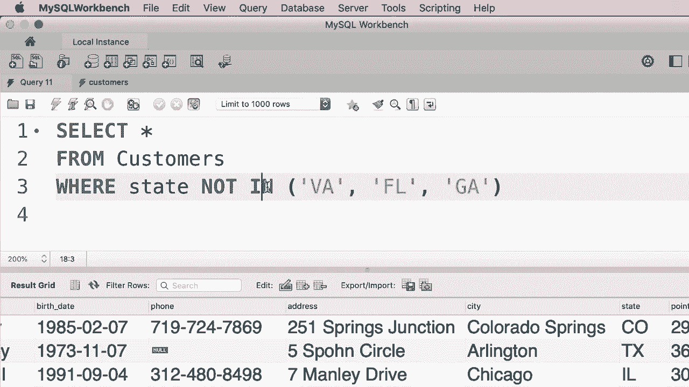
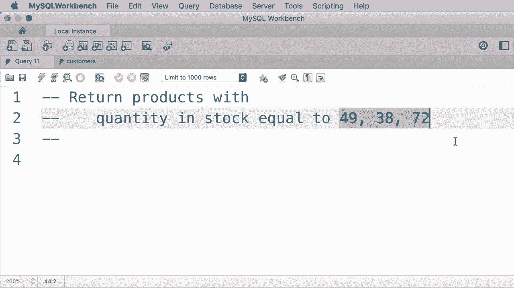
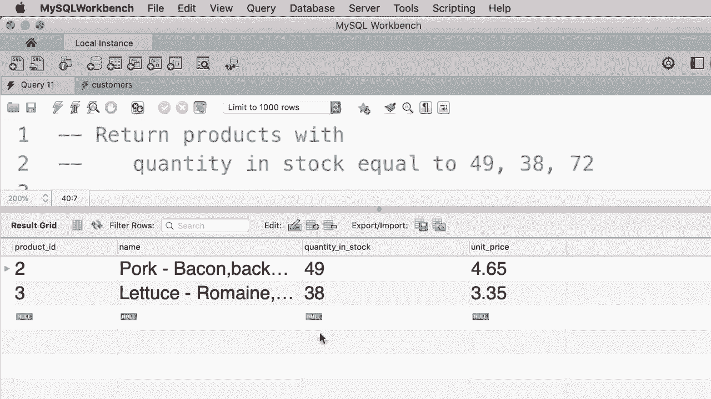

# SQL常用知识点合辑——P11：L11- IN 运算符 📊

在本教程中，我们将学习如何在SQL中使用 **IN** 运算符。该运算符用于简化查询条件，特别是当需要匹配多个特定值时。

## 概述

**IN** 运算符允许我们在 `WHERE` 子句中指定多个可能的值，从而避免使用多个 `OR` 条件。这使查询语句更简洁、更易读。

## 使用多个OR条件的传统方法

假设我们需要查询位于弗吉尼亚州、佛罗里达州或乔治亚州的客户。一种方法是使用多个 `OR` 条件组合。

```sql
SELECT *
FROM customers
WHERE state = 'Virginia'
   OR state = 'Georgia'
   OR state = 'Florida';
```

对于初学者，可能会疑惑为何不能直接写成 `state = 'Virginia' OR 'Georgia' OR 'Florida'`。这是因为在SQL中，`OR` 运算符连接的是两个完整的布尔表达式（结果为真或假），而不能直接连接字符串。

执行上述查询，我们将获得位于这三个州的客户记录。

## 使用IN运算符的简洁方法

上一节我们介绍了使用多个 `OR` 条件的方法，本节中我们来看看如何使用 **IN** 运算符来简化查询。

**IN** 运算符的语法如下：

```sql
WHERE column_name IN (value1, value2, ...);
```

我们可以将之前的查询重写为：

```sql
SELECT *
FROM customers
WHERE state IN ('Virginia', 'Florida', 'Georgia');
```

这个查询与使用多个 `OR` 条件的查询完全等效，但更加简短和清晰。执行此查询，会得到完全相同的结果。

## 结合NOT运算符使用IN

**IN** 运算符也可以与 `NOT` 运算符结合使用，用于排除特定的值。

例如，如果我们想获取不在弗吉尼亚州、佛罗里达州或乔治亚州的客户，可以这样写：



```sql
SELECT *
FROM customers
WHERE state NOT IN ('Virginia', 'Florida', 'Georgia');
```

执行此查询，将获得位于其他州（如科罗拉多州、德克萨斯州等）的客户记录。


当你需要将一个属性与一系列值进行比较时，使用 **IN** 运算符是高效且清晰的选择。

## 练习：应用IN运算符

以下是针对 **IN** 运算符的一个练习。



请编写一个查询，从 `products` 表中获取库存数量等于49、38或72的产品。


请暂停阅读，尝试完成这个练习。

---

练习的参考解答如下：

```sql
SELECT *
FROM products
WHERE quantity_in_stock IN (49, 38, 72);
```



执行这个查询，我们得到了库存数量为49和38的产品记录。注意，结果中可能没有库存数量为72的产品，因此记录数可能少于预期。


## 总结

本节课中我们一起学习了 **IN** 运算符的核心用法：
1.  **IN** 运算符用于简化 `WHERE` 子句中多值匹配的条件。
2.  其基本语法为 `WHERE column IN (value1, value2, ...)`。
3.  它可以与 `NOT` 运算符结合，用于排除指定的值列表。
4.  相比于使用多个 `OR` 条件，**IN** 运算符使SQL语句更简洁、更易于维护。