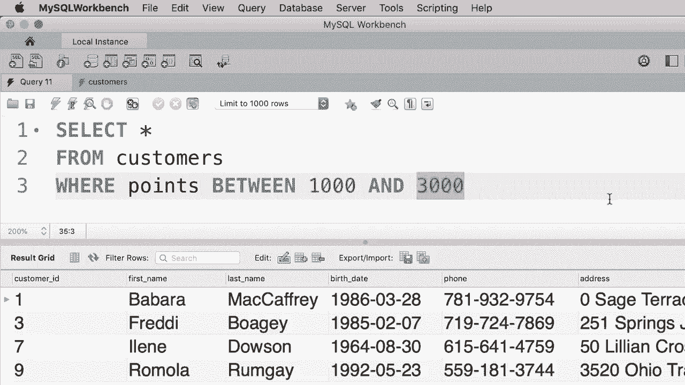
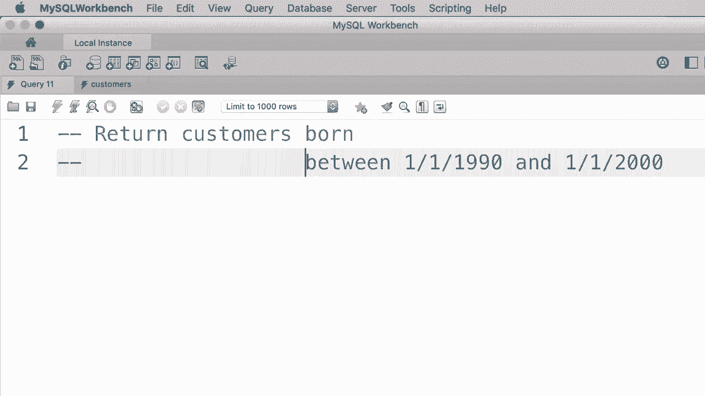
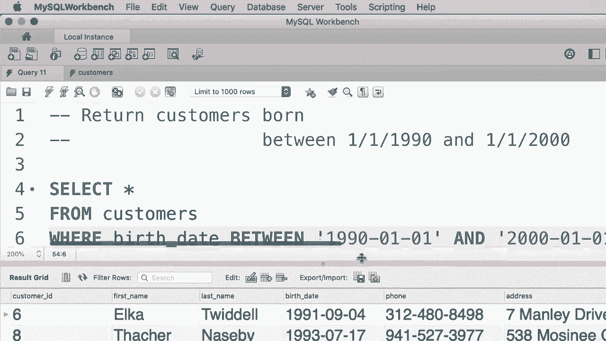

# SQL常用知识点合辑——P12：L12- BETWEEN 运算符 📊


在本教程中，我们将学习 SQL 中的 `BETWEEN` 运算符。这个运算符用于筛选某个范围内的值，它能让你的查询语句更简洁、更易读。

## 概述

本节课我们将要学习 `BETWEEN` 运算符的语法和用法。我们会看到如何用它来筛选数字和日期范围，并通过对比传统方法和使用 `BETWEEN` 的方法，理解其优势。

## 使用 BETWEEN 运算符

假设我们想从数据库中获取积分在 1000 到 3000 之间的客户。使用传统的比较运算符，查询语句会是这样：

```sql
SELECT *
FROM customers
WHERE points >= 1000 AND points <= 3000;
```

执行这个查询，我们会得到四个符合该标准的客户。

上一节我们介绍了使用 `AND` 运算符组合条件的方法。本节中我们来看看如何使用 `BETWEEN` 运算符来简化这类范围查询。

当你需要用一个属性与一个范围的值进行比较时，可以使用 `BETWEEN` 运算符。它能使代码更简短、更清晰。我们可以将上面的表达式重写为：

```sql
SELECT *
FROM customers
WHERE points BETWEEN 1000 AND 3000;
```



这个查询与之前的内容完全等效。`BETWEEN` 运算符是包含边界值的，这意味着它等价于 `points >= 1000 AND points <= 3000`。

执行这个查询，我们得到完全相同的结果。


## 在日期范围中使用 BETWEEN



`BETWEEN` 运算符不仅限于数字，也可以用于日期值。

现在，我们来进行一个练习：编写一个查询，获取出生日期在 1990年1月1日 到 2000年1月1日 之间的客户。


以下是实现此查询的步骤：

1.  从 `customers` 表中选择所有列。
2.  在 `WHERE` 子句中使用 `BETWEEN` 运算符。
3.  为日期值提供正确的格式。

正确的查询语句如下：

```sql
SELECT *
FROM customers
WHERE birth_date BETWEEN '1990-01-01' AND '2000-01-01';
```

需要注意的是，日期的标准格式是四位数的年份、两位数的月份和两位数的日期。

执行这个查询，我们得到三个符合这个标准的客户。




## 总结


本节课中我们一起学习了 `BETWEEN` 运算符。我们了解到：

*   `BETWEEN` 运算符用于筛选某个范围内的值，其语法为 `WHERE column BETWEEN value1 AND value2`。
*   它等同于使用 `>=` 和 `<=` 运算符的组合（`column >= value1 AND column <= value2`），并且范围是包含边界值的。
*   这个运算符不仅适用于数字，也适用于日期等类型，能有效简化查询语句，提高代码的可读性。