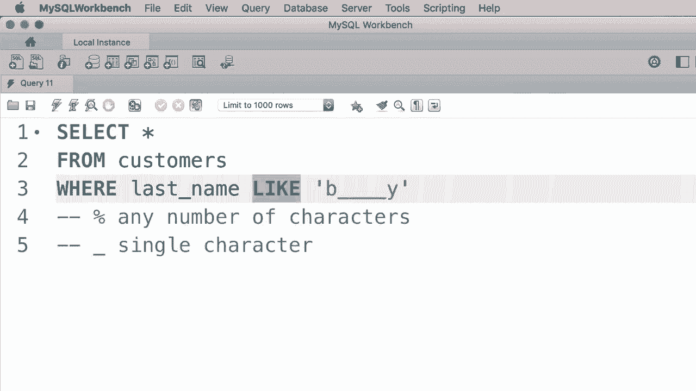
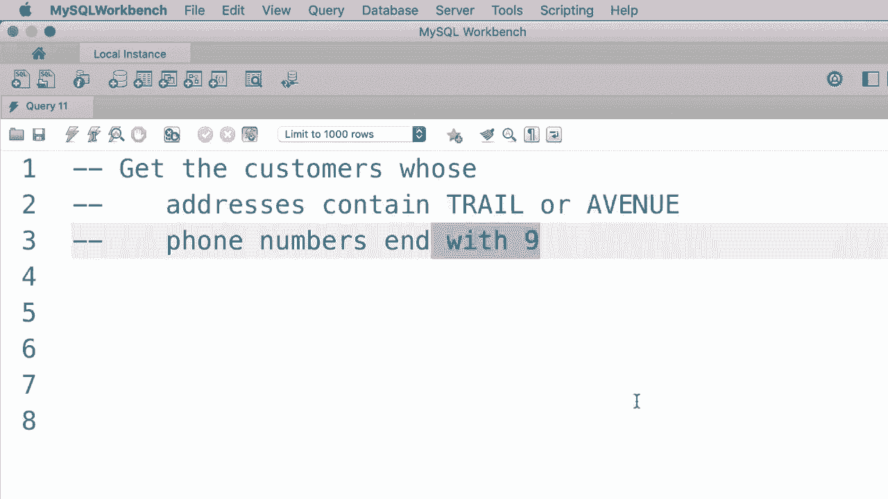
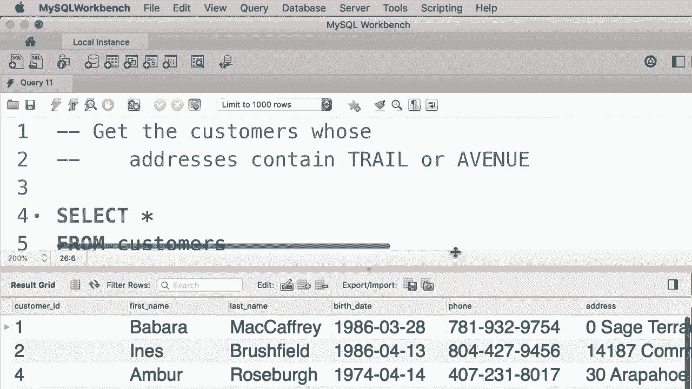

# SQL常用知识点合辑——P13：L13- LIKE 运算符 🔍


在本教程中，我们将学习如何使用 `LIKE` 运算符来检索与特定字符串模式匹配的数据行。我们将通过具体示例，掌握百分号（`%`）和下划线（`_`）这两个通配符的用法。

## 使用 `LIKE` 运算符进行模式匹配

`LIKE` 运算符通常用在 `WHERE` 子句中，用于筛选符合特定模式的文本数据。其基本语法结构如下：

```sql
SELECT column1, column2, ...
FROM table_name
WHERE column_name LIKE pattern;
```

上一节我们介绍了 `LIKE` 的基本概念，本节中我们来看看如何使用通配符来构建这些模式。

### 百分号（`%`）通配符

百分号（`%`）代表零个、一个或多个任意字符。

以下是使用百分号通配符的几种常见情况：

*   **匹配以特定字符开头的字符串**：例如，查找姓氏以“B”开头的客户。
    ```sql
    SELECT * FROM customers
    WHERE last_name LIKE 'B%';
    ```
    这个模式 `‘B%’` 会匹配所有以大写或小写“B”开头，后面跟任意数量字符的姓氏。

*   **匹配包含特定字符的字符串**：例如，查找姓氏中包含字母“B”的客户。
    ```sql
    SELECT * FROM customers
    WHERE last_name LIKE '%B%';
    ```
    模式 `‘%B%’` 表示在“B”的前后都可以有任意数量的字符，因此无论“B”在姓氏的哪个位置都能被找到。

*   **匹配以特定字符结尾的字符串**：例如，查找姓氏以“y”结尾的客户。
    ```sql
    SELECT * FROM customers
    WHERE last_name LIKE '%y';
    ```

### 下划线（`_`）通配符

下划线（`_`）通配符代表一个单一的任意字符。

以下是使用下划线通配符的示例：



*   **匹配固定长度的字符串**：例如，查找姓氏恰好为两个字符的客户。
    ```sql
    SELECT * FROM customers
    WHERE last_name LIKE '__';
    ```
    模式 `‘__’` 使用了两个下划线，代表两个字符。


*   **匹配特定模式的字符串**：例如，查找姓氏以“B”开头，总长度为六个字符，并以“Y”结尾的客户。
    ```sql
    SELECT * FROM customers
    WHERE last_name LIKE 'B____Y';
    ```
    模式 `‘B____Y’` 表示第一个字符是‘B’，中间是四个任意字符，最后一个字符是‘Y’。



## 实践练习 🧪


现在，让我们通过两个练习来巩固对 `LIKE` 运算符的理解。

以下是第一个练习的步骤，我们需要查找地址中包含“trail”或“avenue”的客户：

```sql
SELECT * FROM customers
WHERE address LIKE '%trail%'
   OR address LIKE '%avenue%';
```
这个查询使用了 `OR` 逻辑运算符来组合两个 `LIKE` 条件，只要满足其中一个即可。

以下是第二个练习的步骤，我们需要查找电话号码以数字9结尾的客户：

```sql
SELECT * FROM customers
WHERE phone LIKE '%9';
```
模式 `‘%9’` 匹配所有以‘9’结尾的电话号码。

此外，我们还可以在 `LIKE` 前使用 `NOT` 运算符来查找不匹配某个模式的数据。例如，查找电话号码不以9结尾的客户：

```sql
SELECT * FROM customers
WHERE phone NOT LIKE '%9';
```




## 总结 📝


本节课中我们一起学习了 `LIKE` 运算符的核心用法。我们了解到，`LIKE` 运算符配合通配符 `%`（代表任意数量字符）和 `_`（代表单个字符），可以非常灵活地在数据库中搜索文本模式。无论是查找以特定字符开头、结尾、包含特定字符，还是匹配特定格式的字符串，`LIKE` 都是一个强大的工具。通过实践练习，我们也掌握了如何组合多个条件以及使用 `NOT` 进行反向筛选。