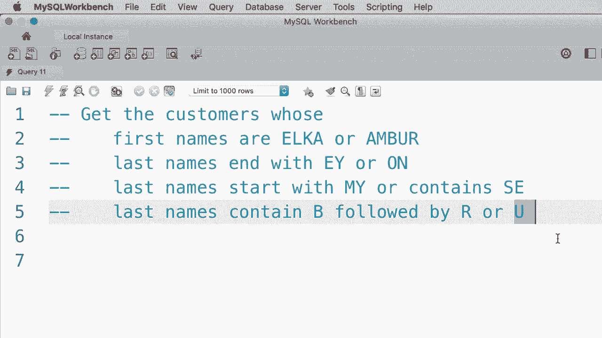
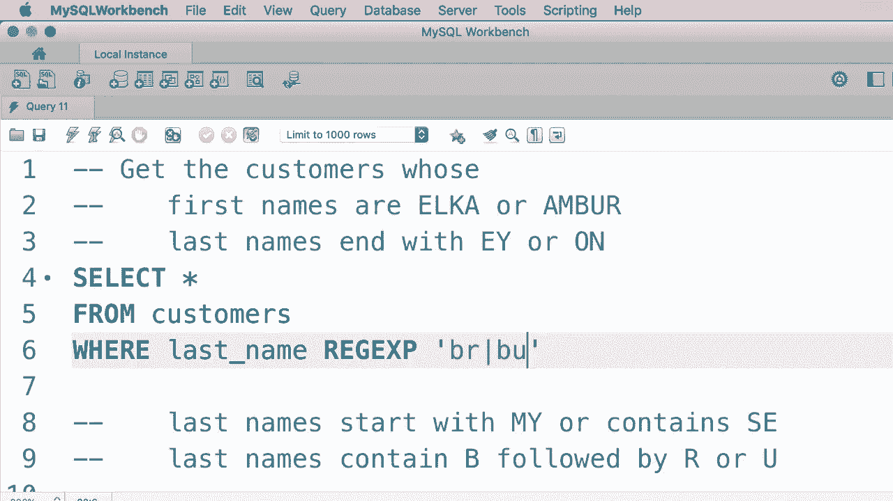

# SQL常用知识点合辑——P14：L14- REGEXP 运算符 🔍

在本节课中，我们将要学习SQL中一个强大的字符串模式匹配工具——`REGEXP`运算符。我们将了解它的基本语法、特殊字符的用法，并通过一系列练习来巩固所学知识。

---

在上一节中，我们学习了`LIKE`运算符。现在，我们来看一个使用`LIKE`的例子。假设我们想搜索姓氏中包含单词“field”的客户。我们可以使用以下`WHERE`子句：

```sql
WHERE last_name LIKE '%field%'
```

这样，单词“field”可以出现在姓氏的任何位置。执行这个查询，我们只得到一个客户。

现在，MySQL中还有另一个运算符，即`REGEXP`。它是“正则表达式”的缩写。正则表达式在搜索字符串时非常强大，允许我们搜索更复杂的模式。

以下是使用正则表达式重写上述`WHERE`子句的例子：

```sql
WHERE last_name REGEXP 'field'
```

在这个字符串模式中，我们不需要输入百分号`%`，只需输入“field”。执行这个查询，我们得到了相同的结果。

在正则表达式中，我们有一些额外的特殊字符，这是`LIKE`运算符所不具备的。

例如，我们可以使用插入符号`^`来表示字符串的开头。因此，如果我把插入符号放在单词“field”前面：

```sql
WHERE last_name REGEXP '^field'
```

这意味着我们的姓氏必须以“field”开头。执行这个查询，没有任何记录匹配该条件。

我们还可以使用美元符号`$`来表示字符串的结尾。因此，这个模式意味着姓氏必须以“field”结尾：

```sql
WHERE last_name REGEXP 'field$'
```

执行这个查询，我们得到了与之前相同的结果。

现在我们也可以在这里搜索多个单词。例如，假设我们想找到姓氏中包含单词“field”或“Mac”的客户。我们使用管道符号`|`（竖线）来分隔多个模式：

```sql
WHERE last_name REGEXP 'field|Mac'
```

执行这个查询，我们得到两个客户。

我们可以将其提升到下一个层次。假设我们想找到姓氏中包含单词“field”、“Mac”或“row”的客户：

```sql
WHERE last_name REGEXP 'field|Mac|row'
```

执行这个查询，我们得到了三个客户。因此，我们使用管道符号`|`来表示多个搜索模式。

现在，作为另一个例子，我们可以将第一个搜索模式更改为类似这样的内容：

```sql
WHERE last_name REGEXP '^field|Mac|row'
```

这个模式意味着姓氏要么以“field”开头，要么包含单词“Mac”，要么包含单词“row”。执行这个查询，我们只得到了两个客户。

所以，这就是我们在构建复杂模式时如何组合多个特殊字符。

现在让我们来看另一个例子。假设我们想要搜索姓氏中包含字母“E”的客户。这些都是符合条件的人。

现在假设我们想确保在字母“E”之前，要么有“G”，要么有“I”。这时我们就使用方括号`[]`。在括号内添加多个字符，如“G”和“I”，这样就能匹配任何姓氏中在“E”之前有“G”或“I”的客户：

```sql
WHERE last_name REGEXP '[GI]e'
```

执行这个查询，我们得到两个客户。

同样，方括号不必一定在“E”之前，我们可以将其放在“E”之后。因此，任何在姓氏中以“E”后跟“F”、“M”或“Q”的客户都可以用这个模式返回：

```sql
WHERE last_name REGEXP 'e[FMQ]'
```

我们也可以提供字符范围。例如，我们可以有“E”，且“E”之前要有任何从“A”到“H”的字符。我们不必像“A”、“B”、“C”那样逐一输入，可以使用连字符`-`来表示范围：

```sql
WHERE last_name REGEXP '[A-H]e'
```

执行这个查询，我们得到三个人。

---

让我们快速回顾一下在本教程中学到的关于正则表达式的所有内容。

以下是核心特殊字符及其含义：

*   `^`：表示字符串的开始。
*   `$`：表示字符串的结束。
*   `|`：表示逻辑或，用于提供多个搜索模式。
*   `[]`：用于匹配括号中列出的任何单个字符。
*   `[a-f]`：使用方括号和连字符来表示一个字符范围（例如，任何从“a”到“f”的字符）。

---

很多初学者发现正则表达式的语法令人困惑。因此，我设计了四个练习来帮助你快速熟悉这套语法。

以下是四个练习题目：

1.  **练习一**：获取名字是“Elka”或“Ambur”的客户。
2.  **练习二**：返回姓氏以“EY”或“ON”结尾的客户。
3.  **练习三**：获取姓氏以“MY”开头或包含“SE”的客户。
4.  **练习四**：返回姓氏中包含“B”后跟“R”或“U”的客户。



请花两到三分钟完成这个练习，完成后请查看下面的参考答案。


---

好的，让我们完成第一个练习。我们想要获取所有名字是“Elka”或“Ambur”的客户。

```sql
SELECT *
FROM customers
WHERE first_name REGEXP 'Elka|Ambur';
```

执行这个查询，我们应该得到两个客户：“Ambur”和“Elka”。

现在让我们完成第二个练习。我们想要获取姓氏以“EY”或“ON”结尾的客户。

```sql
SELECT *
FROM customers
WHERE last_name REGEXP 'EY$|ON$';
```

执行这个查询，我们得到四位客户。

现在，让我们进行第三个练习。我们想要获取姓氏以“MY”开头或包含“SE”的客户。

```sql
SELECT *
FROM customers
WHERE last_name REGEXP '^MY|SE';
```

执行查询，我们得到了三位客户。

最后，我们想获取姓氏中包含“B”后跟“R”或“U”的客户。有两种方式来写这个正则表达式。

第一种方法是使用方括号`[]`：

```sql
WHERE last_name REGEXP 'B[RU]'
```

第二种方法是使用竖线`|`：

```sql
WHERE last_name REGEXP 'BR|BU'
```

这两种都是有效的解决方案。



---

本节课中我们一起学习了SQL的`REGEXP`运算符。我们掌握了如何使用`^`、`$`、`|`、`[]`和`[a-z]`等特殊字符来构建强大的字符串搜索模式，并通过练习巩固了这些概念。在下一个教程中，我们将学习如何查询包含缺失值（NULL）的记录。