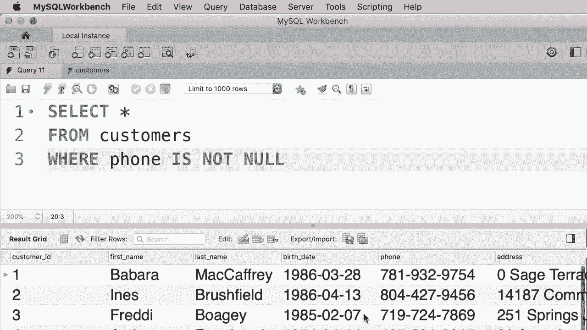
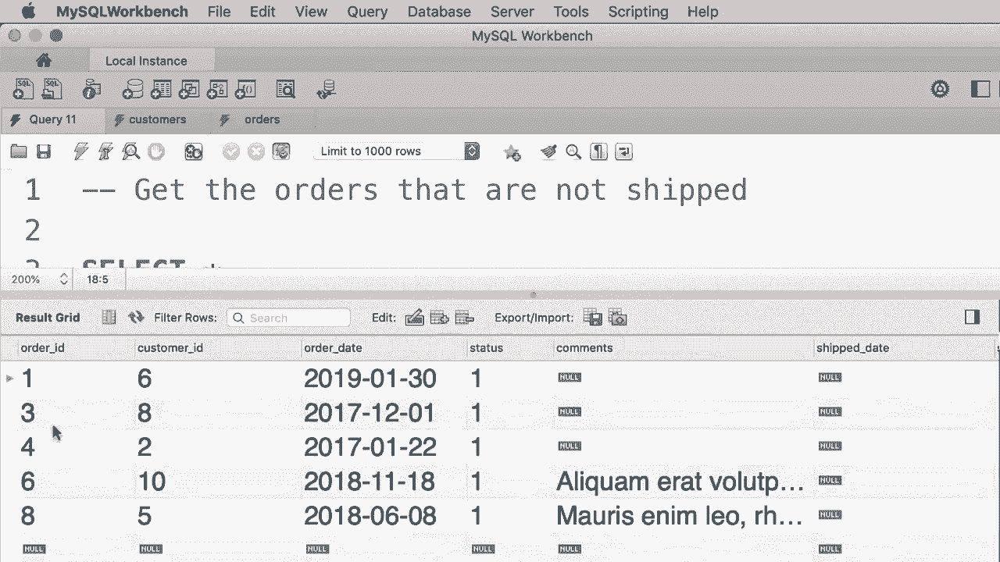

# SQL常用知识点合辑——P15：L15- IS NULL 运算符 📊


在本教程中，我们将学习如何使用 `IS NULL` 运算符来查找数据表中缺少属性值的记录。`NULL` 在数据库中表示一个缺失或未知的值。掌握如何查询这些记录是数据清理和业务分析中的一项重要技能。

## 理解 NULL 值

在数据库中，`NULL` 表示某个字段没有值。它不同于数字0或空字符串，它代表“未知”或“不存在”。例如，查看客户表时，你可能会发现某些客户的电话号码字段显示为 `NULL`，这表示系统中没有记录该客户的电话号码。

## 使用 IS NULL 运算符

要查找包含 `NULL` 值的记录，我们需要使用 `IS NULL` 运算符。它专门用于检查某个字段的值是否为 `NULL`。

以下是其基本语法：
```sql
SELECT * FROM 表名 WHERE 字段名 IS NULL;
```

例如，要查找所有没有电话号码的客户，可以这样写：
```sql
SELECT * FROM customers WHERE phone IS NULL;
```
执行此查询将只返回 `phone` 字段为 `NULL` 的客户记录。

## 使用 IS NOT NULL 运算符



与 `IS NULL` 相对的是 `IS NOT NULL` 运算符，用于查找指定字段**不是** `NULL` 值的记录。


其语法如下：
```sql
SELECT * FROM 表名 WHERE 字段名 IS NOT NULL;
```

例如，要查找所有提供了电话号码的客户，可以这样写：
```sql
SELECT * FROM customers WHERE phone IS NOT NULL;
```
执行此查询将返回所有 `phone` 字段有值的客户记录。


## 实践练习：查找未发货订单

上一节我们介绍了 `IS NULL` 的基本用法，本节中我们来看一个实际应用场景。假设你管理一个在线商店，需要跟进所有尚未发货的订单。在订单表中，已发货的订单会填写“发货日期”和“承运商ID”，而未发货的订单这些字段则为 `NULL`。

以下是完成此任务的步骤：

首先，查看订单表的结构和数据，确认哪些字段能标识发货状态。
```sql
SELECT * FROM orders;
```

接着，编写查询来获取未发货的订单。我们可以检查 `shipped_date` 或 `shipper_id` 是否为 `NULL`。

以下是查询语句：
```sql
SELECT * FROM orders WHERE shipped_date IS NULL;
-- 或者
SELECT * FROM orders WHERE shipper_id IS NULL;
```

执行以上任一查询，都将返回订单ID为1、3、4、6和8的五个未发货订单记录。




## 总结

本节课中我们一起学习了 `IS NULL` 和 `IS NOT NULL` 运算符。我们了解到 `NULL` 代表缺失值，并学会了如何使用这两个运算符来筛选数据表中的记录。通过查找“没有电话号码的客户”和“未发货的订单”这两个实例，我们掌握了该知识点的核心应用。记住，在处理数据时，识别和管理 `NULL` 值是确保数据质量的关键一步。