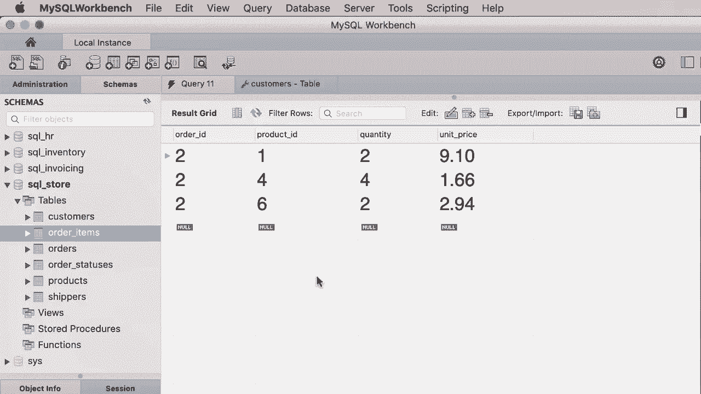
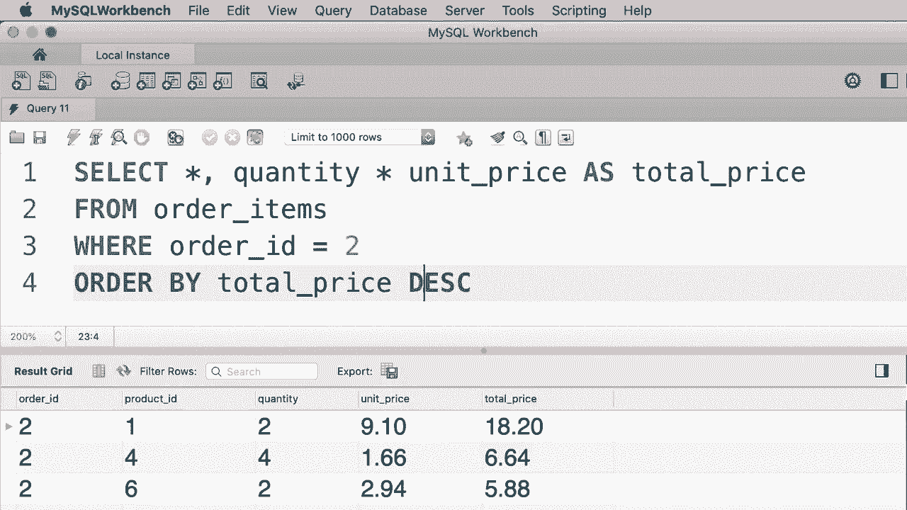

# SQL常用知识点合辑——P16：L16- ORDER BY 运算符 📊


在本教程中，我们将学习如何在 SQL 查询中使用 `ORDER BY` 子句对数据进行排序。排序是组织和分析数据的基本操作，掌握它可以帮助你更清晰地查看查询结果。

## 默认排序规则

首先，我们来看一个查询客户表所有数据的例子。执行查询后，你会发现结果默认按照客户 ID 排序。这是因为客户 ID 列是此表的主键列。

在关系数据库中，主键列用于唯一标识表中的每条记录。因此，当针对一个表编写查询时，如果没有指定排序方式，结果通常会按照主键列进行排序。

## 使用 ORDER BY 子句排序

现在，我们来看看如何使用 `ORDER BY` 子句按其他列进行排序。

在 `ORDER BY` 子句中，输入你想要排序的列名，例如 `first_name`。

```sql
SELECT * FROM customers
ORDER BY first_name;
```

执行查询后，客户将按照名字的字母顺序升序排列。

如果你想反转排序顺序，可以使用 `DESC` 关键字。

```sql
SELECT * FROM customers
ORDER BY first_name DESC;
```

这样，客户就会按照名字的字母顺序降序排列。

## 按多列排序

有时，我们需要根据多个条件对数据进行排序。例如，先按州排序，然后在每个州内再按名字排序。

以下是按多列排序的方法：

```sql
SELECT * FROM customers
ORDER BY state, first_name;
```

执行查询后，数据首先按州排序，然后在每个州内按名字排序。

你还可以为每个列指定不同的排序方向。

```sql
SELECT * FROM customers
ORDER BY state DESC, first_name ASC;
```

这样，数据会先按州降序排列，再按名字升序排列。

## 按表达式和别名排序

在 MySQL 中，你可以按任何列排序，无论该列是否出现在 `SELECT` 子句中。你甚至可以按表达式或别名排序。

例如，假设我们有一个计算总价的表达式：

```sql
SELECT 
    first_name,
    last_name,
    quantity * unit_price AS total_price
FROM order_items
WHERE order_id = 2
ORDER BY total_price DESC;
```

在这个查询中，我们通过别名 `total_price` 对结果进行降序排序。使用别名可以使查询更简洁易读。

## 避免按列位置排序

有些教程会教你按列的位置编号排序，例如：

```sql
SELECT first_name, last_name FROM customers
ORDER BY 1, 2;
```



虽然这种方法有效，但不推荐使用。因为如果将来在 `SELECT` 子句中添加或删除列，列的位置会发生变化，这可能导致排序结果与预期不符。


因此，建议始终使用列名进行排序，以确保查询的稳定性和可读性。

## 实践练习

为了巩固所学知识，我们来进行一个练习。在数据库中，有一个名为 `order_items` 的表，记录了每个订单的商品信息。

**练习要求：** 编写一个查询，选择订单 ID 为 2 的所有商品，并按总价格降序排列。总价格的计算公式为 `quantity * unit_price`。

以下是参考解决方案：

```sql
SELECT 
    *,
    quantity * unit_price AS total_price
FROM order_items
WHERE order_id = 2
ORDER BY total_price DESC;
```

执行这个查询，你将看到订单 2 的所有商品，并按照总价格从高到低排列。

## 总结



在本节课中，我们一起学习了 SQL 中 `ORDER BY` 运算符的使用方法。我们了解了默认排序规则，掌握了按单列、多列、表达式和别名进行排序的技巧，并明白了避免按列位置排序的重要性。通过实践练习，你已能够运用这些知识对查询结果进行有效的排序。


