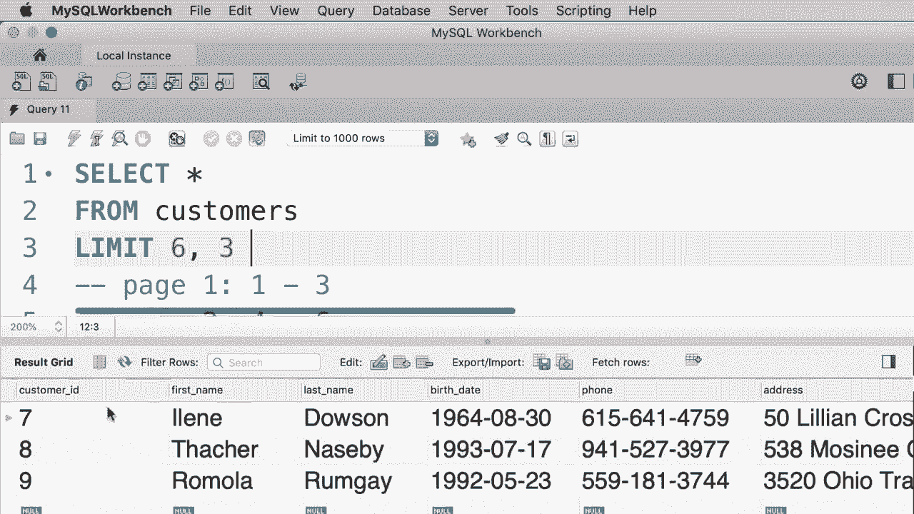
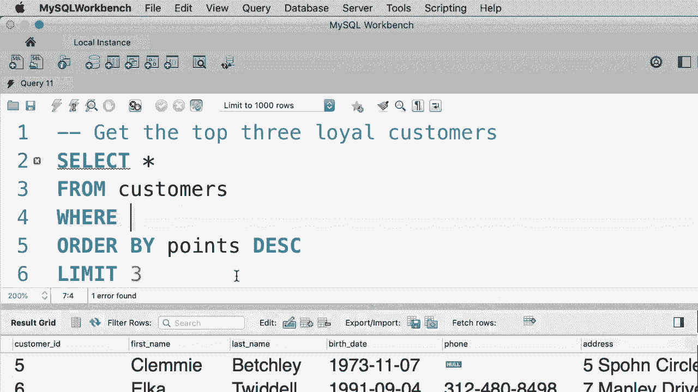

# SQL常用知识点合辑——P17：L17- LIMIT 运算符 📄


在本教程中，我们将学习如何使用 `LIMIT` 运算符来限制查询返回的记录数量。这对于数据分页或仅查看部分结果非常有用。

## 1. 基本用法

上一节我们介绍了课程目标，本节中我们来看看 `LIMIT` 子句的基本语法。

执行一个查询时，可能会返回大量记录。例如，查询客户表会获得所有10位客户。如果只想获取前三位客户，就需要使用 `LIMIT` 子句。

在 `FROM` 子句之后，添加 `LIMIT` 并指定一个数字，即可限制返回的记录数。

```sql
SELECT * FROM customers LIMIT 3;
```

执行上述查询将仅返回前三位客户。

如果传递给 `LIMIT` 的参数大于查询结果的总记录数，则会返回所有记录。例如，`LIMIT 300` 会返回表中全部的10位客户。

## 2. 使用偏移量进行分页

了解了基本用法后，我们来看看如何结合偏移量使用 `LIMIT`，这在数据分页时至关重要。

`LIMIT` 子句可以接受两个参数：偏移量和记录数。偏移量指定要跳过的记录数。

假设一个网页每页显示三位客户。第一页显示客户1、2、3，第二页显示客户4、5、6，第三页显示客户7、8、9。

要查询第三页的客户，需要跳过前六条记录，然后选取三条记录。

以下是实现此功能的查询语法：

```sql
SELECT * FROM customers LIMIT 6, 3;
```

在这个例子中，`6` 是偏移量，`3` 是要获取的记录数。执行该查询将返回客户7、8和9。




## 3. 实践练习：查询最忠诚的客户

现在，让我们通过一个练习来巩固所学知识。我们将查询积分最高的前三位忠实客户。

以下是实现此目标的步骤：
1.  从客户表中选择所有列。
2.  使用 `ORDER BY` 子句按积分降序排列客户。
3.  使用 `LIMIT` 子句仅选取排名前三的客户。

完整的查询语句如下：

```sql
SELECT * FROM customers ORDER BY points DESC LIMIT 3;
```

执行此查询，将得到客户ID为5、6和3的三位最忠诚的客户。

## 4. 重要注意事项：子句顺序

最后，我们必须牢记 `LIMIT` 子句在查询中的位置顺序，这一点非常重要。

在编写SQL查询时，各子句必须遵循特定的顺序。`LIMIT` 子句应始终放在查询语句的最后。

以下是标准的子句顺序：
1.  `SELECT`
2.  `FROM`
3.  `WHERE` (可选)
4.  `ORDER BY` (可选)
5.  `LIMIT`

如果改变这个顺序，MySQL将会报错。因此，在编写查询时请务必注意子句的顺序。




## 总结

本节课中我们一起学习了 `LIMIT` 运算符的核心用法。我们掌握了如何使用 `LIMIT n` 来限制返回的记录数量，以及如何通过 `LIMIT offset, count` 的语法实现数据分页。同时，我们通过练习了解了如何结合 `ORDER BY` 来获取排序后的前N条记录，并明确了 `LIMIT` 子句在SQL语句中必须置于末尾的书写规则。