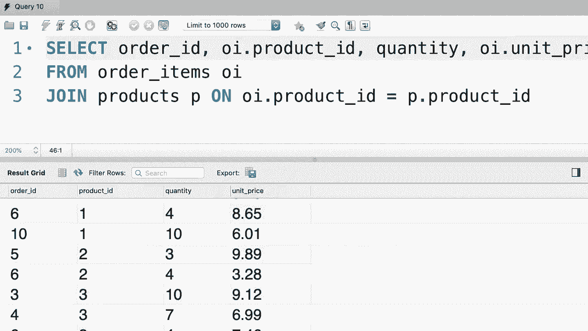

# SQL常用知识点合辑——P18：L18- 内部连接 🔗


在本节课中，我们将要学习如何从多个数据库表中组合数据。具体来说，我们将重点介绍**内部连接**的使用方法，它允许我们基于两个表之间的关联列，将它们的数据合并在一起。

到目前为止，我们只从一个表中选择列。但在现实世界中，我们经常需要从多个表中选择列。例如，查看我们的订单表，我们使用`customer_id`列来标识每个订单的客户。客户的具体信息，如姓名、电话和地址，则存储在单独的客户表中。这样做是为了避免数据冗余和更新异常。

本节中，我们将学习如何将订单表与客户表连接，以便在显示订单时，能同时看到客户的全名，而不仅仅是ID。

## 连接多个表

为了从多个表中获取数据，我们使用`JOIN`关键字。SQL中有两种主要连接类型：`INNER JOIN`和`OUTER JOIN`。本教程我们先学习`INNER JOIN`，`INNER`关键字是可选的。

以下是如何将`orders`表与`customers`表连接的基本语法：

```sql
SELECT *
FROM orders
JOIN customers
  ON orders.customer_id = customers.customer_id;
```

通过`ON`子句，我们指定了连接条件：只有当`orders`表中的`customer_id`与`customers`表中的`customer_id`相等时，两条记录才会被连接在一起。

执行上述查询后，结果集将包含来自两个表的所有列。

## 选择特定列与处理歧义

通常我们不需要所有列。我们可以明确选择需要的列。

```sql
SELECT order_id, first_name, last_name
FROM orders
JOIN customers
  ON orders.customer_id = customers.customer_id;
```

现在，每个订单ID旁边都显示了下单客户的名字和姓氏。

如果想同时显示`customer_id`，直接选择`customer_id`会导致错误，因为该列在两个表中都存在，SQL引擎无法确定我们指的是哪一个。这就是“列歧义”错误。

为了解决这个问题，我们需要使用**表名**来限定列名。

```sql
SELECT order_id, orders.customer_id, first_name, last_name
FROM orders
JOIN customers
  ON orders.customer_id = customers.customer_id;
```

我们可以从`orders`表或`customers`表中选择`customer_id`，因为在连接条件下它们的值是相等的。

## 使用别名简化代码

观察之前的查询，我们在多个地方重复了表名（如`orders`和`customers`）。为了使代码更简洁，我们可以为表设置**别名**。

按照惯例，我们通常使用表名的缩写作为别名。

```sql
SELECT o.order_id, o.customer_id, c.first_name, c.last_name
FROM orders o
JOIN customers c
  ON o.customer_id = c.customer_id;
```
这里，`o`是`orders`表的别名，`c`是`customers`表的别名。在查询的其他部分，我们都使用这些别名来引用对应的表。

## 练习：连接订单项与产品表

现在，请查看`order_items`表。它包含`order_id`、`product_id`、`quantity`和`unit_price`等列。


以下是练习要求：编写一个查询，将`order_items`表与`products`表连接。对于每个订单项，返回`product_id`、产品`name`、`quantity`以及`order_items`表中的`unit_price`。请使用别名简化代码。

**提示**：连接条件应为`order_items.product_id = products.product_id`。注意，两个表都有`unit_price`列，但意义不同。`order_items.unit_price`是下单时的价格快照，而`products.unit_price`是当前价格。在查询中，我们应该选择`order_items`表中的单价。

## 练习解答

以下是上述练习的一种解答：

```sql
SELECT oi.order_id,
       oi.product_id,
       p.name,
       oi.quantity,
       oi.unit_price
FROM order_items oi
JOIN products p
  ON oi.product_id = p.product_id;
```

首先，我们从`order_items`表（别名`oi`）中选择所有内容，然后将其与`products`表（别名`p`）连接。连接条件是`oi.product_id = p.product_id`。

在`SELECT`子句中，我们明确列出了所需的列。由于`product_id`在两个表中都存在，我们使用别名`oi`来限定它（使用`p`也可以）。`unit_price`列也存在于两个表中，根据业务逻辑，我们选择`oi.unit_price`，即下单时的历史价格。

执行此查询，即可得到每个订单项的产品详情和购买时的价格。




## 总结


本节课中我们一起学习了SQL的**内部连接**。我们了解到，使用`JOIN`和`ON`关键字可以基于关联列将多个表的数据合并。我们学会了如何选择特定列、使用表名来限定歧义列名，以及通过为表设置**别名**来简化查询语句。这些技能是进行复杂数据查询和分析的基础。