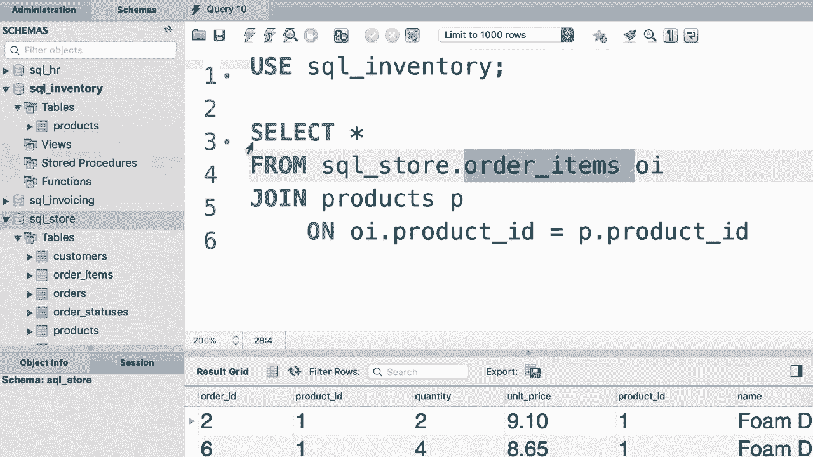

# SQL常用知识点合辑——P19：L19- 跨数据库联接 🔗


在本节课中，我们将要学习如何在SQL中联接来自不同数据库的表。在实际工作中，数据常常分布在多个数据库中，掌握跨数据库查询是一项实用技能。

## 概述

跨数据库联接允许我们将存储在不同数据库中的表连接起来，就像它们在同一数据库中一样。其核心在于为不属于当前数据库的表名添加数据库前缀。

## 跨数据库联接操作

上一节我们介绍了在同一数据库内的表联接，本节中我们来看看如何联接不同数据库中的表。

假设我们有两个数据库：`sql_store` 和 `sql_inventory`。`sql_store` 数据库中有 `order_items` 表，而 `product` 表位于 `sql_inventory` 数据库中。我们需要将它们联接起来。

以下是具体操作步骤：

1.  **确定当前数据库**：首先，确保你的查询窗口当前使用的是 `sql_store` 数据库。
2.  **编写联接查询**：在查询中，为属于其他数据库的表名添加 `数据库名.` 前缀。

```sql
USE sql_store;

SELECT *
FROM order_items oi
JOIN sql_inventory.products p
    ON oi.product_id = p.product_id;
```

在这个例子中，`order_items` 表属于当前数据库 `sql_store`，因此不需要前缀。而 `products` 表属于 `sql_inventory` 数据库，所以使用了 `sql_inventory.products` 来指定其完整位置。

## 切换当前数据库的情况

如果我们将当前数据库切换到 `sql_inventory`，那么情况就会反转。此时，`products` 表属于当前数据库，而 `order_items` 表需要添加前缀。

以下是操作步骤：

1.  **切换当前数据库**：使用 `USE` 语句将当前数据库更改为 `sql_inventory`。
2.  **调整查询语句**：在查询中，为现在不属于当前数据库的 `order_items` 表添加前缀。

```sql
USE sql_inventory;

SELECT *
FROM sql_store.order_items oi
JOIN products p
    ON oi.product_id = p.product_id;
```

## 核心概念与规则

以下是跨数据库查询需要记住的关键点：

*   **数据库前缀**：使用 `数据库名.表名` 的格式来引用非当前数据库中的表。
*   **当前数据库**：你的查询默认在某个当前数据库中执行。只有不属于此数据库的表才需要添加前缀。
*   **设计考量**：在实际数据库设计中，应尽量避免将紧密关联的表分散在不同数据库，因为这会影响查询性能和管理的便利性。本例仅用于演示技术可行性。

## 总结



本节课中我们一起学习了SQL的跨数据库联接。我们了解到，通过为表名添加 `数据库名.` 前缀，可以轻松联接位于不同数据库中的表。关键在于识别查询的当前数据库，并正确地为外部表添加前缀。记住这个简单的规则，你就能处理更复杂的数据分布场景了。


