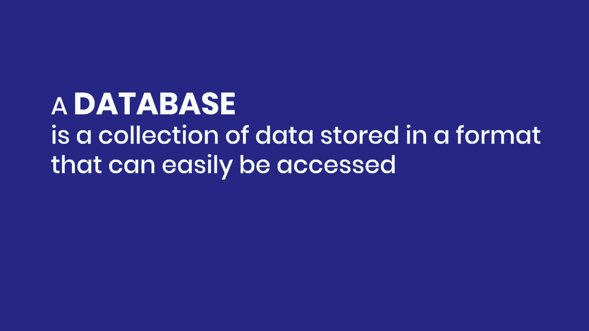
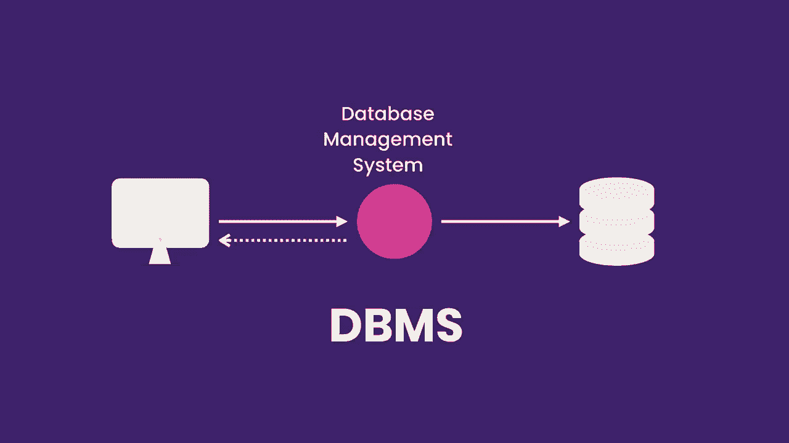
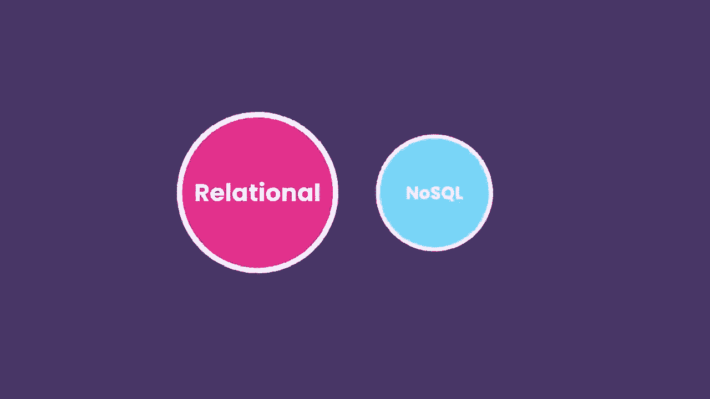
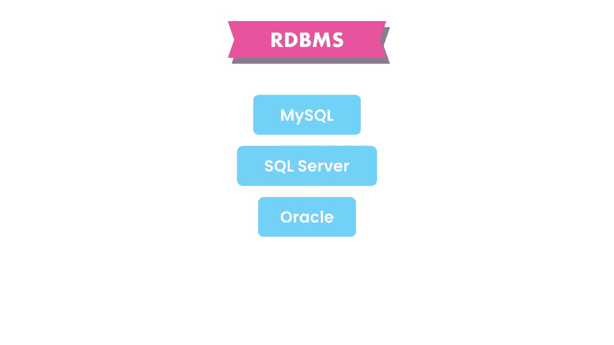
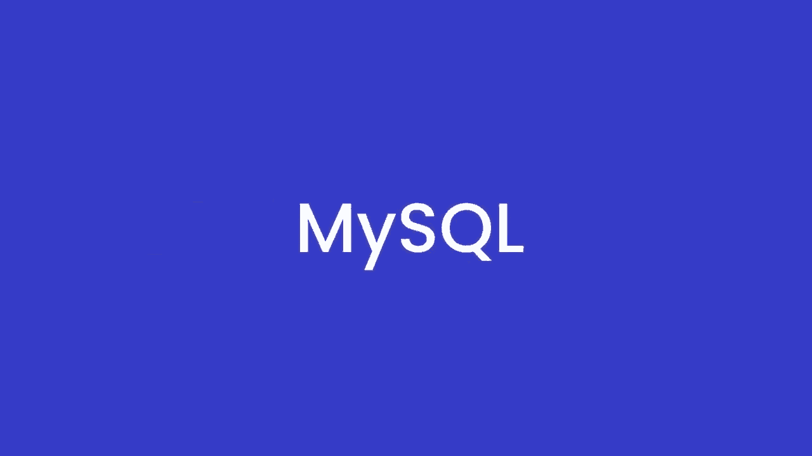
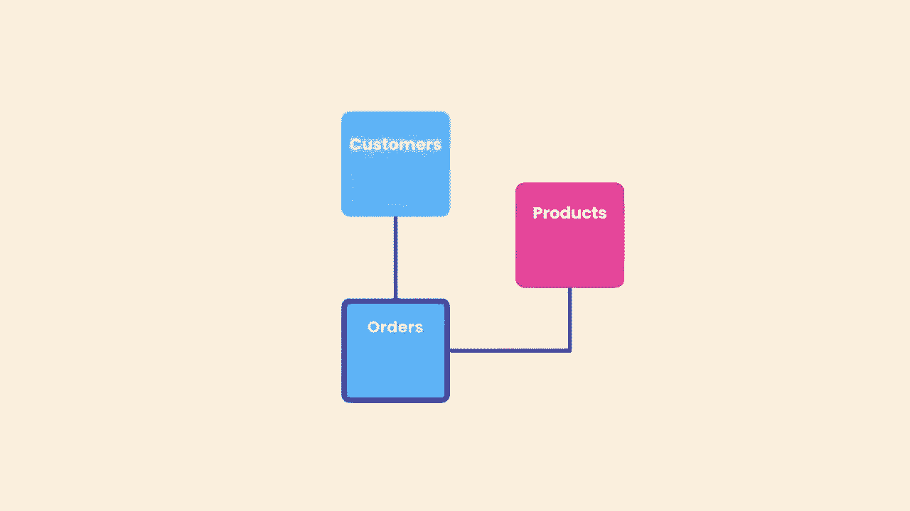
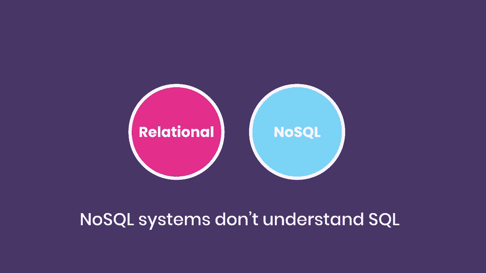
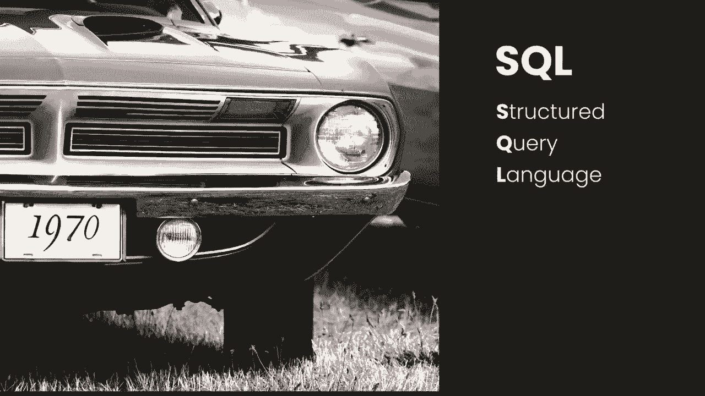
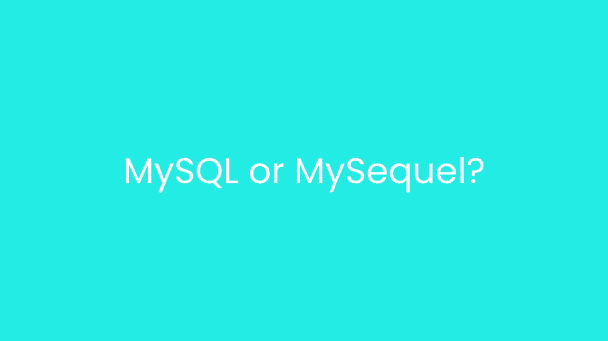
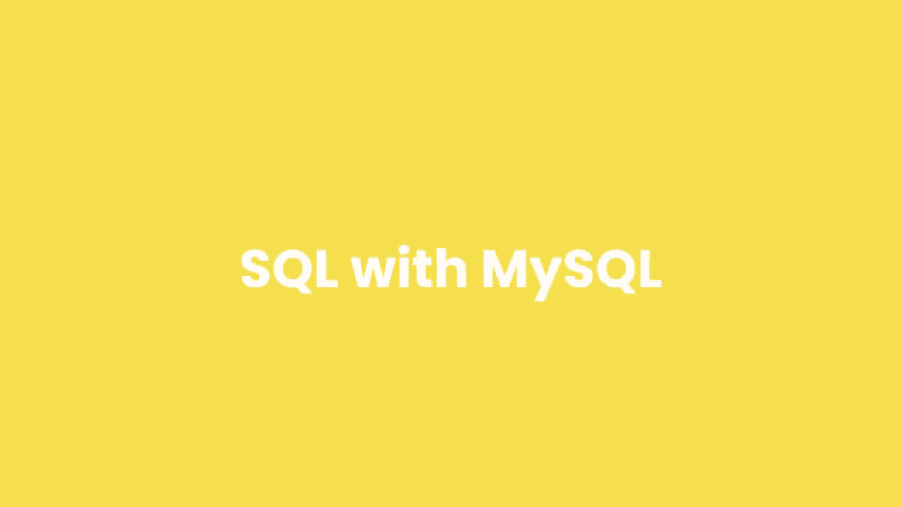

# SQL常用知识点合辑——P2：L2- 什么是 SQL？ 🗃️

在本节课中，我们将要学习SQL的基础概念。我们将从数据库的概述开始，了解什么是数据库以及如何使用它，然后介绍SQL语言本身及其在关系型数据库管理系统中的应用。

## 数据库与数据库管理系统概述

数据库是以易于访问的格式存储的数据集合。为了管理数据库，我们使用一个叫做**数据库管理系统（DBMS）**的软件应用程序。我们连接到DBMS并给它指令以查询或修改数据，DBMS将执行我们的指令并返回结果。

## 数据库管理系统的分类

现在有几种数据库管理系统，这些系统分为两类：关系型和非关系型（也称为NoSQL）。

在关系型数据库中，我们将数据存储在通过关系相互链接的表中。每个表存储特定类型对象的数据，如客户、产品、订单等。

**SQL**或**结构化查询语言**是我们用来操作这些关系型数据库管理系统的语言。我们使用SQL查询或修改数据。

市面上有许多不同的关系型数据库管理系统，最流行的有MySQL、微软的SQL Server和Oracle。每个数据库管理系统都有自己版本的SQL，但所有这些实现都非常相似，因为它们都基于标准SQL规范。

因此，你在本课程中学习的大部分SQL代码都适用于任何数据库管理系统。在本课程中，我们将使用**MySQL**，这是全球最受欢迎的开源数据库。

## 非关系型数据库简介

上一节我们介绍了关系型数据库，本节中我们来看看非关系型数据库。

在非关系型数据库中，我们没有表或关系。这些数据库与关系型数据库非常不同。非关系型数据库管理系统不理解SQL，它们有自己的查询语言。因此，我们使用SQL来处理关系型数据库管理系统。

## SQL的发音与历史

在我们开始安装MySQL之前，需要澄清一件事：SQL有两种常见的发音方式：“SQL”或“S-Q-L”。

SQL最初是在70年代由IBM开发的，当时被称为“SEQUEL”（结构化英语查询语言），但后来缩写改为“SQL”。一直以来，这种语言的发音方式存在争议。一般来说，非英语国家的人称其为“S-Q-L”。

我习惯称之为“SQL”，因为它更简短、更易记。但两种发音都是可以接受的。

关于MySQL作为软件产品，开发者们更喜欢称之为“MySQL”，而不是“My S-Q-L”，但他们并不介意我们称之为“My S-Q-L”。在本课程中，我将教你如何使用MySQL。

## 总结

本节课中我们一起学习了SQL的基础知识。我们了解了数据库和数据库管理系统（DBMS）的概念，区分了关系型和非关系型数据库，并明确了SQL是用于操作关系型数据库的标准语言。我们还介绍了本课程将使用的MySQL数据库，并澄清了SQL的发音和历史。在接下来的课程中，我们将开始动手安装和使用MySQL。