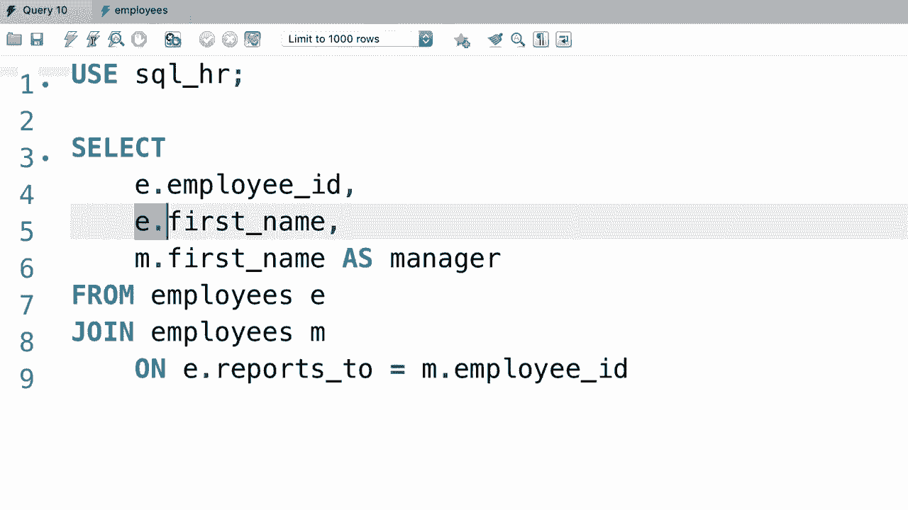

# SQL常用知识点合辑——P20：L20- 自联接 🔗


在本节课中，我们将要学习SQL中一个非常实用的技巧——自联接。自联接允许我们将一个表与其自身连接，这在处理具有层级关系的数据时非常有用，例如员工与经理的关系。

## 概述

自联接的核心思想是将同一个表视为两个独立的实体进行连接。这通常用于查询表中行与行之间的关系，比如查找每个员工的直接经理。

## 自联接的应用场景

为了更好地理解自联接，我们来看一个具体的例子。假设我们有一个名为`SQL_HR`的数据库，其中包含`employees`（员工）表。该表的结构如下：

*   `employee_id`：员工ID
*   `first_name`：名字
*   `last_name`：姓氏
*   `job_title`：职位
*   `salary`：薪资
*   `reports_to`：该员工的经理ID

请注意`reports_to`列，它存储的是经理的`employee_id`。我们没有在这里重复存储经理的详细信息（如电话、地址），而是通过ID引用他们。这样做的好处是信息一致且易于维护。

那么，经理的信息在哪里呢？实际上，经理本身也是公司的员工，他们的信息也存储在同一个`employees`表中。例如，一个员工的`reports_to`值为37270，这意味着ID为37270的员工就是他的经理。如果某个员工的`reports_to`字段为`NULL`，则代表他没有上级，例如公司的CEO。

## 如何编写自联接查询

上一节我们介绍了自联接的概念和应用场景，本节中我们来看看如何编写一个自联接查询，以获取每个员工及其经理的姓名。

首先，我们需要从`employees`表中选择数据。由于我们要将表与自身连接，必须为表的每次出现使用不同的别名。

以下是编写自联接查询的步骤：

1.  **为原始表设置别名**：我们首先从`employees`表中选择，并为其设置一个别名，例如`e`（代表employee）。
2.  **再次引用同一张表并设置新别名**：为了连接经理信息，我们需要再次引用`employees`表，并设置另一个别名，例如`m`（代表manager）。
3.  **指定连接条件**：连接条件是将员工表（`e`）的`reports_to`列与经理表（`m`）的`employee_id`列进行匹配。

让我们看看具体的SQL代码：

```sql
USE SQL_HR; -- 选择数据库

SELECT *
FROM employees e -- 员工表，别名为 e
JOIN employees m -- 再次连接员工表，别名为 m（代表经理）
    ON e.reports_to = m.employee_id; -- 连接条件
```

执行此查询后，结果集会包含两套完整的`employees`表列，第一套是员工（`e`）的信息，第二套是其经理（`m`）的信息。

## 优化查询结果

上一节的查询结果包含了所有列，这通常过于冗余。在实践中，我们往往只关心特定的列。

由于两个别名表（`e`和`m`）拥有完全相同的列名，在`SELECT`子句中必须为每一列明确指定表别名，否则会产生歧义。

以下是优化后的查询，它只选择员工的ID、姓名以及其经理的姓名：

```sql
SELECT
    e.employee_id,
    e.first_name AS employee_name,
    m.first_name AS manager_name
FROM employees e
JOIN employees m
    ON e.reports_to = m.employee_id;
```

在这段代码中：
*   `e.employee_id` 和 `e.first_name` 来自代表员工的表。
*   `m.first_name` 来自代表经理的表，我们使用`AS`关键字将其重命名为`manager_name`，使结果更清晰。

## 总结

本节课中我们一起学习了SQL的自联接。

*   **自联接**是将一个表与自身进行连接的操作。
*   其**核心语法**是使用不同的别名来区分表的两个角色，并通过相关列（如`reports_to`和`employee_id`）建立连接。
*   自联接非常适合查询**层级或树状结构数据**，例如组织架构、产品分类等。
*   编写查询时，务必为所有列**加上表别名前缀**，以明确列的来源。



自联接与连接其他表在逻辑上非常相似，唯一的区别在于连接的是同一个表。掌握这个技巧能帮助你更灵活地处理复杂的数据关系。

