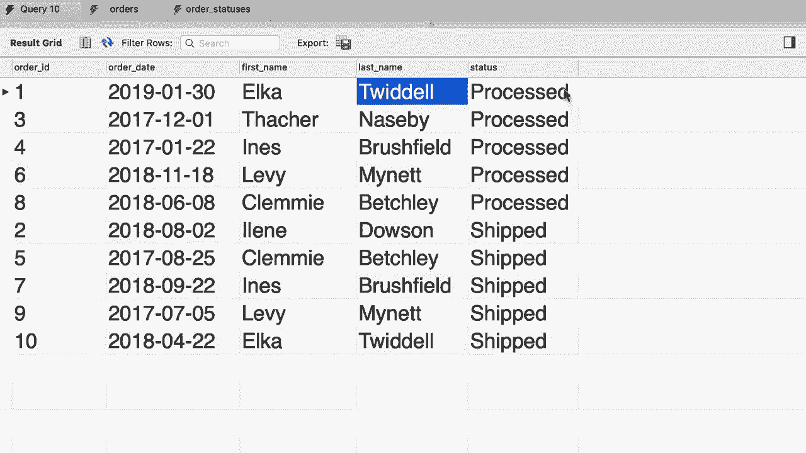
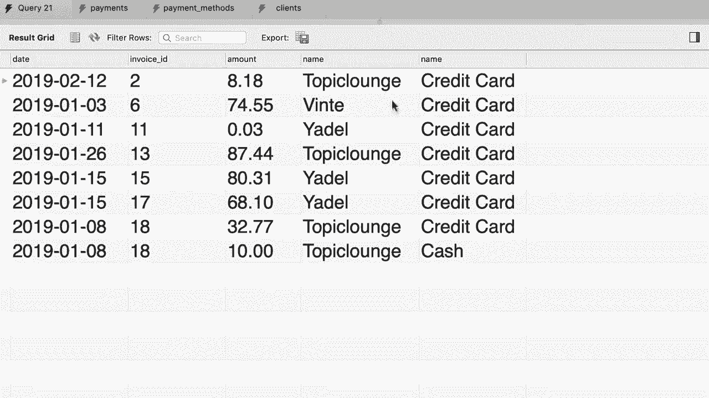

# SQL常用知识点合辑——P21：L21- 连接多个表 🧩


在本教程中，我们将学习如何在编写SQL查询时连接多个表。我们将通过一个商店数据库的实例，演示如何将订单表与客户表和订单状态表连接起来，以生成一份包含详细信息的报告。

## 概述

在之前的课程中，我们学习了如何连接两个表。本节我们将在此基础上，学习如何连接三个或更多的表。这在处理现实世界中的复杂数据关系时非常常见。

## 连接三个表

回到我们的SQL商店数据库，查看订单表。我们已经知道如何将此表与客户表连接，以获取每个订单对应的客户信息。然而，订单表中还有一个“状态”列，它存储的是状态ID，而非状态名称。状态名称实际存储在另一个名为“订单状态”的表中。

因此，我们需要编写一个查询，将订单表同时与客户表和订单状态表连接。

以下是编写此查询的步骤：

首先，选择目标数据库。

```sql
USE sql_store;
```

接下来，从订单表开始，使用`JOIN`关键字依次连接其他表。我们需要为每个表指定别名以简化查询。

```sql
SELECT *
FROM orders o
JOIN customers c
    ON o.customer_id = c.customer_id
JOIN order_statuses os
    ON o.status = os.order_status_id;
```

在这个查询中：
*   `orders o`：`orders`是主表，`o`是其别名。
*   `JOIN customers c`：连接`customers`表，别名`c`。连接条件是订单的`customer_id`等于客户的`customer_id`。
*   `JOIN order_statuses os`：连接`order_statuses`表，别名`os`。连接条件是订单的`status`等于状态表的`order_status_id`。

执行此查询会返回所有列，但结果可能过于复杂。为了生成更清晰的报告，我们应明确选择所需的列。



以下是优化后的查询，只选择关键信息：


```sql
SELECT
    o.order_id,
    o.order_date,
    c.first_name,
    c.last_name,
    os.name AS status
FROM orders o
JOIN customers c
    ON o.customer_id = c.customer_id
JOIN order_statuses os
    ON o.status = os.order_status_id;
```

这个查询的结果将为每一行显示：订单ID、订单日期、客户姓名以及订单状态。

## 实践练习：连接支付相关表

上一节我们介绍了如何连接三个表生成订单报告。本节中我们来看看另一个例子，以巩固所学知识。

现在，查看SQL发票数据库中的支付表。该表记录了客户对发票的支付情况，包含客户ID、发票ID、日期、金额和支付方式等列。

为了生成更详细的报告，我们需要将此表与客户表（以获取客户名称）和支付方式表（以获取支付方式名称）连接。

以下是完成此任务的步骤：

首先，切换到正确的数据库。

```sql
USE sql_invoicing;
```

然后，构建连接三个表的查询。同样，我们使用别名来简化语句。

```sql
SELECT
    p.date,
    p.invoice_id,
    p.amount,
    c.name AS client,
    pm.name AS payment_method
FROM payments p
JOIN clients c
    ON p.client_id = c.client_id
JOIN payment_methods pm
    ON p.payment_method = pm.payment_method_id;
```

在这个查询中：
*   `payments p`：主表是`payments`，别名`p`。
*   `JOIN clients c`：连接`clients`表（别名`c`），条件是支付记录中的`client_id`等于客户表中的`client_id`。
*   `JOIN payment_methods pm`：连接`payment_methods`表（别名`pm`），条件是支付记录中的`payment_method`等于支付方式表中的`payment_method_id`。
*   `SELECT`语句选择了日期、发票ID、金额、客户名称和支付方式名称。

执行此查询后，我们将得到一个清晰的报告，显示每笔支付的日期、对应发票、金额、客户以及所使用的支付方式（如信用卡、现金等）。



## 总结


本节课中我们一起学习了如何连接多个SQL表。我们掌握了使用多个`JOIN`子句将三个或更多表关联起来的方法，并通过选择特定的列来生成清晰、有用的数据报告。在处理复杂的数据库查询时，这是一种强大且必需的技术。记住，连接条件必须准确无误，否则会导致错误或错误的结果。