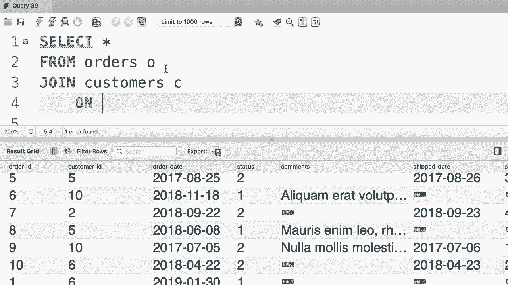

# SQL常用知识点合辑——P23：L23- 隐式连接语法 🧩


在本节课中，我们将要学习MySQL中的隐式连接语法。这是一种编写连接查询的替代方式，但了解其原理和潜在风险对于编写健壮的SQL语句至关重要。

## 显式连接语法回顾

上一节我们介绍了标准的内连接语法。让我们先回顾一个基本的内连接查询示例。

```sql
SELECT *
FROM orders
JOIN customers
  ON orders.customer_id = customers.customer_id;
```

这个查询从`orders`表中选择所有列，并将其与`customers`表连接，连接条件是两个表中的`customer_id`字段相等。这是使用`JOIN`和`ON`关键字的显式连接语法。

## 什么是隐式连接语法

本节中我们来看看如何使用隐式连接语法来编写相同的查询。隐式连接语法不使用`JOIN`关键字，而是通过在`FROM`子句中列出多个表，并将连接条件移至`WHERE`子句中来实现。

以下是使用隐式连接语法编写的等效查询：

```sql
SELECT *
FROM orders o, customers c
WHERE o.customer_id = c.customer_id;
```

在这个查询中，我们在`FROM`子句中同时列出了`orders`和`customers`两个表，并分别给它们起了别名`o`和`c`。连接条件`o.customer_id = c.customer_id`被移到了`WHERE`子句中。这两个查询的执行结果是完全相同的。

## 隐式连接的风险：笛卡尔积

虽然隐式连接语法在MySQL中是被支持的，但通常不建议使用它，因为它存在一个重大的风险：容易意外产生笛卡尔积。

如果我们不小心忘记了在隐式连接查询中编写`WHERE`子句，会发生什么呢？

```sql
SELECT *
FROM orders o, customers c;
```

执行这个查询将不会报错，但它会产生一个**笛卡尔积**。这意味着`orders`表中的每一条记录都会与`customers`表中的每一条记录进行配对连接。

假设`orders`表有10条记录，`customers`表有10条记录，那么查询结果将包含 **10 × 10 = 100** 条记录，这显然不是我们期望的结果。笛卡尔积会导致数据量急剧膨胀，消耗大量资源，并返回无意义的数据。

## 为什么推荐显式连接语法

鉴于隐式连接语法的风险，强烈建议始终使用显式连接语法（即`JOIN ... ON ...`）。

使用显式连接语法的主要优势在于其安全性。如果你尝试编写一个没有连接条件的显式连接，数据库会报出语法错误，从而强制你思考并明确指定连接逻辑。

```sql
-- 这将导致语法错误，提醒你缺少连接条件
SELECT *
FROM orders
JOIN customers;
```

这种设计帮助你避免了因疏忽而生成笛卡尔积的错误，使得代码更加清晰和健壮。

## 核心要点总结



本节课中我们一起学习了MySQL的隐式连接语法及其注意事项。

以下是本课的核心要点：
*   **隐式连接语法**：通过在`FROM`子句中列出多个表，并在`WHERE`子句中指定连接条件来实现表连接。
*   **主要风险**：忘记编写`WHERE`子句中的连接条件会导致产生笛卡尔积，即两个表所有行的组合，这通常是错误且低效的。
*   **最佳实践**：为了代码的清晰性和安全性，应始终优先使用显式连接语法（`JOIN ... ON ...`）。显式语法能强制指定连接条件，有效防止意外错误。


