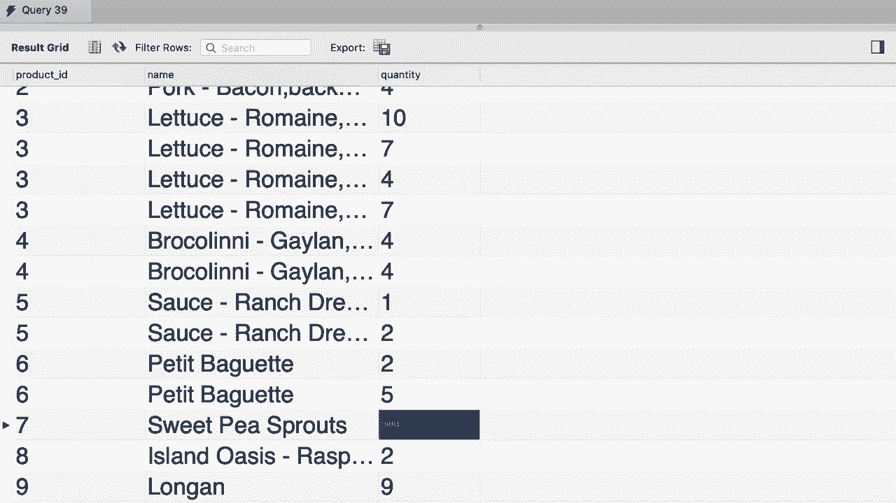
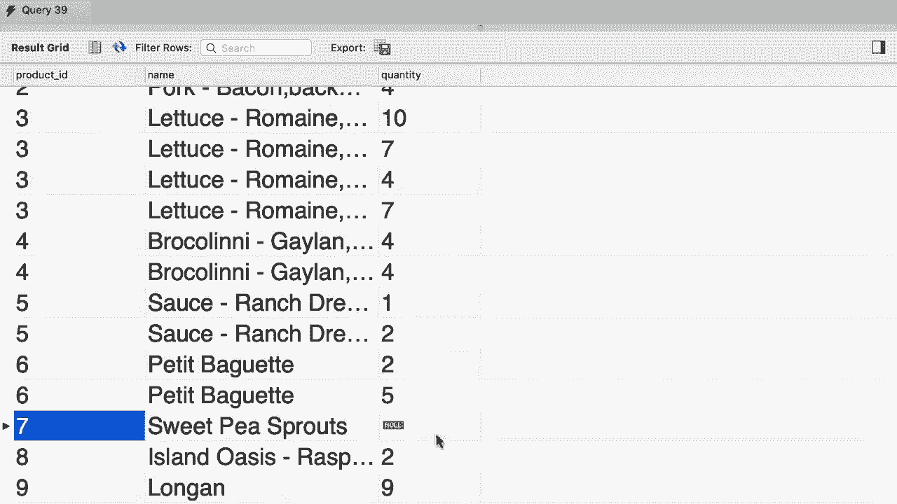
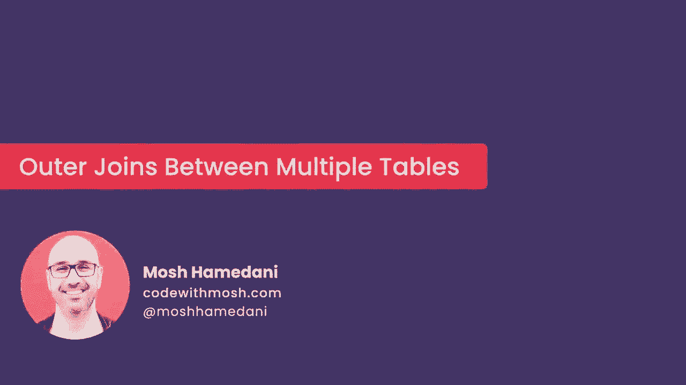

# SQL常用知识点合辑——P24：L24- 外连接 🧩


在本节课中，我们将要学习SQL中的外连接。之前我们介绍了内连接，并提到`INNER`关键字是可选的。本节中我们来看看外连接，它能解决内连接无法返回所有记录的问题。

## 内连接的局限性

首先，我们写一个使用内连接的基础查询。

```sql
SELECT 
    c.customer_id,
    c.first_name,
    o.order_id
FROM customers c
JOIN orders o
    ON c.customer_id = o.customer_id
ORDER BY c.customer_id;
```

执行此查询后，结果只包含了那些在`orders`表中有对应订单的客户。例如，客户2、5、6等。然而，在`customers`表中，客户1、3等因为没有订单，所以没有出现在结果中。

上一节我们介绍了内连接的特性，本节中我们来看看如何解决这个问题。

## 外连接的概念与类型

为了解决上述问题，我们需要使用外连接。外连接允许我们返回一个表中的所有记录，即使它在另一个表中没有匹配项。SQL中有两种主要的外连接：

*   **左外连接**：返回左表的所有记录，以及右表中匹配的记录。若无匹配，则右表部分为`NULL`。
*   **右外连接**：返回右表的所有记录，以及左表中匹配的记录。若无匹配，则左表部分为`NULL`。

以下是两种外连接的基本语法公式：
*   左外连接：`SELECT ... FROM 左表 LEFT [OUTER] JOIN 右表 ON 条件`
*   右外连接：`SELECT ... FROM 左表 RIGHT [OUTER] JOIN 右表 ON 条件`

其中，`OUTER`关键字是可选的，通常可以省略。

## 使用左外连接

现在，我们将上面的内连接查询改为左外连接，以查看所有客户。

```sql
SELECT 
    c.customer_id,
    c.first_name,
    o.order_id
FROM customers c
LEFT JOIN orders o
    ON c.customer_id = o.customer_id
ORDER BY c.customer_id;
```

执行此查询后，结果包含了`customers`表（左表）中的所有客户。对于有订单的客户（如客户2），会显示其`order_id`；对于没有订单的客户（如客户1、3），其`order_id`字段显示为`NULL`。

## 使用右外连接

右外连接与左外连接逻辑相似，但以右表为基准。直接使用右连接可能不会得到所有客户。

```sql
-- 此查询返回所有订单，而非所有客户
SELECT 
    c.customer_id,
    c.first_name,
    o.order_id
FROM customers c
RIGHT JOIN orders o
    ON c.customer_id = o.customer_id
ORDER BY c.customer_id;
```

若想用右连接查看所有客户，需要调整表的顺序，让`customers`表作为右表。

```sql
SELECT 
    c.customer_id,
    c.first_name,
    o.order_id
FROM orders o
RIGHT JOIN customers c
    ON c.customer_id = o.customer_id
ORDER BY c.customer_id;
```

## 实践练习

为了巩固理解，我们进行一个练习：编写查询，列出所有产品及其被订购的数量，即使某些产品从未被订购过。

以下是实现此目标的查询步骤：



1.  我们需要连接`products`表和`order_items`表。
2.  使用左外连接，以确保`products`表中的所有产品都能被列出。
3.  选择产品ID、产品名称和订购数量。


```sql
SELECT 
    p.product_id,
    p.name,
    oi.quantity
FROM products p
LEFT JOIN order_items oi
    ON p.product_id = oi.product_id;
```

执行此查询后，所有产品都会出现在结果中。对于从未被订购过的产品（如产品7），其`quantity`字段将显示为`NULL`。



## 总结


本节课中我们一起学习了SQL外连接的核心知识。我们了解到，内连接只返回两个表中匹配的记录，而外连接（包括左连接和右连接）可以返回一个表中的全部记录，并与另一个表进行匹配，不匹配的部分用`NULL`填充。`LEFT JOIN`和`RIGHT JOIN`的选择取决于你想以哪个表为基准返回所有行。记住，`OUTER`关键字通常可以省略，使代码更简洁。



