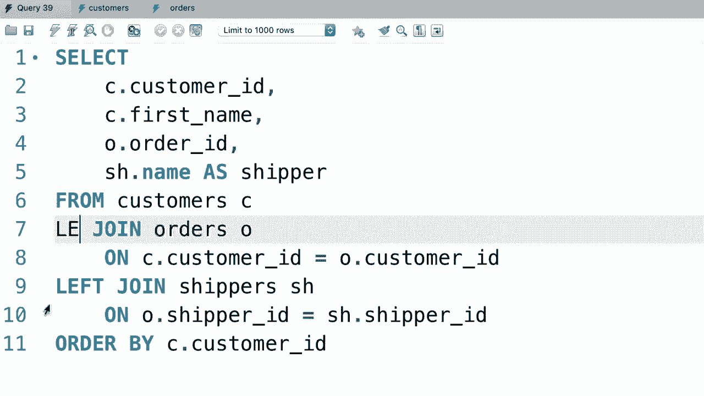
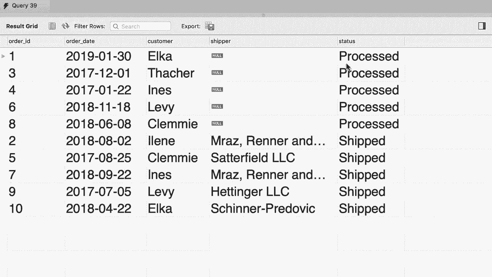

# SQL常用知识点合辑——P25：L25- 多个表之间的外连接 🧩


在本节课中，我们将要学习如何在多个表之间使用外连接。外连接允许我们获取一个表中的所有记录，即使在另一个表中没有匹配的记录。我们将通过一个具体的例子，演示如何将左连接与内连接结合使用，并解释为什么应避免使用右连接。

## 回顾左连接

上一节我们介绍了在两个表之间使用左连接。让我们回顾一下之前的查询，它在客户表（`customers`）和订单表（`orders`）之间进行了左连接。

```sql
SELECT *
FROM customers c
LEFT JOIN orders o ON c.customer_id = o.customer_id;
```

这个查询会返回所有客户，无论他们是否有订单。对于有订单的客户，结果中会显示订单信息。

## 连接第三个表

现在，如果你查看订单表，会发现一些订单有发货人ID（`shipper_id`），这表示订单已经发货。我们希望将订单表与发货人表（`shippers`）连接，以在结果中显示发货人的名称。

以下是初始尝试，在左连接后添加一个内连接：

```sql
SELECT *
FROM customers c
LEFT JOIN orders o ON c.customer_id = o.customer_id
JOIN shippers s ON o.shipper_id = s.shipper_id;
```

在这个查询中，我们有一个左外连接和一个内连接。执行后，我们可能只看到部分记录，因为一些订单没有发货人（即 `shipper_id` 为 `NULL`），导致内连接条件不成立，这些订单不会被返回。

## 使用左连接解决问题

要解决这个问题，确保所有订单都返回（无论是否有发货人），我们需要将第二个连接也改为左连接。

```sql
SELECT *
FROM customers c
LEFT JOIN orders o ON c.customer_id = o.customer_id
LEFT JOIN shippers s ON o.shipper_id = s.shipper_id;
```

现在，为了让结果更清晰，我们可以选择特定的列：

```sql
SELECT
    c.customer_id,
    c.name AS customer_name,
    o.order_id,
    o.order_date,
    s.name AS shipper_name
FROM customers c
LEFT JOIN orders o ON c.customer_id = o.customer_id
LEFT JOIN shippers s ON o.shipper_id = s.shipper_id;
```

执行这个查询，我们会得到所有客户及其所有订单，并且每个订单都会显示其发货人（如果存在）。这就是外连接在处理多个表时的强大之处。

## 关于左连接与右连接的最佳实践

在上一个教程中，你学到了使用左连接或右连接都可以得到相同的结果，只需交换表的顺序。然而，作为最佳实践，应避免使用右连接。



当连接多个表，并且混合使用左连接、右连接和内连接时，查询会变得非常复杂。其他人阅读你的代码时，会很难理解表是如何连接的。例如，如果一个查询中既有右连接又有左连接，逻辑会变得难以追踪。


因此，为了保持代码的清晰和可读性，建议统一使用左连接。


## 练习：综合运用连接


以下是本教程的练习。请编写一个查询，产生包含以下列的结果集：订单日期（`order_date`）、订单ID（`order_id`）、客户名字（`customer_name`）、发货人（`shipper_name`）和订单状态（`status_name`）。注意，一些订单可能尚未发货，因此发货人列可能为 `NULL`。

请花几分钟时间尝试完成这个练习。

## 练习解答

让我们一步步构建这个查询。

首先，从订单表开始，并将其与客户表连接。由于每个订单都对应一个客户，这里使用内连接或左连接均可。

```sql
SELECT
    o.order_id,
    o.order_date,
    c.name AS customer_name
FROM orders o
JOIN customers c ON o.customer_id = c.customer_id;
```

接下来，我们需要连接发货人表。由于部分订单可能没有发货人，我们必须使用左连接来确保所有订单都被返回。

```sql
SELECT
    o.order_id,
    o.order_date,
    c.name AS customer_name,
    s.name AS shipper_name
FROM orders o
JOIN customers c ON o.customer_id = c.customer_id
LEFT JOIN shippers s ON o.shipper_id = s.shipper_id;
```

最后，我们需要添加订单状态信息。这需要连接订单状态表（`order_statuses`）。

```sql
SELECT
    o.order_id,
    o.order_date,
    c.name AS customer_name,
    s.name AS shipper_name,
    os.name AS status_name
FROM orders o
JOIN customers c ON o.customer_id = c.customer_id
LEFT JOIN shippers s ON o.shipper_id = s.shipper_id
JOIN order_statuses os ON o.status = os.order_status_id;
```

请注意，在最后一个连接中，我们使用了内连接（`JOIN`），因为假设每个订单都有一个有效的状态。执行这个查询，我们将得到包含所有所需列的完整结果集。




## 总结

本节课中我们一起学习了如何在多个表之间使用外连接。关键点包括：
1.  使用左连接（`LEFT JOIN`）可以确保返回左表的所有记录，即使在右表中没有匹配项。
2.  在连接三个或更多表时，需要仔细考虑每个连接的类型，以确保获取所需的所有数据。
3.  作为最佳实践，应优先使用左连接并避免使用右连接，以保持查询逻辑的清晰和易于理解。
4.  通过综合练习，我们实践了将内连接与多个左连接结合使用，以生成包含客户、订单、发货人和状态信息的完整报告。