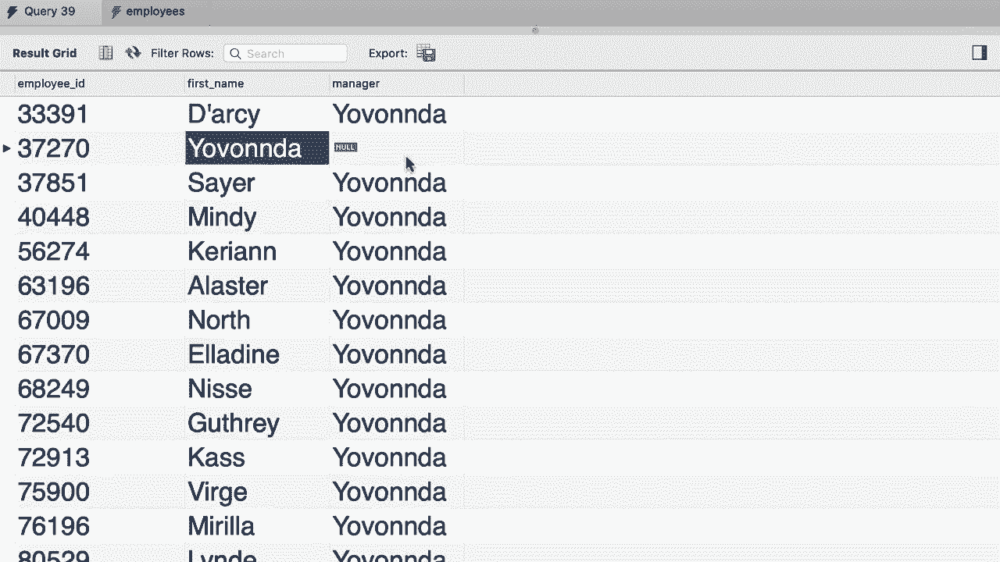

# SQL常用知识点合辑——P26：L26- 自外连接 🔗


在本节课中，我们将要学习如何使用自外连接来查询数据，特别是如何获取包括最高管理者在内的所有员工及其经理的信息。

## 回顾自连接

上一节我们介绍了SQL中的自连接。在SQL HR数据库中，有一个员工表。我们曾编写查询来获取所有员工及其经理。表中有一列 `reports_to`，用于指定每位员工的经理ID。

## 使用内连接的问题

让我们回到查询编辑窗口，首先使用SQL HR数据库。

```sql
USE sql_hr;
```

然后，我们尝试通过自连接来获取员工和经理信息。我们为员工表使用别名`E`，为经理表（即同一个表的另一实例）使用别名`M`。

```sql
SELECT
    E.employee_id,
    E.first_name,
    M.first_name AS manager
FROM employees E
JOIN employees M
    ON E.reports_to = M.employee_id;
```

执行此查询后，我们得到了所有有经理的员工记录。然而，结果中缺少了CEO或公司最高负责人的记录，因为这个人没有经理（`reports_to` 字段为NULL）。这是因为我们使用了内连接（`JOIN`），它只返回匹配连接条件的行。

## 引入左外连接

为了解决这个问题，我们需要使用左外连接（`LEFT JOIN`）。左外连接会返回左表（`employees E`）中的所有记录，即使在右表（`employees M`）中没有匹配的行。

以下是修改后的查询：

```sql
SELECT
    E.employee_id,
    E.first_name,
    M.first_name AS manager
FROM employees E
LEFT JOIN employees M
    ON E.reports_to = M.employee_id;
```

现在，当我们执行这个查询时，结果集会包含每一位员工。对于没有经理的最高负责人，其`manager`字段将显示为`NULL`。




## 关键步骤总结

以下是实现自外连接查询的核心步骤：


1.  **确定主表和连接表**：在本例中，`employees`表既是主表（别名`E`），也是用于连接获取经理信息的表（别名`M`）。
2.  **指定连接条件**：连接条件是主表的`reports_to`字段等于连接表的`employee_id`字段，即 `E.reports_to = M.employee_id`。
3.  **选择连接类型**：为了包含所有员工（即使没有经理），必须使用`LEFT JOIN`，而不是`INNER JOIN`。
4.  **选择所需列**：从主表选择员工信息（如ID、姓名），从连接表选择经理信息。


## 总结

本节课中我们一起学习了自外连接的应用。我们回顾了自连接的概念，指出了使用内连接进行自连接时会遗漏无经理员工记录的问题，并通过将内连接改为左外连接解决了这个问题。关键点在于理解**左外连接会保留左表的所有行**，这对于查询包含完整层级关系的数据至关重要。