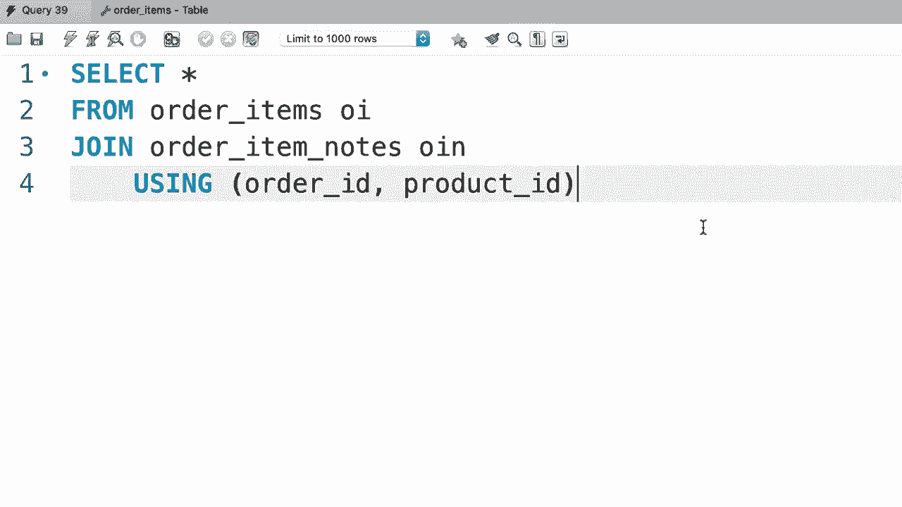
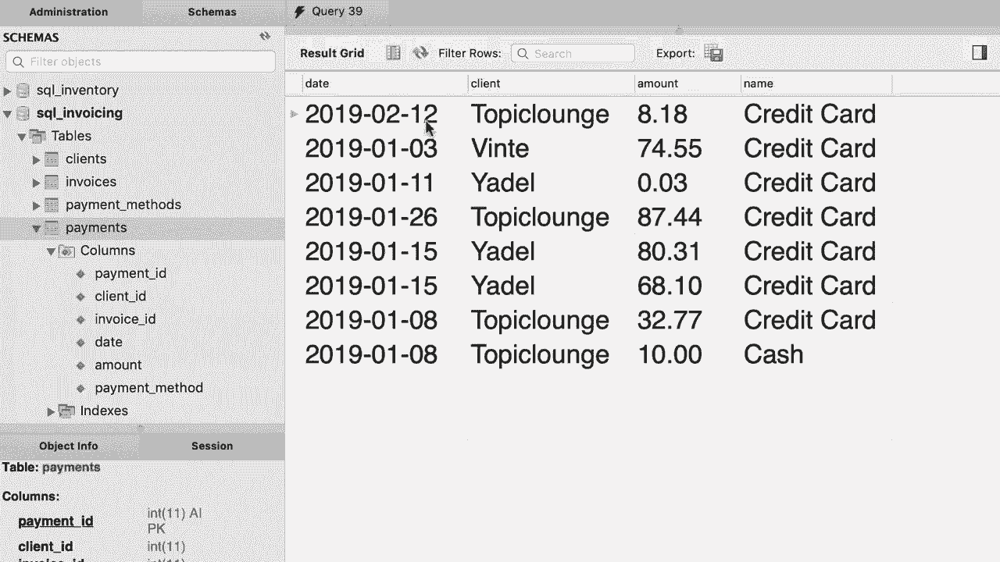
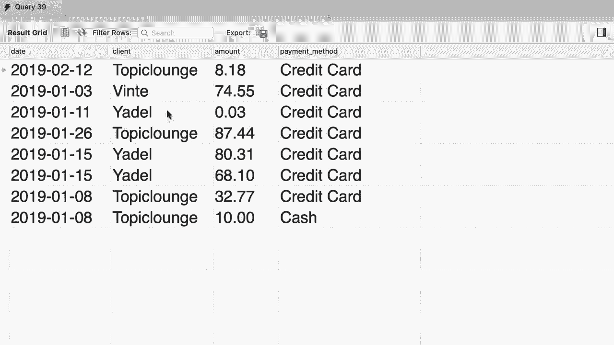

# SQL常用知识点合辑——P27：L27- USING表达式 📚


在本节课中，我们将要学习SQL中的`USING`表达式。这是一种简化连接查询的强大工具，特别是在多表连接时，能让我们的SQL语句更加简洁易读。

## 概述

当我们在SQL中进行多表连接时，通常需要使用`ON`子句来指定连接条件。随着查询变得复杂，这些连接条件可能会使查询语句变得冗长和难以阅读。`USING`关键字提供了一种更简洁的替代方案，但它的使用有特定条件。

## 简化单列连接条件

上一节我们介绍了基本的连接查询，本节中我们来看看如何使用`USING`来简化它们。

考虑一个将`orders`表与`customers`表连接的查询。传统的写法使用`ON`子句：

```sql
SELECT *
FROM orders o
JOIN customers c ON o.customer_id = c.customer_id;
```

如果连接的两个表中用于连接的列名**完全相同**（例如都是`customer_id`），我们可以使用`USING`子句来简化：

```sql
SELECT *
FROM orders
JOIN customers USING (customer_id);
```

第7行的`USING`语句与第6行的`ON`语句功能完全相同，但更简短、更易读。

## 在多表连接中使用USING

我们可以在查询中连续使用`USING`关键字。例如，在连接了客户信息后，我们还可以连接`shippers`表来获取发货人信息：

```sql
SELECT *
FROM orders
JOIN customers USING (customer_id)
JOIN shippers USING (shipper_id);
```

现在执行这个查询，我们可以得到订单ID以及对应的客户信息。为了展示更多信息，我们可以添加一列：

```sql
SELECT o.order_id, c.name AS customer, s.name AS shipper
FROM orders o
JOIN customers c USING (customer_id)
LEFT JOIN shippers s USING (shipper_id);
```

请注意，我们将第二个连接改为了`LEFT JOIN`，因为某些订单可能尚未发货。这说明了`USING`关键字同样适用于内连接和外连接。

## USING的使用限制

然而，`USING`关键字并非万能。它有一个重要的使用前提：**连接的两个表中的列名必须完全相同**。

例如，我们不能使用`USING`将`orders`表与`order_statuses`表连接，因为在`orders`表中对应的列名为`status`，而在`order_statuses`表中列名为`order_status_id`。在这种情况下，我们必须使用传统的`ON`子句：

```sql
SELECT *
FROM orders o
JOIN order_statuses os ON o.status = os.order_status_id;
```

## 简化复合键连接

当连接条件涉及多个列（即复合主键）时，`USING`关键字同样能发挥简化作用。

假设我们需要连接`order_items`表和`order_item_notes`表，连接条件涉及两列：`order_id`和`product_id`。使用`ON`子句的写法如下：



```sql
SELECT *
FROM order_items oi
JOIN order_item_notes oin 
  ON oi.order_id = oin.order_id 
  AND oi.product_id = oin.product_id;
```


这个连接条件看起来有些混乱。我们可以用`USING`关键字来简化它：

```sql
SELECT *
FROM order_items
JOIN order_item_notes USING (order_id, product_id);
```

在`USING`后的括号中，我们只需列出两个表中都存在的、用于连接的列名，并用逗号分隔。这样写不仅更简洁，也更容易理解。



## 实践练习


现在，让我们回到SQL发票数据库进行一个练习。

**任务**：编写一个查询，从`payments`表中选择支付记录，并连接其他表以显示日期、客户、金额和支付方式。

以下是实现步骤：

1.  首先连接`customers`表。由于两个表都有`customer_id`列，我们可以使用`USING`。
2.  然后连接`payment_methods`表。但请注意，在`payments`表中，相关列名为`payment_method`，而在`payment_methods`表中列名为`payment_method_id`。列名不同，因此我们必须使用`ON`子句。

以下是完整的查询语句：

```sql
SELECT 
    p.date,
    c.name AS customer,
    p.amount,
    pm.name AS payment_method
FROM payments p
JOIN customers c USING (customer_id)
JOIN payment_methods pm ON p.payment_method = pm.payment_method_id;
```

执行此查询，我们将得到格式清晰的结果，包含日期、客户名称、支付金额和所使用的支付方式。

## 总结



本节课中我们一起学习了SQL的`USING`表达式。我们了解到：


*   `USING`关键字是`ON`子句的一种简洁替代，用于指定表连接条件。
*   它的核心优势在于**简化查询语句**，提升可读性，尤其是在多表连接时。
*   使用`USING`有一个关键前提：**参与连接的两个表中的列名必须完全相同**。
*   它既可用于单列连接，也可用于多列（复合键）连接，只需在括号内列出所有共同列名。
*   当列名不同时，我们仍需使用传统的`ON`子句。

掌握`USING`表达式能让你的SQL代码更加优雅和专业。