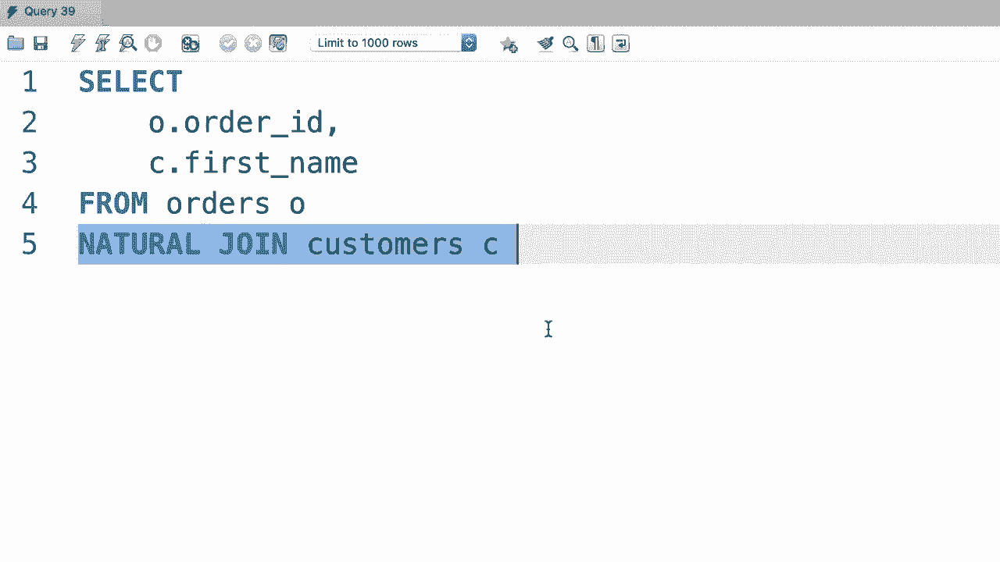

# SQL常用知识点合辑——P28：L28- 自然连接 🔗


在本节课中，我们将要学习SQL中的另一种表连接方法——自然连接。这是一种语法更简洁的连接方式，但使用时需要格外注意。

## 概述 📋

上一节我们介绍了使用`JOIN...ON`进行显式内连接。本节中我们来看看一种更简单的连接方式：自然连接。它的语法非常简短，但将连接条件的决定权交给了数据库引擎，这有时会带来风险。

## 什么是自然连接？ 🤔

自然连接是一种特殊的连接操作。它不需要我们使用`ON`子句明确指定连接条件。相反，数据库引擎会自动检查参与连接的两个表，找出所有**列名相同**的列，并将这些列作为连接条件。

其基本语法结构如下：
```sql
SELECT 列名
FROM 表A
NATURAL JOIN 表B;
```

## 自然连接示例 ✨

让我们通过一个具体的例子来理解它的工作方式。假设我们有两个表：`orders`（订单表）和`customers`（客户表），它们都有一个名为`customer_id`的公共列。

以下是使用自然连接查询订单及对应客户信息的示例：
```sql
SELECT order_id, first_name
FROM orders
NATURAL JOIN customers;
```
在这个查询中，数据库会自动识别出`orders`和`customers`表都包含`customer_id`列，并基于此列进行等值连接，返回匹配的结果。

## 自然连接的优点与风险 ⚖️

自然连接的主要优点是**编码简洁**。我们无需手动编写连接条件，SQL语句更短。

然而，这也正是它的主要风险所在。以下是使用自然连接时需要注意的几个关键点：

*   **失去控制权**：连接条件由数据库自动推断，我们无法精确控制。
*   **依赖列名**：如果两个表有多个同名列（例如都有`created_at`字段），这些列都会被加入连接条件，可能导致意外结果。
*   **可读性差**：对于阅读代码的人来说，无法直接从SQL语句中看出具体的连接逻辑。

正因如此，在生产环境或重要的查询中，通常不鼓励使用自然连接。使用显式的`INNER JOIN`或`LEFT JOIN`配合`ON`子句是更安全、更清晰的做法。



## 总结 🎯

本节课中我们一起学习了SQL的自然连接。我们了解到，自然连接是一种基于相同列名自动进行表连接的简便方法，其语法非常简短。但是，由于它将连接逻辑的控制权交给了数据库，并且完全依赖于列名的一致性，因此可能产生难以预料的结果，在实际开发中应谨慎使用。


