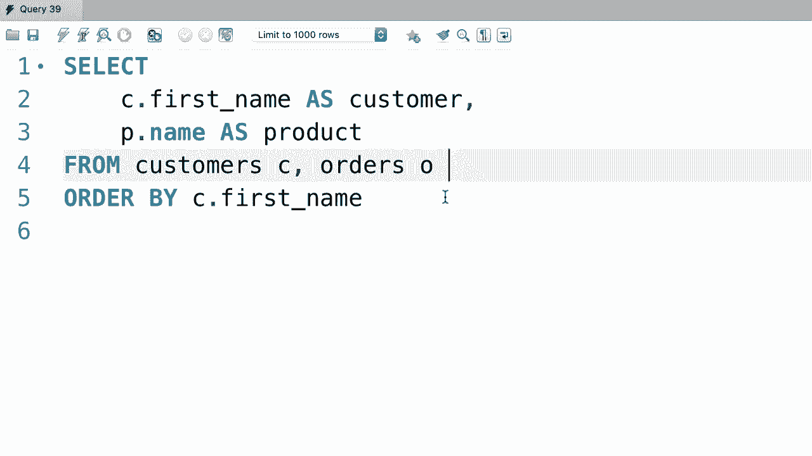
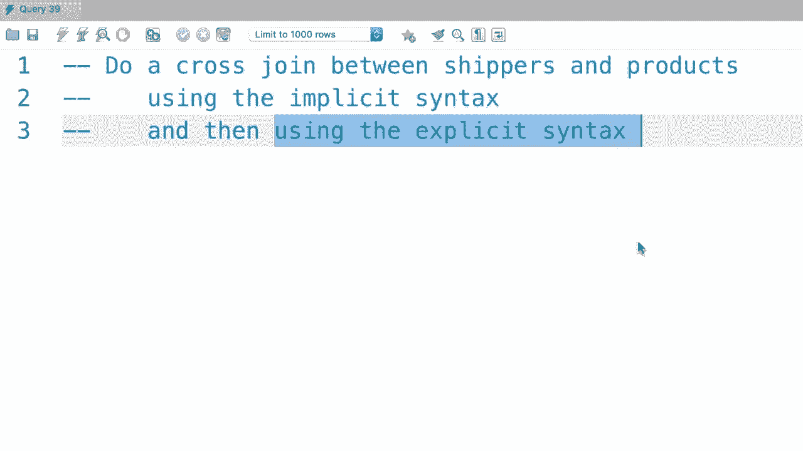
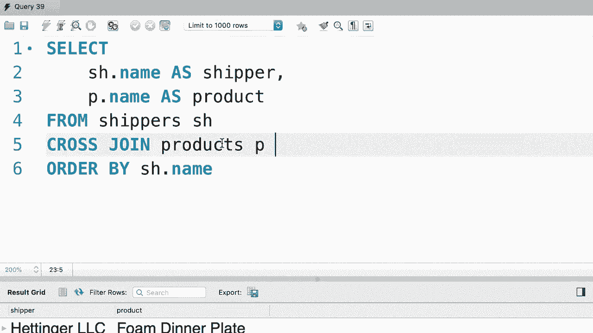

# SQL常用知识点合辑——P29：L29- 交叉连接 🔗


在本节课中，我们将学习SQL中的交叉连接。交叉连接用于将第一张表中的每一条记录与第二张表中的每一条记录进行组合。

## 概述

交叉连接是SQL连接操作的一种，它返回两个表的笛卡尔积。这意味着结果集中的每一行都是第一个表的某一行与第二个表的某一行的组合。

## 交叉连接的基本语法

交叉连接有两种语法形式：显式语法和隐式语法。

以下是交叉连接的显式语法示例：

```sql
SELECT *
FROM 表A
CROSS JOIN 表B;
```

在这个查询中，`表A`中的每一条记录都会与`表B`中的每一条记录进行组合。

为了更清晰地展示结果，我们可以选择特定的列并为其设置别名。例如：

```sql
SELECT
    c.first_name AS 客户,
    p.name AS 产品
FROM customers c
CROSS JOIN products p
ORDER BY c.first_name;
```

执行此查询后，会先列出第一位客户与所有产品的组合，然后是下一位客户与所有产品的组合，依此类推。

## 交叉连接的适用场景

在上一节我们介绍了交叉连接的基本语法，本节中我们来看看它的典型使用场景。

使用交叉连接的一个典型例子是组合不同的属性。例如，假设你有一个包含尺寸（小、中、大）的`尺寸表`和一个包含颜色（红、蓝、绿）的`颜色表`。如果你想生成所有尺寸与所有颜色的组合列表，交叉连接就非常有用。

## 显式语法与隐式语法

除了显式语法，交叉连接还可以使用隐式语法来实现。

以下是隐式语法的写法：

```sql
SELECT *
FROM 表A, 表B;
```



这两种写法（显式和隐式）会产生完全相同的结果集。显式语法使用`CROSS JOIN`关键字，而隐式语法则是在`FROM`子句中直接列出多个表名，用逗号分隔。

虽然结果相同，但显式语法通常被认为更清晰、更易读，因为它明确表达了连接的类型。


## 实践练习

为了巩固对交叉连接的理解，我们来进行一个简单的练习。

以下是练习要求：对`shippers`（运输商）表和`products`（产品）表执行交叉连接。请分别使用隐式语法和显式语法完成。

这个过程相当简单。请尝试动手编写代码，以熟悉这两种语法。



### 使用隐式语法


首先，我们使用隐式语法来实现交叉连接。

```sql
SELECT
    s.name AS 运输商,
    p.name AS 产品
FROM shippers s, products p
ORDER BY s.name;
```

执行此查询后，我们将得到所有运输商与所有产品的组合列表，并按运输商名称排序。

### 使用显式语法

接下来，我们使用显式语法来实现相同的功能。

```sql
SELECT
    s.name AS 运输商,
    p.name AS 产品
FROM shippers s
CROSS JOIN products p
ORDER BY s.name;
```

这个查询将产生与隐式语法完全相同的结果。



## 总结

本节课中我们一起学习了SQL中的交叉连接。


我们首先了解了交叉连接的定义，它用于生成两个表的笛卡尔积。然后，我们学习了其显式语法（`CROSS JOIN`）和隐式语法（在`FROM`子句中用逗号分隔表名）。最后，我们通过一个组合运输商和产品的练习，实践了这两种语法。

记住，虽然两种语法结果相同，但在编写复杂查询时，使用显式的`CROSS JOIN`语法通常能使代码意图更清晰。