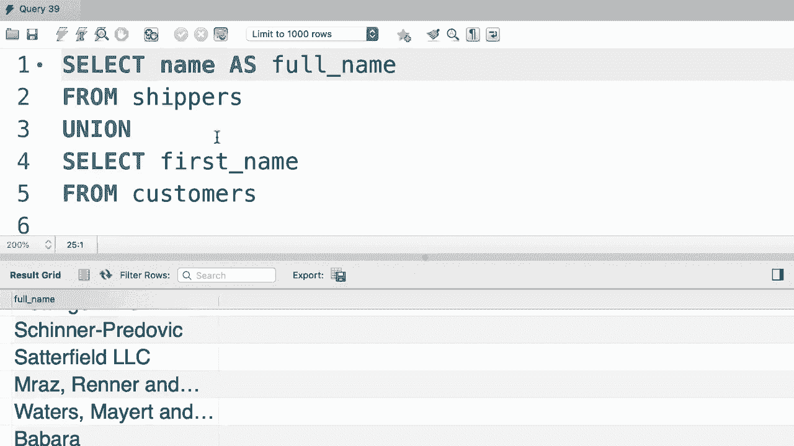
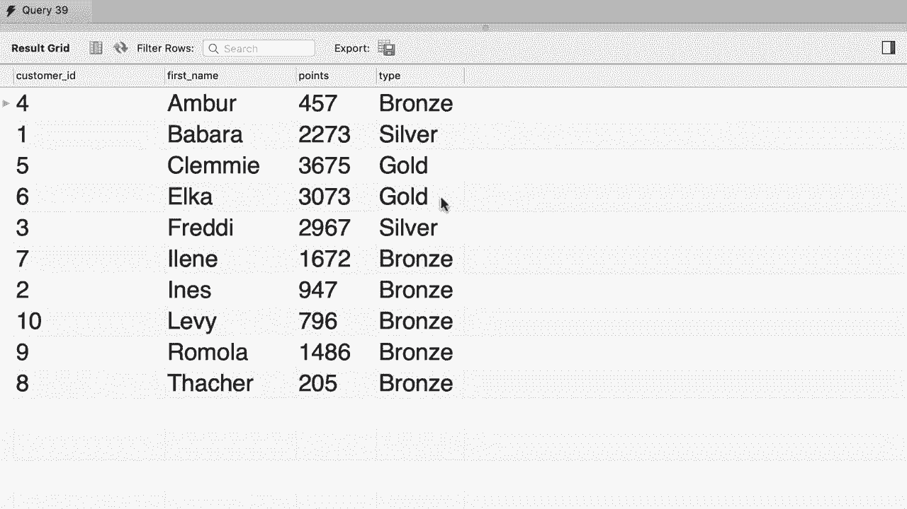

# SQL常用知识点合辑——P30：L30- 联合操作符 UNION 🧩


在本节课中，我们将要学习SQL中的`UNION`操作符。我们已经学习了如何使用`JOIN`来组合多个表的列。本节中我们来看看如何使用`UNION`来组合多个查询结果的行，这是一个非常强大的功能。

## 概述：什么是UNION？

`UNION`操作符用于合并两个或多个`SELECT`语句的结果集。每个`SELECT`语句必须拥有相同数量的列，且对应列的数据类型必须兼容。`UNION`会自动去除结果集中的重复行。

## 基础用法：合并同一表的查询结果

首先，我们快速查看一下订单表。

```sql
SELECT * FROM orders;
```

假设我们需要创建一个报告，为每个订单添加状态标签：如果订单日期是当前年份（2019年），则标记为“active”；如果是更早的年份，则标记为“archived”。

我们先获取当前年份的订单，并添加标签。

```sql
SELECT
    order_id,
    order_date,
    ‘active’ AS status
FROM orders
WHERE order_date >= ‘2019-01-01’;
```

接着，我们获取之前年份的订单，并添加不同的标签。

```sql
SELECT
    order_id,
    order_date,
    ‘archived’ AS status
FROM orders
WHERE order_date < ‘2019-01-01’;
```

现在，使用`UNION`操作符将这两个查询的结果合并成一个结果集。

```sql
SELECT
    order_id,
    order_date,
    ‘active’ AS status
FROM orders
WHERE order_date >= ‘2019-01-01’

UNION

SELECT
    order_id,
    order_date,
    ‘archived’ AS status
FROM orders
WHERE order_date < ‘2019-01-01’;
```

执行后，我们会先看到当前年份的“active”订单，接着是之前年份的所有“archived”订单。

## 扩展应用：合并不同表的查询结果

`UNION`不仅可以用于同一张表，也可以合并来自不同表的查询结果。以下是合并客户表（`customers`）和发货人表（`shippers`）中名称字段的例子。

```sql
SELECT first_name FROM customers
UNION
SELECT name FROM shippers;
```

请注意，这个例子主要用于演示功能，在实际业务中可能不常用。一个更实际的场景可能是合并“活动订单”表和“归档订单”表的所有记录。

## 使用UNION的重要规则

在使用`UNION`时，必须遵守以下核心规则：

1.  **列数必须相同**：每个`SELECT`语句必须返回相同数量的列，否则会报错。
2.  **列的数据类型必须兼容**：对应列的数据类型应该相似（例如，都是字符串或都是数字）。
3.  **列名由第一个查询决定**：最终结果集的列名取自第一个`SELECT`语句中的列名或别名。

例如，下面的查询会因列数不同而失败：

```sql
-- 错误示例：列数不匹配
SELECT first_name, last_name FROM customers
UNION
SELECT name FROM shippers;
```

我们可以通过调整查询顺序或使用别名来控制最终结果集的列名。

```sql
SELECT name FROM shippers
UNION
SELECT first_name FROM customers;
```

## 实战练习：客户积分等级报告

现在，让我们通过一个练习来巩固所学知识。我们需要生成一个报告，包含以下四列：`customer_id`、`first_name`、`points`、`type`。`type`列根据积分动态生成：
*   积分 < 2000：`Bronze`
*   2000 <= 积分 <= 3000：`Silver`
*   积分 > 3000：`Gold`

最终结果需要按客户名字（`first_name`）排序。



以下是实现步骤和最终查询：


首先，查询“青铜”级别客户。

```sql
SELECT
    customer_id,
    first_name,
    points,
    ‘Bronze’ AS type
FROM customers
WHERE points < 2000;
```

接着，使用`UNION`合并“白银”级别客户的查询。

```sql
SELECT
    customer_id,
    first_name,
    points,
    ‘Bronze’ AS type
FROM customers
WHERE points < 2000

UNION

SELECT
    customer_id,
    first_name,
    points,
    ‘Silver’ AS type
FROM customers
WHERE points BETWEEN 2000 AND 3000;
```

最后，再次使用`UNION`合并“黄金”级别客户，并在整个查询的最后添加`ORDER BY`子句进行排序。

```sql
SELECT
    customer_id,
    first_name,
    points,
    ‘Bronze’ AS type
FROM customers
WHERE points < 2000

UNION

SELECT
    customer_id,
    first_name,
    points,
    ‘Silver’ AS type
FROM customers
WHERE points BETWEEN 2000 AND 3000

UNION

SELECT
    customer_id,
    first_name,
    points,
    ‘Gold’ AS type
FROM customers
WHERE points > 3000

ORDER BY first_name;
```

执行此查询后，我们将得到一个按客户名字排序的完整报告，其中包含了所有客户及其对应的积分等级。

## 总结 📝

本节课中我们一起学习了SQL的`UNION`操作符。我们了解到：
1.  `UNION`用于垂直合并多个`SELECT`查询的结果集。
2.  它要求每个查询必须拥有相同数量的列，且列的数据类型兼容。
3.  结果集的列名由第一个查询决定。
4.  通过`UNION`，我们可以灵活地将来自同一表或不同表的数据组合在一起，生成复杂的报告，例如本课中的客户积分等级报告。

掌握`UNION`能极大地增强你处理复杂数据汇总和报告生成的能力。



