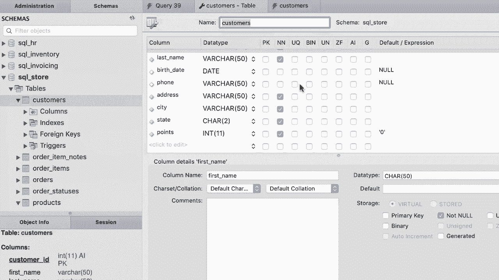

# SQL常用知识点合辑——P31：L31- 列属性 📋

在本节课中，我们将学习如何查看和理解数据表的列属性。理解这些属性是进行数据插入、更新和删除操作的基础。

上一节我们介绍了数据表的基本操作，本节中我们来看看如何查看和理解数据表的列属性。首先，请点击设计模式图标来打开客户表的设计视图。这里显示的内容包含了每列的详细设置。

## 理解列属性

在表的设计视图中，左侧是列名，旁边是每列的数据类型。

*   **客户ID** 列的数据类型是整数（`INT`）。整数是像1、2、3这样没有小数点的数字。
*   **名字** 列的数据类型是 `VARCHAR(50)`。`VARCHAR` 代表可变长度字符，括号中的 `50` 表示此列最多可以存储50个字符。如果实际存储的名字只有5个字符，数据库也只会占用5个字符的空间，不会浪费。
*   与 `VARCHAR` 对应的是 `CHAR` 类型。如果使用 `CHAR(50)` 存储一个5字符的名字，数据库会自动用45个空格填充，这会浪费存储空间。因此，最佳实践是通常使用 `VARCHAR` 来存储字符串。

在视图的右侧，我们可以看到一些额外的列属性标记：

*   **PK**：代表主键（Primary Key）。客户ID列被标记为主键，这就是它旁边有一个黄色钥匙图标的原因。主键的值唯一标识表中的每一行记录。
*   **NN**：代表非空（Not Null）。这个属性决定了该列是否允许存储 `NULL` 值。对于客户ID、名字、姓氏等列，`NN` 被勾选，意味着这些列必须有值。而出生日期和电话列没有勾选 `NN`，表示这些列可以为空（`NULL`），即可选。
*   **AI**：代表自动递增（Auto Increment）。这个属性通常与主键列一起使用。每次向表中插入新记录时，数据库引擎会自动为该列生成一个值，通常是取最后一行的值并加1。例如，如果最后一位客户的ID是10，那么下一位新客户的ID会自动设为11。
*   **Default**：此列指定了该列的默认值。例如，出生日期和电话列的默认值是 `NULL`。如果我们插入数据时不提供这些列的值，数据库将自动填入 `NULL`。积分列的默认值被设置为 `0`，因此如果不提供积分值，数据库会默认使用0。

表设计中还有其他一些列属性，在现阶段并不关键，我们将在后续课程中学习。

## 本节总结

本节课中我们一起学习了如何查看和理解数据表的列属性。我们认识了数据类型（如 `INT`, `VARCHAR`），以及重要的列属性标记：主键（PK）、非空（NN）、自动递增（AI）和默认值（Default）。理解这些属性是准确操作表中数据的前提。

现在你已经了解了表中每列的属性，接下来我们就可以开始学习如何向这个表中插入数据了。