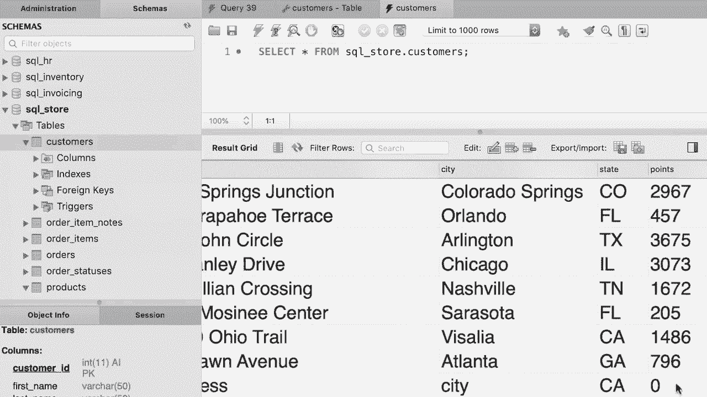

# SQL常用知识点合辑——P32：L32- 插入单行 📝


在本教程中，我们将学习如何使用 `INSERT` 语句向数据库表中插入一行新数据。这是向数据库添加记录的基础操作。

## 插入语句的基本结构

要向表中插入一行，我们使用 `INSERT INTO` 语句。其基本语法是：指定表名，然后使用 `VALUES` 子句为表的每一列提供对应的值。

```sql
INSERT INTO 表名
VALUES (值1, 值2, 值3, ...);
```

上一节我们介绍了插入语句的基本概念，本节中我们来看看一个具体的例子。

## 为所有列插入值

假设我们要向 `customers` 表中插入一行数据。首先，我们需要了解表的结构。以下是 `customers` 表的所有列：`customer_id`, `first_name`, `last_name`, `birth_date`, `phone`, `address`, `city`, `state`, `points`。

其中，`customer_id` 列启用了自增属性。这意味着如果我们不为其提供值，MySQL会自动生成一个唯一的值。显式提供一个值（如200）可能导致与现有ID冲突，从而引发错误。因此，更推荐的做法是使用 `DEFAULT` 关键字，让MySQL自动生成。

对于字符串和日期类型的值，在SQL中必须用引号括起来，可以使用单引号或双引号。

以下是向所有列插入值的示例语句：

```sql
INSERT INTO customers
VALUES (
    DEFAULT,
    ‘John’,
    ‘Smith’,
    ‘1990-01-01’,
    NULL,
    ‘123 Main St’,
    ‘New York’,
    ‘NY’,
    DEFAULT
);
```

在这个例子中：
*   `customer_id` 和 `points` 使用了 `DEFAULT` 关键字。
*   名字、姓氏、出生日期、地址、城市和州提供了具体的值。
*   电话列使用了 `NULL` 关键字，表示该列没有值。

为了代码的清晰和易读性，建议将语句分成多行书写。

## 为指定列插入值

除了为所有列提供值，我们还可以选择只为部分列插入数据。这种方法更为灵活。

其语法是在表名后明确列出要插入值的列名，然后在 `VALUES` 子句中按相同顺序提供对应的值。

```sql
INSERT INTO 表名 (列名1, 列名2, ...)
VALUES (值1, 值2, ...);
```

以下是具体操作步骤：

首先，在表名后指定我们想要赋值的列。例如，我们只想为 `first_name`, `last_name`, `birth_date`, `address`, `city`, `state` 这六列提供值。

```sql
INSERT INTO customers (
    first_name,
    last_name,
    birth_date,
    address,
    city,
    state
)
VALUES (
    ‘John’,
    ‘Smith’,
    ‘1990-01-01’,
    ‘123 Main St’,
    ‘New York’,
    ‘NY’
);
```

使用这种方法的好处是：
1.  我们无需为未指定的列（如 `phone`, `points`）显式地写入 `NULL` 或 `DEFAULT`。
2.  可以自由调整列的顺序，只需确保 `VALUES` 子句中值的顺序与之匹配即可。例如，可以先写姓氏再写名字：

```sql
INSERT INTO customers (
    last_name,
    first_name,
    state,
    city,
    address,
    birth_date
)
VALUES (
    ‘Smith’,
    ‘John’,
    ‘NY’,
    ‘New York’,
    ‘123 Main St’,
    ‘1990-01-01’
);
```

## 执行与验证

执行上述任一 `INSERT` 语句后，数据库会返回类似“1 row affected”的消息，表示一行记录已成功插入。

现在让我们查看 `customers` 表中的数据来验证插入结果。



可以看到，最后一行就是我们刚刚插入的新记录。`customer_id` 被自动生成为11（这是自增属性的效果），我们没有提供值的 `phone` 列显示为空，`points` 列则使用了默认值0。


## 总结


本节课中我们一起学习了如何向SQL数据库表中插入单行数据。我们掌握了两种主要方法：
1.  **为所有列插入值**：使用 `INSERT INTO 表名 VALUES (...)` 语法，需要为每一列按顺序提供值，对于想使用默认值或留空的列，需使用 `DEFAULT` 或 `NULL` 关键字。
2.  **为指定列插入值**：使用 `INSERT INTO 表名 (列名1, 列名2, ...) VALUES (...)` 语法。这种方法更加灵活和安全，允许我们只关注需要赋值的列，并且可以自定义列的顺序。


理解并熟练运用 `INSERT` 语句，是进行数据管理和操作的重要第一步。