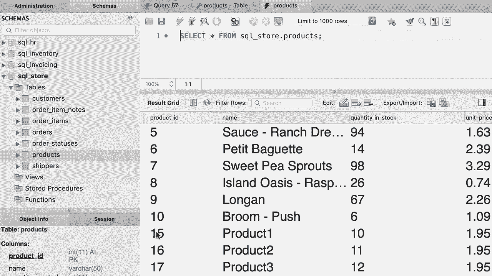

# SQL常用知识点合辑——P33：L33- 插入多行 📥


在本教程中，我们将学习如何使用一条SQL语句一次性向数据库表中插入多行数据。我们将通过具体的例子来演示这一操作。

## 准备工作

为了演示，我们将使用一个名为 `shippers` 的表。首先，让我们查看一下这个表的定义。

该表有两列：
*   `shipper_id`：这是主键，不能为空，并且是一个自增列。这意味着MySQL会自动为这一列生成递增值。
*   `name`：这是我们需要提供数据的列。

因此，在插入数据时，我们只需要为 `name` 列提供值。

## 插入多行数据

回到查询编辑窗口。插入单行数据的标准语法是：
```sql
INSERT INTO table_name (column_name) VALUES (value);
```

要插入多行，只需在 `VALUES` 子句后添加多个用逗号分隔的值组。

以下是向 `shippers` 表一次性插入三行数据的语句：

```sql
INSERT INTO shippers (name)
VALUES ('Shipper1'),
       ('Shipper2'),
       ('Shipper3');
```

现在执行这个语句。

执行成功后，我们可以检查 `shippers` 表中的数据。最初表中只有五行记录，执行插入后，可以看到新增了三条记录。

请注意，`shipper_id` 列的值（6, 7, 8）是由MySQL自动生成的。

## 练习

现在，我们来完成一个练习，以巩固对插入多行数据的理解。

编写一个语句，向 `products` 表中插入三行数据。这个表有四列，但第一列是自增列，因此我们只需要为 `name`、`quantity_in_stock` 和 `unit_price` 列提供值。

以下是插入语句的示例：

```sql
INSERT INTO products (name, quantity_in_stock, unit_price)
VALUES ('Product1', 10, 1.95),
       ('Product2', 20, 2.95),
       ('Product3', 30, 3.95);
```

执行这个语句，然后验证结果。在 `products` 表中，现在应该能看到三条新记录。

你可能会注意到新记录的ID是15、16和17，而不是从11开始。这是因为在录制本教程前，表中曾插入并删除过一些记录，自增计数器会记住最后使用的值。在你的环境中，ID可能会从11开始递增。




## 总结

在本节课中，我们一起学习了如何使用 `INSERT INTO ... VALUES (...), (...), (...);` 的语法，一次性向数据库表中插入多行数据。关键点在于，在 `VALUES` 关键字后，用逗号分隔多个括号包裹的值组。对于自增主键列，数据库会自动处理值的生成，我们无需手动指定。掌握这个方法可以极大地提高数据插入的效率。