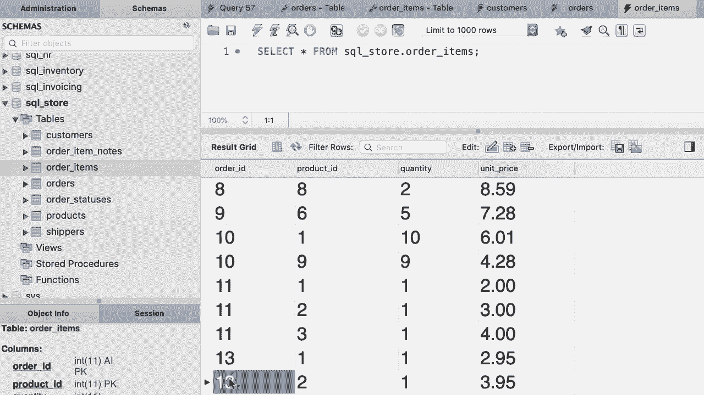

# SQL常用知识点合辑——P34：L34- 插入分层行 📝


在本节课中，我们将要学习如何向多个相关联的表中插入数据，即插入分层数据。我们将通过一个具体的例子——插入一个订单及其包含的所有项目——来掌握这一技巧。

到目前为止，我们只学习了如何向单个表插入数据。本节将展示如何向多个表插入数据。这里有一个很好的例子。请看订单表。该表包含订单ID、客户ID、订单日期、状态、评论以及运输信息等列。但此订单的实际项目不在此表中，它们存储在订单项目表中。

在订单项目表中，我们有四列：订单ID、产品ID、数量和单价。因此，一个订单可以包含一个或多个订单项目。这就是我们所说的父子关系。在这个关系中，订单表是父表，订单项目表是子表。订单表中的一行可以在订单项目表中有一个或多个子项。本教程将展示如何插入一个订单及其所有项目，从而学习如何向多个表插入数据。

## 插入父表记录

首先，我们需要在父表（订单表）中插入一条记录。

以下是插入订单的步骤。订单表有多列，但只有客户ID、订单日期和状态是必须提供的值。订单ID是自增列，数据库会自动生成。

```sql
INSERT INTO orders (customer_id, order_date, status)
VALUES (1, '2019-01-02', 1);
```

在这条语句中，我们指定了列名并提供了对应的值。客户ID `1` 必须是一个存在于客户表中的有效ID。订单状态 `1` 也必须是一个有效的状态ID。

## 获取新插入记录的ID

插入订单后，我们需要获取数据库为新订单自动生成的ID，以便在子表中使用。

MySQL提供了一个内置函数 `LAST_INSERT_ID()` 来获取最后插入行的自增ID值。函数就像一段可重用的代码，数据库引擎提供了许多这样的内置函数供我们使用。

```sql
SELECT LAST_INSERT_ID();
```

执行此查询将返回新插入订单的ID。在继续之前，请确保用分号终止之前的插入语句，然后执行整个查询块以获取正确的ID。

## 插入子表记录

获取到新订单的ID后，我们就可以在子表（订单项目表）中插入属于该订单的项目了。

现在，我们使用获取到的订单ID来插入订单项目。订单项目表的所有列都是必需的，因此我们可以不指定列名，直接按顺序提供所有值。

```sql
INSERT INTO order_items
VALUES
    (LAST_INSERT_ID(), 1, 1, 2.95),
    (LAST_INSERT_ID(), 2, 1, 3.95);
```

在这条插入语句中，我们为同一个订单ID插入了两个项目。`LAST_INSERT_ID()` 函数被调用了两次，它返回的是同一个值，即我们刚刚创建的订单ID。我们为每个项目指定了产品ID、数量和单价。

## 验证结果

执行完所有插入语句后，我们应该验证数据是否被正确插入到两个表中。

可以分别查询订单表和订单项目表。在订单表中，你应该能看到一条新的订单记录。在订单项目表中，你应该能找到两条记录，它们的订单ID字段值都与新订单的ID相匹配，这确认了父子关系的正确建立。

## 总结

本节课中我们一起学习了如何向具有父子关系的多个表中插入分层数据。关键步骤包括：首先在父表中插入记录，然后使用 `LAST_INSERT_ID()` 函数获取自动生成的ID，最后在子表中使用这个ID插入相关的记录。这种方法确保了数据间引用关系的完整性和准确性。



