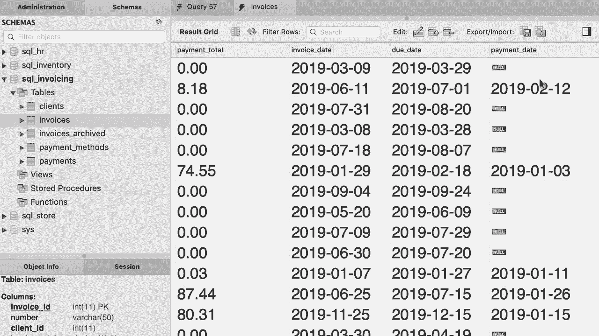
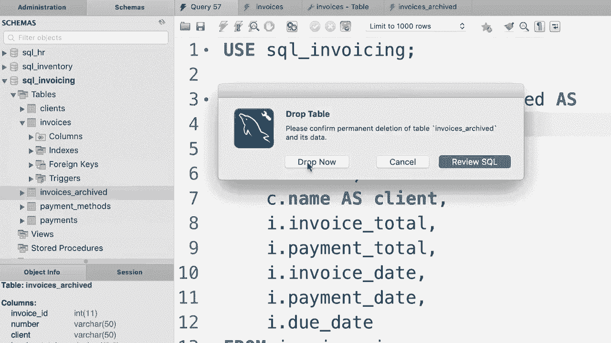
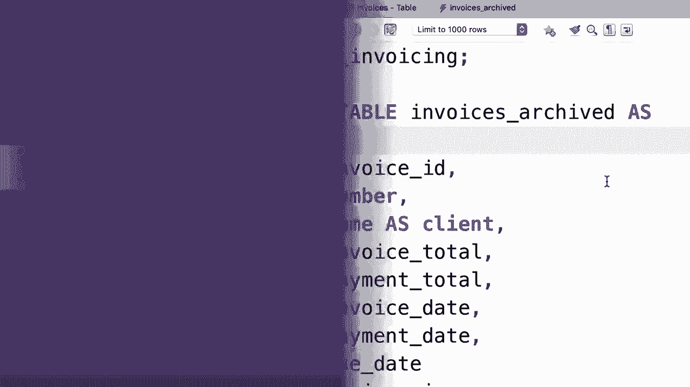

# SQL常用知识点合辑——P35：L35- 创建表的副本 📋


在本教程中，我们将学习如何将数据从一个表复制到另一个新表。我们将重点介绍两种强大的技术：使用 `CREATE TABLE ... AS` 语句创建包含数据的表副本，以及在 `INSERT` 语句中使用子查询有选择地复制数据。

## 使用 `CREATE TABLE ... AS` 创建副本

上一节我们介绍了课程目标，本节中我们来看看第一种复制数据的方法：`CREATE TABLE ... AS` 语句。

这种方法可以快速创建一个新表，并将源表的查询结果直接插入其中。例如，我们有一个 `orders` 表，想创建一个名为 `orders_archive` 的归档表来存放所有订单数据。

以下是具体操作步骤：
1.  编写 `CREATE TABLE ... AS` 语句，后跟一个 `SELECT` 查询。
2.  执行该语句后，将同时创建新表并填充数据。

```sql
CREATE TABLE orders_archive AS
SELECT * FROM orders;
```

执行上述查询后，数据库会创建一个名为 `orders_archive` 的新表，其结构和数据与 `orders` 表完全一致。但需要注意，使用此方法时，原表中的一些特殊属性（如主键、自增等）不会被复制到新表中。

## 在 `INSERT` 语句中使用子查询

我们已经学会了如何创建完整的表副本，接下来我们看看如何更灵活地复制部分数据。这可以通过在 `INSERT` 语句中嵌入子查询来实现。

子查询是嵌套在另一个 SQL 语句（如 `INSERT` 或 `CREATE TABLE`）中的 `SELECT` 语句。它允许我们基于复杂的条件筛选要复制的数据。

假设我们只想将 `orders` 表中2019年之前的订单复制到已清空的 `orders_archive` 表中。

以下是具体操作步骤：
1.  使用 `TRUNCATE TABLE` 清空目标表。
2.  编写 `INSERT INTO ... SELECT` 语句，在 `SELECT` 部分定义筛选条件。




```sql
-- 首先清空目标表
TRUNCATE TABLE orders_archive;

-- 然后插入筛选后的数据
INSERT INTO orders_archive
SELECT * FROM orders
WHERE order_date < ‘2019-01-01’;
```

执行后，`orders_archive` 表将只包含2019年之前的订单记录。这种方法结合了数据筛选和插入，非常高效。

## 综合练习：创建连接查询的副本

前面我们介绍了两种基础的数据复制方法，本节中我们通过一个综合练习来应用更复杂的技术：创建一个包含连接（JOIN）查询结果的新表。

任务描述：在 `sql_invoicing` 数据库中，基于 `invoices` 表创建名为 `invoices_archive` 的新表。新表需要满足以下条件：
*   用客户名称（`name`）替换原来的客户编号（`client_id`）。
*   只复制已付款的发票（即 `payment_date` 不为空的记录）。

以下是解决此任务的步骤分解：
1.  首先，编写一个 `SELECT` 查询，连接 `invoices` 表和 `clients` 表，选择所需的列，并应用过滤条件。
2.  然后，将这个 `SELECT` 查询作为子查询，放入 `CREATE TABLE ... AS` 语句中。

```sql
-- 步骤1：构建获取所需数据的查询
SELECT
    i.invoice_id,
    i.number,
    c.name AS client,
    i.invoice_total,
    i.payment_total,
    i.invoice_date,
    i.due_date,
    i.payment_date
FROM invoices i
JOIN clients c
    USING (client_id)
WHERE i.payment_date IS NOT NULL;

-- 步骤2：将上述查询用于创建新表
CREATE TABLE invoices_archive AS
SELECT
    i.invoice_id,
    i.number,
    c.name AS client,
    i.invoice_total,
    i.payment_total,
    i.invoice_date,
    i.due_date,
    i.payment_date
FROM invoices i
JOIN clients c
    USING (client_id)
WHERE i.payment_date IS NOT NULL;
```

执行成功后，将创建一个包含客户姓名且仅有已付款发票记录的 `invoices_archive` 表。请注意，如果同名表已存在，再次执行 `CREATE TABLE` 会报错，需要先删除旧表。



---



本节课中我们一起学习了在 SQL 中创建表副本的两种核心方法。我们掌握了使用 **`CREATE TABLE ... AS`** 快速复制整个表结构及数据，也学会了在 **`INSERT INTO ... SELECT`** 语句中使用子查询来灵活复制符合条件的数据行。最后，通过一个综合练习，我们实践了结合表连接和条件过滤来创建符合特定业务需求的数据副本。这些技术能极大提升数据归档、备份和迁移的效率。