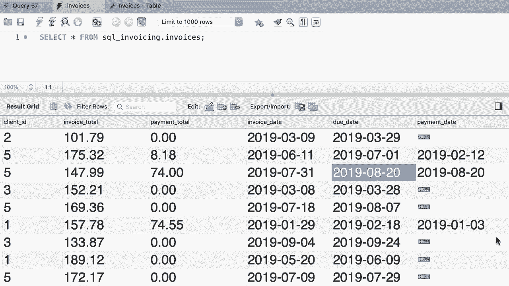

# SQL常用知识点合辑——P36：L36- 更新单行 📝


在本节课中，我们将学习如何使用SQL的`UPDATE`语句来修改数据库表中已有的数据。我们将通过一个具体的例子，演示如何更新单行记录中的一列或多列值，并介绍如何使用表达式和默认值进行更新。

---

## 更新数据的基本语法

上一节我们介绍了查询数据，本节中我们来看看如何修改数据。在SQL中，我们使用`UPDATE`语句来更新表中的记录。其基本语法结构如下：

```sql
UPDATE 表名
SET 列名1 = 新值1,
    列名2 = 新值2
WHERE 条件;
```

*   `UPDATE` 子句指定要修改的表。
*   `SET` 子句用于指定要更新的列及其对应的新值。
*   `WHERE` 子句至关重要，它用于精确筛选出需要更新的行。如果省略`WHERE`子句，将更新表中的**所有**行。

## 一个具体的更新案例

假设我们有一个`invoices`（发票）表。第一条记录的`payment_total`（付款总额）为0，且`payment_date`（付款日期）为空。现在，我们需要更新这条记录，因为客户支付了10美元。

以下是实现此更新的步骤和代码：

1.  我们首先指定要更新的表为`invoices`。
2.  在`SET`子句中，我们将`payment_total`列的值设置为10。
3.  同时，我们将`payment_date`列的值设置为一个具体的日期，例如‘2019-03-01’。
4.  最后，通过`WHERE`子句精确指定要更新的是`invoice_id`（发票ID）为1的记录。

```sql
UPDATE invoices
SET payment_total = 10,
    payment_date = '2019-03-01'
WHERE invoice_id = 1;
```

执行此语句后，`invoice_id`为1的记录的付款信息就被成功更新了。

## 如何撤销或更正更新

如果我们不小心更新了错误的行（例如本应更新`invoice_id`为3的记录），我们需要将其恢复原状。原记录中`payment_total`的默认值是0，`payment_date`应为空。

以下是两种恢复数据的方法：

**方法一：显式设置为`NULL`或0**
我们可以直接将列的值设回`NULL`（空值）或0。

```sql
UPDATE invoices
SET payment_total = 0,
    payment_date = NULL
WHERE invoice_id = 1;
```

**方法二：使用`DEFAULT`关键字**
如果表中为列定义了默认值，我们可以使用`DEFAULT`关键字让数据库自动使用该默认值。

```sql
UPDATE invoices
SET payment_total = DEFAULT,
    payment_date = DEFAULT
WHERE invoice_id = 1;
```

## 使用表达式进行更新

有时，新值并非一个固定数字，而是需要计算得出。例如，假设客户支付了`invoice_id`为3的发票总金额的50%，并且付款日期就是到期日。

在这种情况下，我们可以在`SET`子句中使用表达式：
*   `payment_total`的新值等于`invoice_total`（发票总额）乘以0.5。
*   `payment_date`的新值直接取自`due_date`（到期日）列。

```sql
UPDATE invoices
SET payment_total = invoice_total * 0.5,
    payment_date = due_date
WHERE invoice_id = 3;
```



执行此更新后，`payment_total`会被自动计算并更新，`payment_date`也会被设置为与`due_date`相同的值。


---

本节课中我们一起学习了SQL中更新单行数据的方法。核心要点是掌握`UPDATE...SET...WHERE`的语法结构，理解`WHERE`条件对于精准定位数据的重要性，并学会使用固定值、`NULL`、`DEFAULT`关键字以及算术表达式来设置新的列值。记住，在执行更新操作前务必确认`WHERE`条件是否正确，以避免误改大量数据。