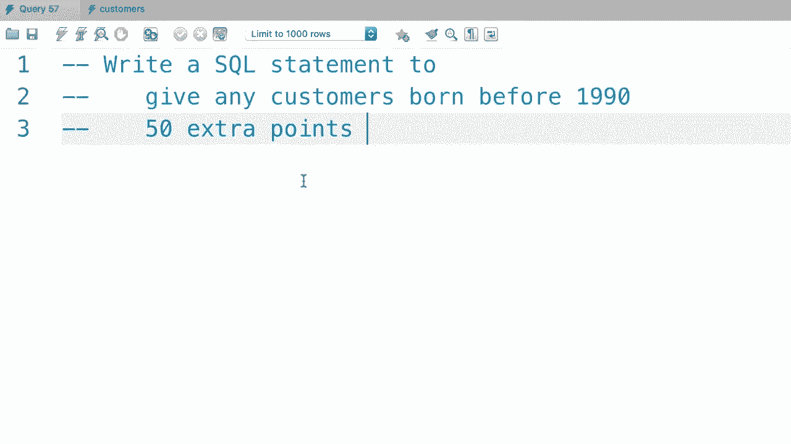
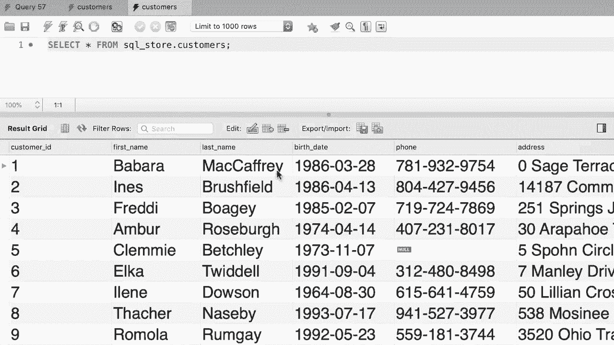

# SQL常用知识点合辑——P37：L37- 更新多行 📝


在本教程中，我们将学习如何使用UPDATE语句来更新数据库表中的多行记录。我们将探讨其基本语法、注意事项，并通过一个实际练习来巩固所学知识。

---

在上一节中，我们介绍了如何使用UPDATE语句更新单条记录。本节中，我们来看看如何更新多条记录。

更新多条记录的语法与更新单条记录完全相同。关键在于`WHERE`子句中设置的条件需要更通用，以匹配到多行数据。

例如，在`invoices`（发票）表中，客户ID为3的客户有多条发票记录。我们可以编写一条语句来更新该客户的所有发票。

```sql
UPDATE invoices
SET payment_total = 10, payment_date = '2019-03-01'
WHERE client_id = 3;
```

然而，如果你在MySQL Workbench中执行此语句，可能会遇到错误。这是因为MySQL Workbench默认以安全更新模式运行，该模式只允许你更新单条记录。此限制仅限于MySQL Workbench，在其他MySQL客户端或应用程序代码中则不会出现此问题。

以下是解决此问题的方法。

首先，转到顶部菜单栏的“MySQL Workbench”菜单，然后选择“Preferences”（首选项）。

在弹出对话框的左侧，点击“SQL Editor”（SQL编辑器）。

接着，向下滚动到底部，找到“Safe Updates”（安全更新）选项。

取消勾选“Safe Updates”复选框。这个设置可以防止你不小心更新或删除表中的大量记录。

完成设置后，需要重新连接到MySQL实例以使更改生效。

复制所有SQL代码，然后关闭当前的连接窗口。

在MySQL Workbench主界面，双击你的连接重新建立连接。

最后，粘贴并执行你的SQL代码。现在，客户ID为3的所有发票记录都将被成功更新。

我们还可以使用`IN`运算符来更新更多特定条件的记录。例如，假设我们想同时更新客户ID为3和4的所有发票。

```sql
UPDATE invoices
SET payment_total = 10, payment_date = '2019-03-01'
WHERE client_id IN (3, 4);
```

你在`WHERE`子句中学到的所有运算符在这里都适用。从技术上讲，`WHERE`子句是可选的。如果你想更新表中的所有记录，只需省略它。

```sql
-- 更新表中所有记录（请谨慎使用）
UPDATE invoices
SET payment_total = 10, payment_date = '2019-03-01';
```



---


以下是本教程的练习。

回到我们的SQL数据库，编写一条SQL语句，为任何在1990年之前出生的客户增加50积分。

我们将在`customers`（客户）表上使用UPDATE语句。

```sql
UPDATE customers
SET points = points + 50
WHERE birth_date < '1990-01-01';
```

在这条语句中：
*   `SET points = points + 50` 是一个表达式，它将当前积分值加上50。
*   `WHERE birth_date < '1990-01-01'` 是条件，用于筛选出出生日期早于1990年1月1日的客户。

执行此查询后，任何在1990年之前出生的客户的积分都将增加50分。



---

本节课中，我们一起学习了如何更新数据库中的多行记录。我们掌握了UPDATE语句的基本用法，了解了MySQL Workbench中安全更新模式的设置与关闭方法，并练习了使用表达式和条件来批量更新数据。记住，在执行更新操作时，务必谨慎确认`WHERE`条件，以避免意外修改大量数据。