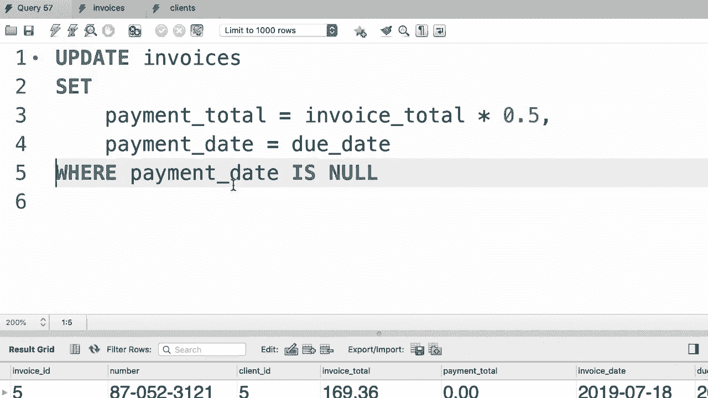
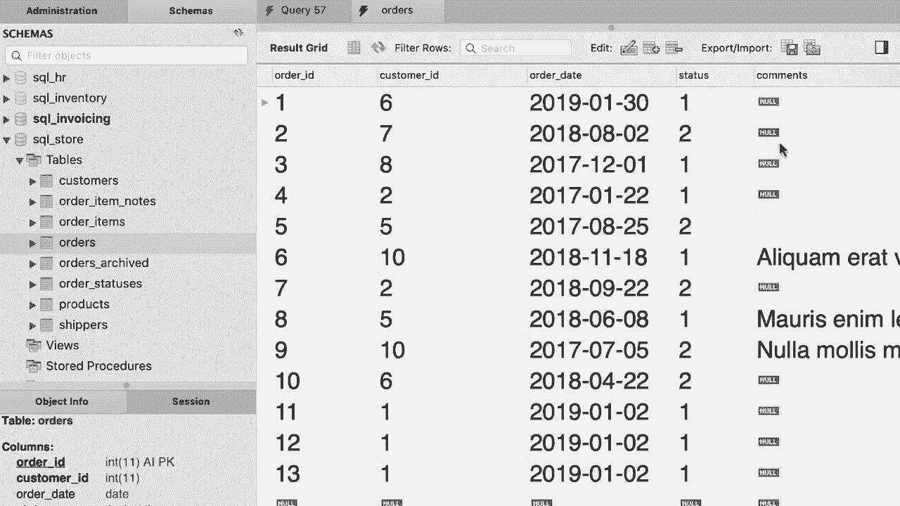
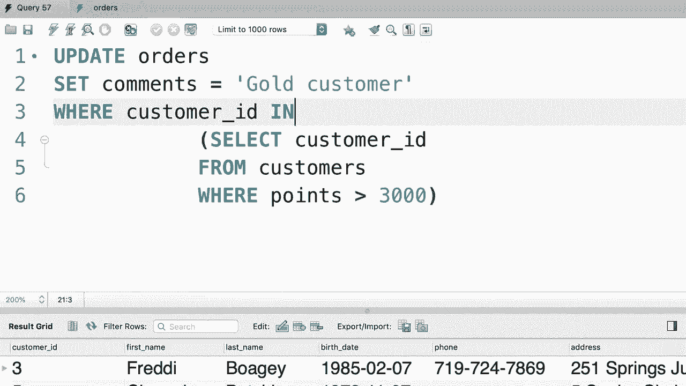

# SQL常用知识点合辑——P38：L38- 在更新中使用子查询 📝


在本节课中，我们将要学习如何在SQL的`UPDATE`语句中灵活地使用子查询。这是一种非常强大的技术，可以帮助我们基于复杂的条件来更新数据，而不仅仅是依赖简单的硬编码值。

## 从简单更新到动态查询 🔄

上一节我们介绍了基本的更新操作。本节中我们来看看如何让更新条件变得更智能。假设我们想更新某个客户的所有发票，但我们只知道客户的名字，而不知道其ID。这时，我们就需要先通过名字查询到ID，再用这个ID去更新。

首先，我们需要从`customers`表中根据名字查找客户ID。这可以通过一个简单的`SELECT`语句完成。

```sql
SELECT customer_id
FROM customers
WHERE name = ‘My-Work’;
```

执行这个查询，我们就能得到名为“My-Work”的客户ID。

## 将查询嵌入更新语句 🧩

现在，我们可以将这个`SELECT`语句作为子查询，嵌入到`UPDATE`语句的`WHERE`子句中。子查询就是一个嵌套在另一个SQL语句内部的`SELECT`语句。

以下是具体的做法。我们不再在`WHERE`子句中硬编码客户ID，而是用括号包裹住我们刚才写的查询。

```sql
UPDATE invoices
SET payment_total = 10
WHERE client_id = (
    SELECT client_id
    FROM clients
    WHERE name = ‘My-Work’
);
```

执行这个语句时，数据库会先运行子查询得到客户ID，然后用这个结果去更新对应的发票记录。

## 处理多个结果的子查询 📊

有时，我们的子查询可能会返回多个结果。例如，我们想更新所有位于“California”或“NY”州的客户的发票。

首先，我们单独运行子查询来确认结果。

```sql
SELECT client_id
FROM clients
WHERE state IN (‘CA’, ‘NY’);
```

这个查询会返回多个客户ID。因此，在`UPDATE`语句中，我们不能使用等号`=`，而必须使用`IN`操作符来匹配多个可能的值。

```sql
UPDATE invoices
SET payment_total = 10
WHERE client_id IN (
    SELECT client_id
    FROM clients
    WHERE state IN (‘CA’, ‘NY’)
);
```

## 更新前的安全检查 ✅

在执行任何更新操作前，验证将要被更新的记录是一个好习惯。这可以防止意外的数据修改。

例如，我们想更新所有支付日期为空的发票。可以先运行一个`SELECT`查询来查看哪些记录会被影响。

```sql
SELECT *
FROM invoices
WHERE payment_date IS NULL;
```



确认查询结果无误后，再将`WHERE`条件应用到`UPDATE`语句中。


```sql
UPDATE invoices
SET payment_total = 10
WHERE payment_date IS NULL;
```


## 实战练习 ✍️

现在，让我们通过一个练习来巩固所学知识。请查看`orders`表，你会发现有些订单没有评论。



**任务**：编写一个SQL语句，更新所有积分超过3000的“黄金客户”的订单，将他们的`comments`列设置为“黄金客户”。


以下是解决步骤：

1.  **找到黄金客户**：首先，我们需要识别出哪些客户是黄金客户（积分>3000）。

    ```sql
    SELECT customer_id
    FROM customers
    WHERE points > 3000;
    ```

2.  **构建更新语句**：然后，我们将上一步的查询作为子查询，用于更新`orders`表。

    ```sql
    UPDATE orders
    SET comments = ‘黄金客户’
    WHERE customer_id IN (
        SELECT customer_id
        FROM customers
        WHERE points > 3000
    );
    ```

这个语句会找到所有黄金客户的ID，然后更新这些客户对应的订单评论。



## 总结 📚


本节课中我们一起学习了如何在`UPDATE`语句中使用子查询。关键点包括：
*   子查询是嵌套在另一个SQL语句中的`SELECT`语句。
*   当子查询返回单个值时，可以在`WHERE`子句中使用`=`。
*   当子查询返回多个值时，必须在`WHERE`子句中使用`IN`操作符。
*   在执行更新前，先运行子查询或条件查询来验证目标数据，这是一个重要的安全实践。

掌握这项技术能让你编写出更动态、更强大的数据更新语句。