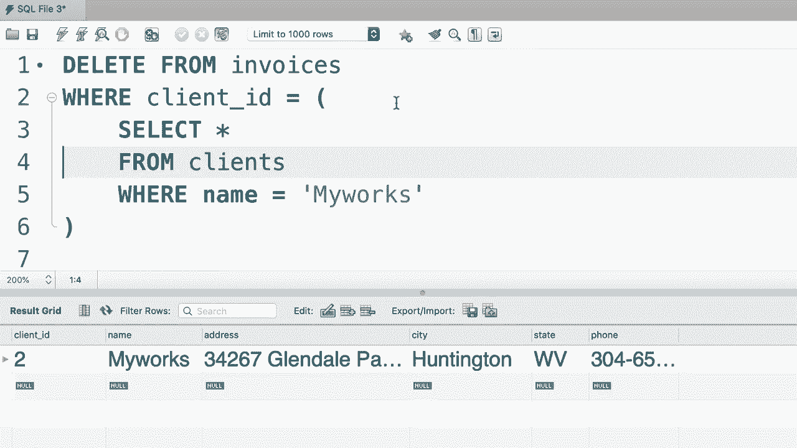

# SQL常用知识点合辑——P39：L39- 删除行 🗑️


在本节课中，我们将学习如何从数据库表中删除数据。这是数据操作中与插入、更新同等重要的部分。我们将重点介绍 `DELETE` 语句的基本用法以及如何安全地使用条件来删除特定记录。

上一节我们介绍了如何更新数据，本节中我们来看看如何删除数据。删除操作使用 `DELETE FROM` 语句，其基本语法结构如下：

```sql
DELETE FROM table_name
WHERE condition;
```

`DELETE FROM` 指定要从哪个表中删除记录。`WHERE` 子句用于设置删除记录的条件，这是控制删除范围、避免误删的关键。如果不使用 `WHERE` 子句，该语句将删除表中的所有记录，这是一个非常危险的操作，执行时必须格外小心。

## 删除特定记录

假设我们想从 `invoices`（发票）表中删除 `invoice_id` 为 1 的记录。以下是具体的操作步骤：

```sql
DELETE FROM invoices
WHERE invoice_id = 1;
```

执行此语句后，`invoices` 表中所有 `invoice_id` 等于 1 的行将被永久删除。

## 使用子查询进行条件删除

有时，我们需要根据更复杂的条件来删除记录。例如，我们想删除所有客户名为“我的作品”的发票。这需要分两步进行：首先找到该客户的ID，然后根据这个ID删除相关发票。

以下是查找名为“我的作品”的客户的查询：

```sql
SELECT *
FROM customers
WHERE name = ‘我的作品’;
```

执行这个查询后，我们可以获得该客户的ID。接着，我们可以将这个查询作为子查询，嵌入到 `DELETE` 语句的 `WHERE` 条件中，一次性完成删除操作：

```sql
DELETE FROM invoices
WHERE client_id = (
    SELECT client_id
    FROM customers
    WHERE name = ‘我的作品’
);
```

这个语句的含义是：删除 `invoices` 表中，那些 `client_id` 等于从 `customers` 表中查出的、名为“我的作品”的客户的 `client_id` 的所有记录。

## 操作要点总结

以下是执行删除操作时需要注意的几个关键点：



1.  **始终使用 WHERE 子句**：除非确实需要清空整个表，否则务必使用 `WHERE` 子句来精确指定要删除的记录。
2.  **先查询，后删除**：在执行 `DELETE` 前，可以先用 `SELECT` 语句配合相同的 `WHERE` 条件进行查询，确认将要删除的记录是否正确。
3.  **理解子查询的作用**：子查询可以帮助我们基于其他表的数据来构建删除条件，实现更复杂的删除逻辑。
4.  **注意操作不可逆**：`DELETE` 操作是永久性的，删除的数据通常无法直接恢复（除非有备份）。在生产环境中执行需谨慎。


本节课中我们一起学习了如何使用 `DELETE FROM` 语句从数据库表中删除数据。我们掌握了根据简单条件（如 `invoice_id = 1`）删除特定记录的方法，也学会了利用子查询实现基于关联信息的复杂条件删除。请牢记，删除操作具有破坏性，在执行时务必通过 `WHERE` 子句明确指定范围，并在可能的情况下先进行数据确认，以保证数据安全。