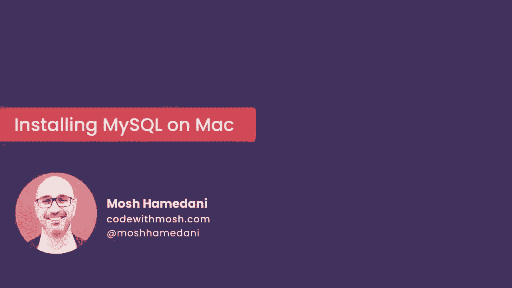
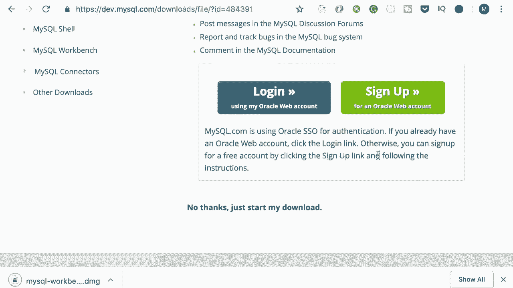
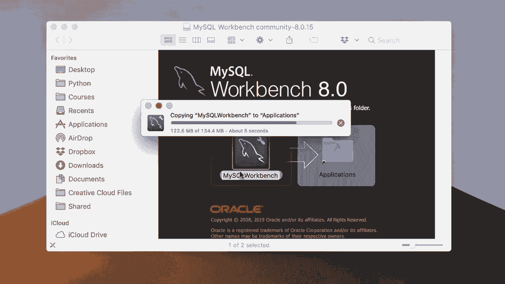
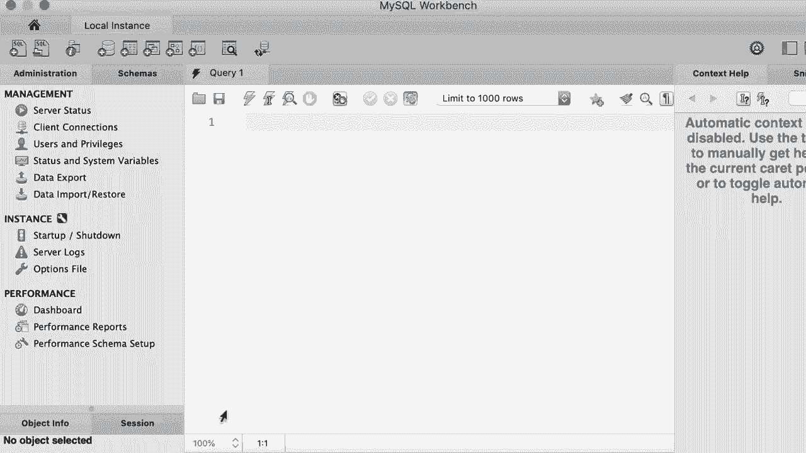

# SQL常用知识点合辑——P4：L4- 在Mac上安装MySQL 🍎

在本节课中，我们将学习如何在Mac电脑上安装MySQL数据库服务器及其图形化管理工具MySQL Workbench。整个过程分为下载、安装和配置连接几个主要步骤。

---

## 下载MySQL社区服务器

首先，我们需要获取MySQL的安装文件。

打开浏览器，访问MySQL官方网站（MySQL.com）。进入下载页面，向下滚动至底部。在页面中找到“MySQL社区版”，这是完全免费的版本，本课程将使用它。

在社区版页面中，点击“MySQL社区服务器”。在随后显示的页面上，找到适用于Mac OS的版本列表。下载列表中的第一个项目，即DMG归档文件。

在下载页面，点击“我不需要”选项，然后开始下载。下载完成后，你将获得一个DMG文件，这是一个安装向导。

---

## 安装MySQL服务器

接下来，我们将运行安装向导来完成MySQL服务器的安装。

打开已下载的DMG文件，双击其中的安装包。这将启动安装向导，过程非常简单，只需按照提示逐步操作。

点击“继续”，并同意软件许可协议。安装程序会要求你输入电脑的登录密码以授权安装。输入密码后继续。

安装过程中，需要为MySQL的root（管理员）用户设置一个密码。在输入框中设置一个复杂的密码，并牢记它。

完成上述设置后，继续完成安装。安装结束时，可能再次需要输入电脑密码。至此，MySQL社区服务器安装完成。

---

## 下载并安装MySQL Workbench

仅有服务器还不够，我们还需要一个图形化工具来连接和管理数据库。我们将安装MySQL Workbench。

回到MySQL官网的下载页面，再次向下滚动至“MySQL社区版”部分。在此页面找到“MySQL Workbench”，这是一个用于连接和管理数据库的图形工具，点击下载。

同样，在下载页面选择不登录或不注册，直接下载对应的DMG归档文件。

下载完成后，打开DMG文件。你会看到一个应用程序图标，只需将“MySQL Workbench”图标拖拽到“应用程序”文件夹中即可完成安装。

---

## 配置并连接数据库

安装好工具后，我们需要创建连接来访问本地的MySQL服务器。

按下 `Command + 空格键` 打开Spotlight搜索，输入“MySQL Workbench”并打开它。首次打开时，Mac可能会提示你确认信任此来自互联网的应用程序，点击“打开”即可。

进入MySQL Workbench后，默认可能已有一个连接。为了演示，我们可以右键点击并删除它，然后从头创建一个新连接。

点击界面上的加号（+）图标来创建新连接。在配置页面中，进行如下设置：
*   **连接名称**： 例如“本地实例”。
*   **连接方法**： 选择“Standard (TCP/IP)”。
*   **主机名**： 输入 `127.0.0.1`（这是本地机器的地址）。
*   **端口**： 输入 `3306`（MySQL服务器的默认端口）。
*   **用户名**： 输入 `root`。
*   **密码**： 点击“存储在钥匙串中”，然后输入安装MySQL时设置的root用户密码。

配置完成后，点击“测试连接”按钮。如果显示连接成功，则表明配置正确。点击“确定”保存该连接。

现在，在MySQL Workbench的主页上就会出现这个连接。以后每次打开Workbench，只需点击此连接即可连接到本地的MySQL服务器。

---

本节课中，我们一起学习了在Mac系统上安装MySQL数据库环境的全过程：从官网下载免费的社区版服务器和Workbench工具，运行安装向导，到最后成功配置并测试数据库连接。现在你的Mac已经准备好运行SQL了。