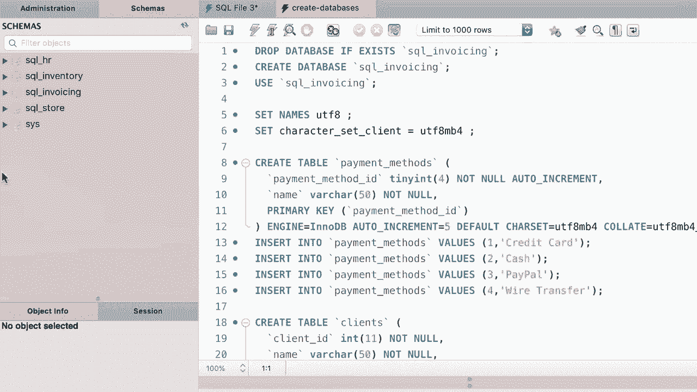

# SQL常用知识点合辑——P40：L40- 恢复课程数据库 📂

在本节课中，我们将学习如何在MySQL Workbench中恢复课程数据库到原始状态。这是为了确保在后续课程中，所有数据库的数据保持一致，避免因之前的数据修改操作导致结果出现偏差。

上一节我们介绍了数据的增删改查操作。本节中我们来看看如何将数据库恢复到初始的干净状态。

## 恢复数据库的必要性

在之前的课程中，我们对数据库执行了添加、更新和删除记录的操作。如果不进行恢复，这些更改会一直保留，可能导致后续课程演示或练习的结果与预期不符。因此，在进入新的学习部分前，将数据库恢复至原始配置是一个好习惯。

## 恢复步骤详解

以下是使用MySQL Workbench恢复数据库的具体步骤。

1.  **打开SQL脚本文件**
    在MySQL Workbench顶部菜单栏，点击 **文件**，然后选择 **打开SQL脚本**。

2.  **定位脚本目录**
    在弹出的文件浏览器中，导航至存储本课程SQL脚本的目录。该目录包含了创建所有原始数据库的脚本文件。
    > 如果忘记该目录位置，可以回顾课程第一部分中关于下载补充材料的课程。

3.  **选择并执行脚本**
    在目录中，找到并打开名为 **创建数据库.sql** 的脚本文件。在查询编辑器窗口中，点击执行按钮（闪电图标）来运行整个脚本。

4.  **刷新数据库列表**
    脚本执行成功后，左侧导航面板的数据库列表可能不会立即更新。点击导航面板上方的 **刷新** 图标，即可看到所有恢复的数据库重新出现。

至此，所有课程数据库都已恢复到初始状态。我们可以确保学习环境的一致性，为接下来的课程内容做好准备。

本节课中我们一起学习了恢复数据库的重要性及在MySQL Workbench中的具体操作步骤。通过执行提供的SQL脚本并刷新列表，我们可以快速将数据库重置，这是管理学习与开发环境的一项实用技能。

下一个部分见。😊

