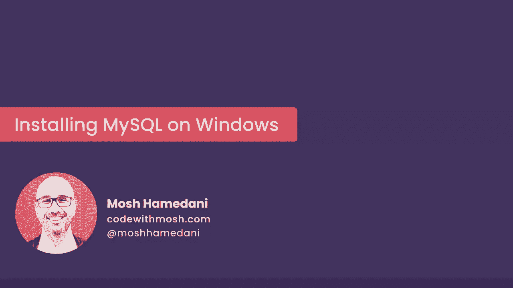
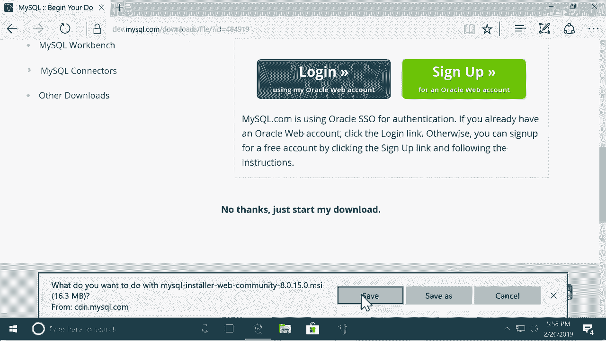
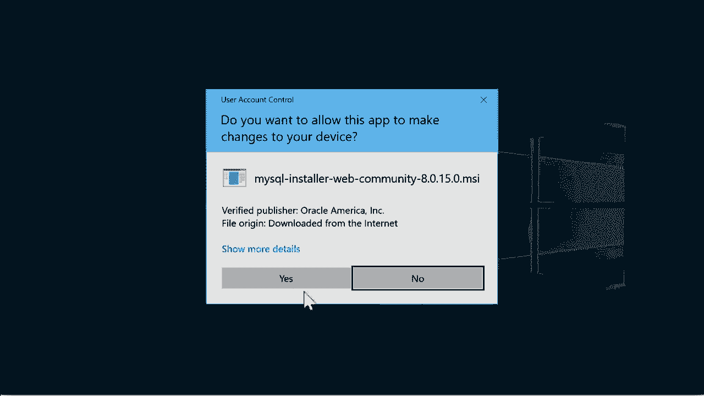
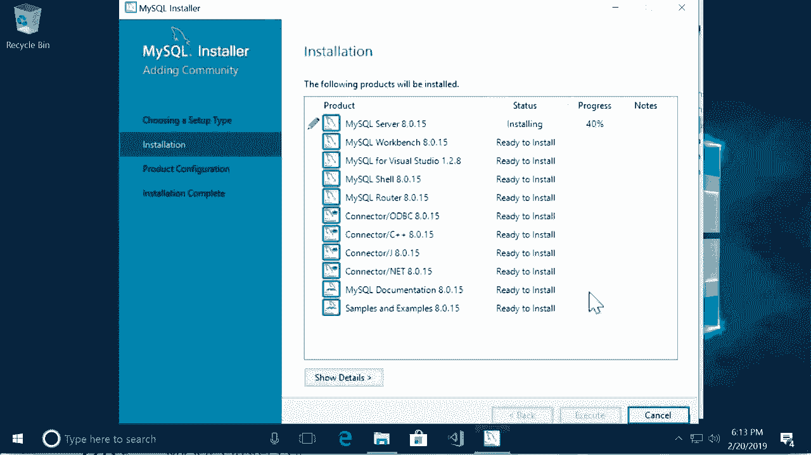
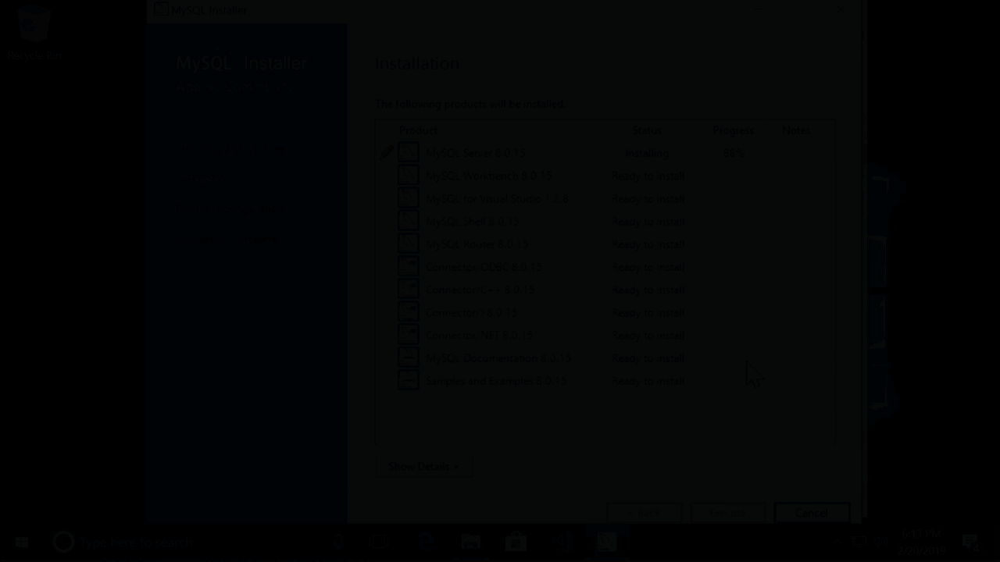
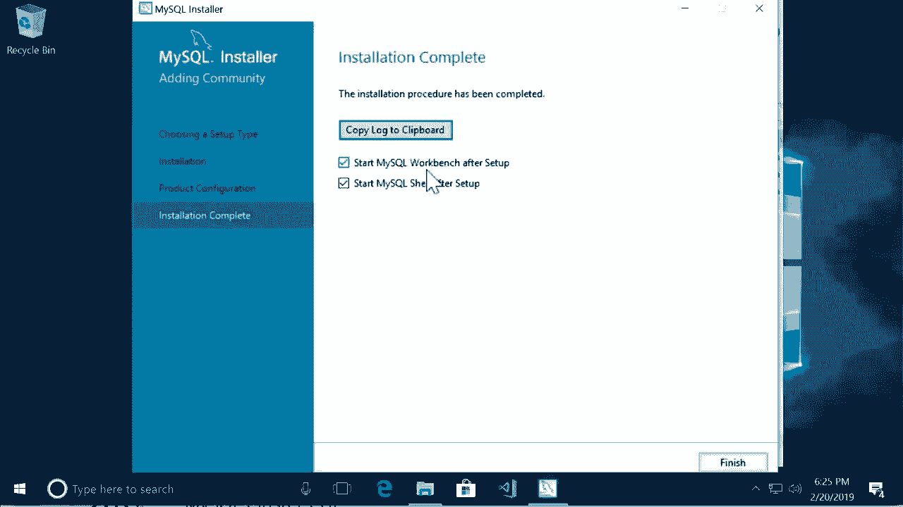
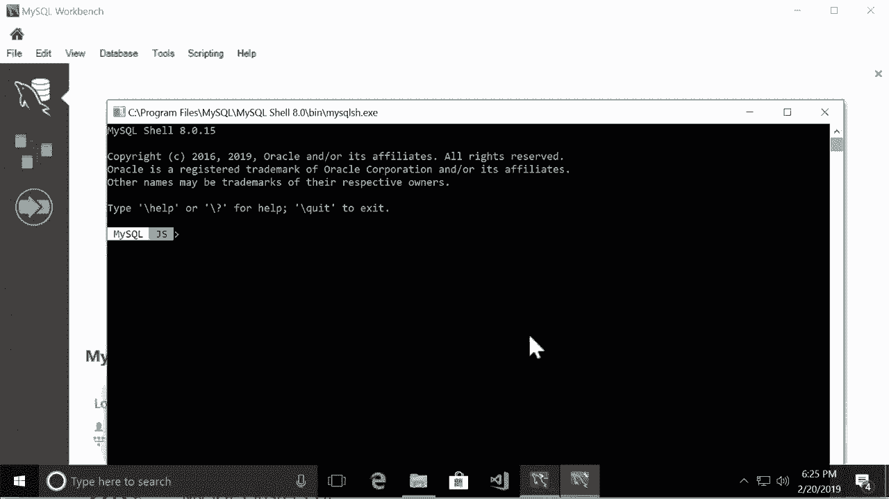
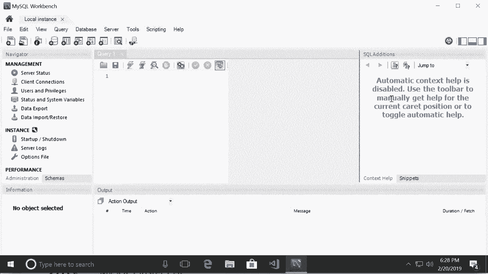

# SQL常用知识点合辑——P5：L5- 在 Windows 上安装 MySQL 💻

在本节课中，我们将学习如何在 Windows 操作系统上安装 MySQL 数据库服务器及其图形化管理工具 MySQL Workbench。整个过程将通过官方安装向导完成，步骤清晰，适合初学者跟随操作。

## 概述

我们将从访问 MySQL 官方网站开始，下载免费的社区版安装程序，然后通过图形化向导完成服务器和客户端的安装与基本配置。

## 下载 MySQL 安装程序

首先，我们需要获取 MySQL 的安装程序。

1.  打开浏览器，访问 MySQL 官方网站。
2.  导航至下载页面。
3.  在页面中找到 “MySQL Community (GPL) Downloads” 部分，这是完全免费的版本。
4.  点击 “MySQL Community Server”。
5.  在下载页面中，找到 “MySQL Installer for Windows” 并点击下载，这是 Windows 系统推荐的安装方式。
6.  在接下来的页面中，点击 “No thanks, just start my download.” 链接，即可开始下载安装程序，无需注册账户。
7.  将下载的 `.msi` 安装文件保存到电脑。

## 运行安装向导

下载完成后，运行安装程序，启动安装向导。

1.  双击运行下载的 `.msi` 安装文件。
2.  安装向导将引导我们完成安装。大部分步骤只需点击 “Next”，但其中有几步需要特别注意。

## 安装类型与组件选择

接下来，我们选择安装类型和需要安装的产品。

1.  在 “Choosing a Setup Type” 页面，选择 **Developer Default** 选项，这会安装适合开发者的常用组件。
2.  点击 “Next”。如果出现关于缺少 Python 的警告，可以忽略，继续点击 “Next”。
3.  在 “Check Requirements” 页面，再次点击 “Next”。
4.  在 “Installation” 页面，可以看到将要安装的产品列表，主要包括 **MySQL Server**（数据库服务器）和 **MySQL Workbench**（图形化管理工具）。确认后，点击 “Execute” 开始安装。
5.  安装过程可能需要几分钟，请耐心等待。

## 产品配置

所有产品安装完成后，需要对 MySQL 服务器进行基本配置。

1.  安装完成后，点击 “Next” 进入配置环节。
2.  在 “Group Replication” 页面，直接点击 “Next”。
3.  在 “Networking” 页面，保持默认的网络设置，点击 “Next”。
4.  接下来是为 MySQL 的 root（管理员）账户设置密码。在相应输入框中设置一个强密码并牢记。点击 “Next”。
5.  在 “Windows Service” 页面，保持默认设置，点击 “Next”。
6.  点击 “Execute” 应用配置。
7.  配置完成后，点击 “Finish”。

## 连接到服务器并完成安装

最后一步是验证安装并连接到数据库服务器。

1.  在 “Connect To Server” 页面，输入之前为 root 用户设置的密码。
2.  点击 “Check” 测试连接。显示 “Connection succeeded” 表示成功。
3.  点击 “Next”，然后点击 “Execute” 执行最后的应用配置。
4.  点击 “Finish” 完成全部安装。
5.  安装程序可能会提示启动 MySQL Workbench，点击 “Finish” 确认。

## 配置 MySQL Workbench

安装完成后，我们将首次启动并配置 MySQL Workbench。

1.  如果 MySQL Workbench 没有自动打开，可以从开始菜单启动它。
2.  首次启动时，主界面会显示一个连接设置。如果没有，点击 “+” 图标创建新连接。
3.  在 “Setup New Connection” 对话框中，为连接命名（例如：Local Instance）。
4.  保持其他参数为默认值。
5.  在 “Password” 栏，点击 “Store in Vault…”，输入 root 用户的密码并保存。
6.  点击 “Test Connection” 测试连接，成功后会弹出提示。
7.  点击 “OK” 保存连接配置。
8.  在主界面双击新创建的连接，即可连接到本地的 MySQL 服务器。

连接成功后，你会看到 MySQL Workbench 的主界面。左侧是导航面板，用于管理数据库和表；中间是查询编辑器，用于编写和运行 SQL 语句；右侧提供了一些附加功能。这个界面将是本课程后续操作的主要环境。

## 总结

本节课中，我们一起完成了在 Windows 系统上安装 MySQL 的全过程。我们学习了如何从官网下载安装程序，通过安装向导部署 MySQL Server 和 MySQL Workbench，完成了 root 账户的密码设置，并成功配置和连接了 MySQL Workbench 管理工具。现在，你的开发环境已经准备就绪，可以开始进行数据库操作了。