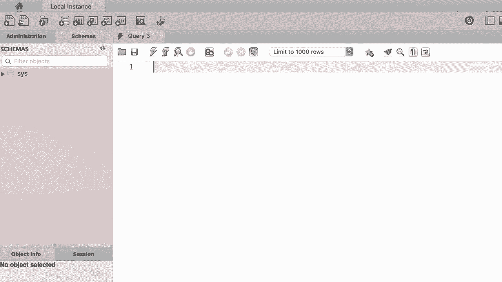
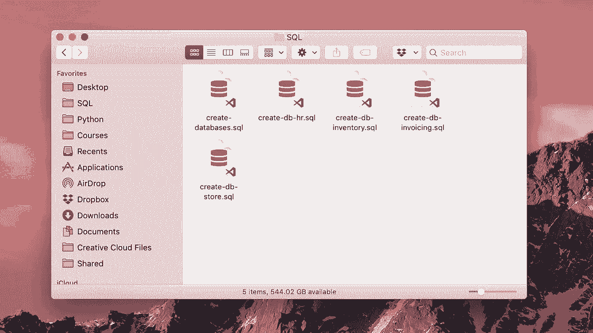
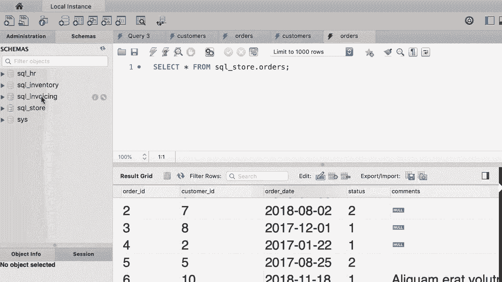

# SQL常用知识点合辑——P6：L6- 为本课程创建数据库 🗄️

在本节课中，我们将学习如何创建本课程所需的数据库。我们将使用MySQL Workbench工具，并导入预先准备好的SQL脚本文件来快速搭建学习环境。

## 认识MySQL Workbench界面

第一次打开MySQL Workbench时，界面可能看起来有些复杂，但实际上它的布局非常清晰。

*   顶部是**工具栏**，包含创建新查询标签页、打开SQL文件等按钮。
*   左侧是**导航面板**，包含“管理”和“模式”两个选项卡。“管理”用于服务器启停、数据导入导出等工作；“模式”则显示当前数据库服务器中的所有数据库。
*   中间是**查询编辑器窗口**，这是我们编写和执行SQL代码的主要区域。
*   右侧面板包含“内容帮助”和“代码片段”选项卡，可以提供辅助信息。

为了获得更简洁的界面，我们可以隐藏右侧和底部的面板。Windows系统上的界面可能略有不同，但这不影响基本操作。

## 获取并导入课程数据库文件

创建课程数据库的最佳方式是使用准备好的SQL脚本文件。

请下载视频下方提供的压缩文件。解压后，你会看到一系列SQL文件。

以下是主要文件说明：

*   `create-databases.sql`：这是主文件，包含了创建本课程所有数据库的SQL代码。
*   其他单独的文件：用于创建单个数据库，以备将来需要重新创建某个特定数据库时使用。

现在，我们回到MySQL Workbench，打开主SQL文件 `create-databases.sql`。

这段SQL代码起初可能看起来复杂，但随着课程深入，你会完全理解其原理。现在，我们只需执行它来创建数据库。

要执行SQL代码，点击工具栏上的**黄色闪电图标**。如果选中了部分代码，则只执行选中部分；如果未选中任何内容，则执行全部代码。我们需要执行整个文件，因此确保没有选中任何文本。

点击执行后，底部的**输出窗口**会显示所有操作的状态。绿色勾号表示操作成功完成。

执行成功后，我们需要刷新左侧“模式”选项卡的视图才能看到新创建的数据库。所有课程数据库都以 `sql_` 为前缀，以便区分。

**注意**：录制视频时只有四个数据库，但课程脚本可能会更新。因此，你看到的数据库数量可能更多，这属于正常情况。

## 探索数据库结构

现在，让我们探索其中一个数据库，例如 `sql_store`。

每个数据库包含多种对象：

*   **表**：存储数据的地方。
*   **视图**：类似于虚拟表，可以组合多个表的数据，常用于生成报告。
*   **存储过程和函数**：存储在数据库中的小程序，用于执行查询或操作。

展开 `sql_store` 数据库下的“表”，可以看到 `customers`、`orders`、`products`、`shippers` 等表。

将鼠标悬停在 `customers` 表上，点击右侧出现的**第三个图标**（形似带闪电的表格），即可查看表中的所有数据。

在 `customers` 表中：
*   每一列代表一个属性，如 `customer_id`（客户ID）、`first_name`（名）、`last_name`（姓）、`birth_date`（出生日期）等。
*   每一行称为一条**记录**，代表一位客户及其信息。

接下来，查看 `orders` 表。该表包含 `order_id`、`customer_id`、`order_date`、`status` 等列。

这里有一个关键点：`orders` 表中的 `customer_id` 列用于标识下达每个订单的客户。我们并不在订单中重复存储客户的姓名、地址等信息，而是只存储其唯一的 `customer_id`。

**这样设计的好处是**：如果客户信息（如地址、电话）发生变更，我们只需在 `customers` 表中更新一次，所有关联的订单都会自动反映这一变化，避免了数据冗余和不一致。

例如，要查找 `customer_id` 为 6 的客户信息，只需在 `customers` 表中查询即可。这些数据是使用工具生成的虚拟数据。

## 理解关系型数据库

这种设计体现了**关系型数据库**的核心思想。数据库中有多个表，表之间通过**关系**相互关联。

具体来说，`customers` 表和 `orders` 表通过 `customer_id` 列建立了关系（或链接）。这种关系使我们能够高效、一致地管理和查询数据。

至此，你已初步了解了数据库、表、列、行和关系这些基本概念。

## 本节练习

在进入下一部分学习如何从表中检索数据之前，请完成以下练习：

请探索 `sql_invoicing` 数据库，查看其中的所有表及数据，了解该数据库存储的数据类型。我们将在后续课程中频繁使用这个数据库。

请花几分钟时间完成这个探索。

## 课程总结

在本节课中，我们一起学习了：
1.  MySQL Workbench 的基本界面布局。
2.  如何通过执行SQL脚本文件 `create-databases.sql` 来创建本课程所需的数据库。
3.  初步探索了数据库的结构，包括表、视图等对象。
4.  理解了表、列、记录（行）的概念。
5.  通过 `customers` 和 `orders` 表示例，了解了关系型数据库中表之间如何通过**关系**（如 `customer_id`）进行关联，以及这种设计如何避免数据冗余。
6.  完成了对 `sql_invoicing` 数据库的初步探索练习。

你已经成功搭建好了学习环境，并对数据如何组织有了直观认识，为后续的SQL查询学习打下了坚实基础。